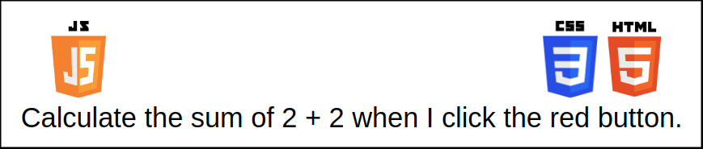
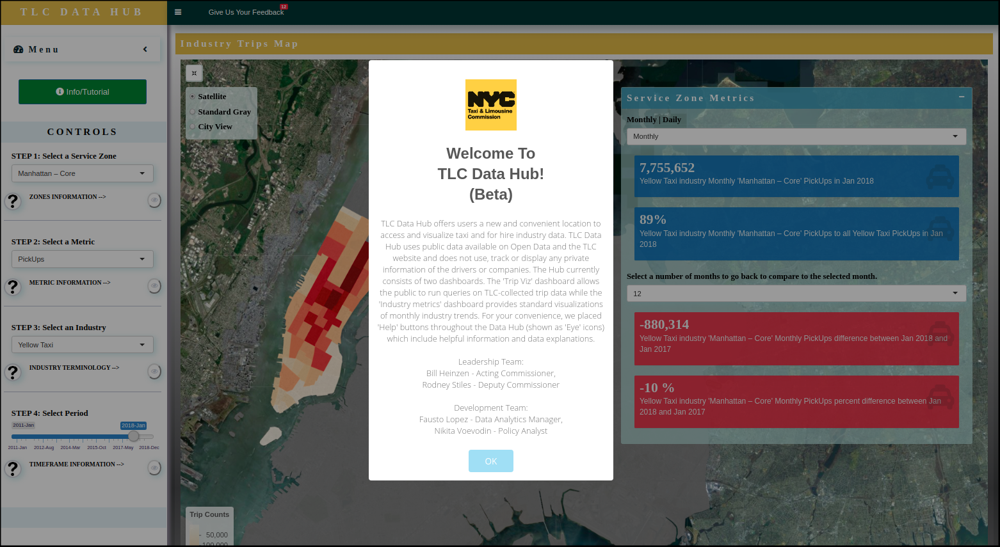
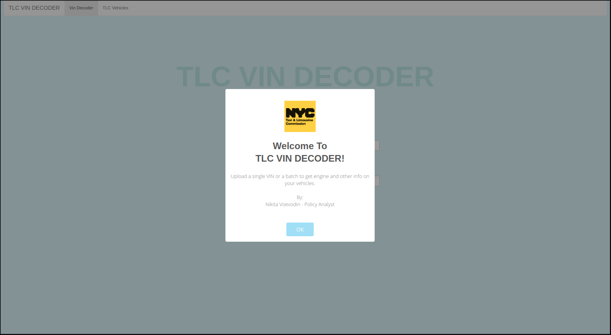

# Languages, Infrastructure, and Myself {-}

## Programming Languages and R’ Place Among Them

### R
Let’s face it, you are new to programming and explaining that R is a functional language and that Java is an object-oriented language won’t make any sense to you. Instead, I’ll give you a few of my thoughts on how I see the R universe, and how it interacts with other languages. I will not cover all the languages, not even close, and I might not even be hundred percent accurate all the time; however, I will cover everything that I think you need to start with R and reach a solid post-noob level. 

The goal here is to make sure you have an overall understanding of the environment you are working in. I want to make sure that you retain as much information as possible. Once you feel comfortable with your level, obviously, go ahead and learn some advanced geek stuff about different languages, the who the what the why.

Firstly, R is an open-source aka free programming language that focuses on working with data, statistical computation, and graphical visualization. It is widely used by academics, statisticians, data miners, and big data companies to work with all sorts of information. Just to give you a perspective of how popular it is in its field, here is a list of 10 largest R users: 

::: {.infobox .caution data-latex="{caution}"}
- Facebook
- Google
- Twitter
- Microsoft
- Uber 
- Airbnb 
- IBM 
- HP 
- Ford
- New York Times 
:::

Some of these might not exist when you are reading this (UBER lol). These companies use R for things like behavior analysis, data forecasting, advanced visualizations and statistical modeling. We will not be doing those things, but it is good to know that the language that you are using is popular with some of the big names.

Secondly, R is different from most other languages because of how it works with data; this is its main advantage and appeal. The following diagram spells out my thoughts on this point:


<center>


</center>


### Excel 
You’re probably familiar with Excel and know what an excel table looks like. When you start working with R, you’ll notice that tables are your bread and butter, just like in excel. Next you’ll probably think that tables are supported by every language, for example JavaScript, Java, PHP and other big ones. You are wrong. These languages do not work with data like Excel or R. Simple operations like joining two tables and aggregating, something that would take two or three lines of code in R, will require some substantial coding and time in those languages, especially if you are new. But how DO those languages work with data? It’s possible to use them for data analysis, but it’s simply not their specialty. Most of the time, these languages connect to a SQL database and use the SQL language to interact with tabular data. You don’t need to worry about that right now. All you need to remember is that R is designed to work with data, and you will be much more efficient using R compared to the languages mentioned above. But what about these other languages in the diagram?

### STATA, SPSS, and SAS
STATA, SPSS, and SAS are powerful but outdated and expensive statistical packages that also work with tabular data just like excel and R. They are not programming languages and unless you want to find yourself hungry, crawling on the floor looking for rats to eat in your studio that you share with some unemployed actor, because nobody wants that shit, I would recommend to stay away from them.

### Python
Python is a full-fledged general-purpose programming language. It’s very hot right now and it seems like every homeless guy knows it already. That, plus the fact that Python is not specifically built to work with data makes me think that a combination of R with something like JavaScript makes more sense. Don’t get me wrong, Python is a great and powerful language and is really dominating R at the moment. I used both and found R easier to set up and start working with. To put it simply, Python tries to mimic what R does natively by creating additional packages that are just not as powerful. Pythonistas might dispute that but if you are reading this, I am assuming that you have made your choice, at least for the moment, and I’m just trying to confirm that thought.

### Diagram and Related Languages
So to sum this up, if you look at the diagram again from right to left: 

::: {.infobox .note data-latex="{note}"}
Excel is a point and click tool and you should only use it for some final touches; STATA, SPSS, and SAS are the bottom of the barrel and you should stay away from them; and R and Python are both programming languages that you really can’t go wrong with. 
:::

This was an overview of what R is and how it compares to some other similar and not so similar languages. Right now, though, we don’t need to know anything else about them, because we won’t be interacting with any of them for the first half of the book. 

There are four languages that we will be interacting with throughout this book. Don’t get scared, as they will be introduced very slowly. These languages are SQL, HTML, CSS, and JavaScript. If you never heard of them, don’t start googling them as you do not need them now. Maybe, google SQL, but that’s it. By the time you are finished with this book, you will have a some understanding of SQL. CSS, HTML and JavaScript will be introduced in the next books. However, I’ll still explain what they all do in this chapter. That’ll serve you well as an entry point to these languages should you decide to branch out beyond R. 

### SQL
Let’s start with SQL. One of the things you’ll be doing almost every day is interacting with a database or databases. I know, because that’s what I’ve doing since the second day at my R-requiring job. That is what I’m still doing today and that’s what I’ll be doing for as long as I am programming in any language. Here is a brief intro to SQL: SQL is sort of a programming language, but it really isn’t. It’s a language that you’ll use to interact with databases.

::: {.infobox .caution data-latex="{caution}"}
You can’t really avoid using SQL as it’s the only way to get or add data from or to a database, and if there is another way that I don’t know about, then you don’t need to know about it at the moment either, because it’s definitely some bullshit way nobody uses. Just remember, SQL is your language for database interaction. SQL is important, and the best thing about it is that it is quite easy to pick up, at least the basics.
:::
 
SQL is quite easy. Obviously, there is a bunch of complicated and advanced stuff that you can do with SQL, but you will not need that now. Instead, we will do some very simple pulls in SQL and compliment it with some R language to clean and aggregate our data. After you finish the book and build a few small apps requiring some basic SQL, you will obviously spread your wings and learn some advanced SQL, but that will be later.

So, that was SQL. If you’re new like I was a couple of years ago you also want to know what a database is and why we need it. 

::: {.infobox .tip data-latex="{tip}"}
A database is just that, a base with data, storage where you keep all kinds of information in the form of tables. Imagine an Excel table.
:::

::: {.infobox .warning data-latex="{warning}"}
If you can’t imagine an excel spreadsheet, then you should really take some prerequisites before continuing.
:::

Well, database is just a collection of such tables. Why can’t we just use an excel file for our data storage needs? We could, but an excel table can only hold so much. Imagine you’re running a store that sells 1 million bananas every day. You’ll have to create a new spreadsheet every day just to keep your banana selling records. What if you’re also selling some rifles? Your records will get out of hand very quickly and you’ll start losing a lot of information. Instead of paying attention to your weird banana/rifle selling business, you’ll be worrying about your excel spreadsheets not opening. Databases solve that problem. They are built specifically to store virtually infinite number of banana and rifle records and they help us link information across those tables. On top of that, databases are fast, and the SQL language makes working with them easy. So, remember, for a lot of data (millions of rows) we are using databases and SQL. You can still use an excel type of file to do some small jobs and share them via emails and so forth, nothing wrong with that; we will in fact do some of that. 


### About HTML/CSS/JavaScript
Cascading Style Sheets. Fancy, right? CSS is not really a programming language; it’s a styling language. Every color, every curved line, sliding panel, animation, and all the fancy stuff that you see when you browse the internet or use apps is styled using CSS or at least some implementation of CSS. I mentioned that CSS is not a programming language; it’s instead a part of the family of three languages, HTML/CSS/JavaScript. Basically, these three languages power the modern internet. Nearly 100% of what you see when opening your browser is these languages. They DO work with other languages to do some stuff behind the scenes like shopping carts, statistics, machine learning, etc. but, generally, whatever you see in front of you is some combination of these three languages. 

::: {.infobox .note data-latex="{note}"}
To cement it in your head, I want you to think about these languages as a sentence structure. HTML is a noun; it defines the object. The object being a web page. So, HTML creates a web page, just an empty skeleton, no colors, no pop ups, no styling, nothing really works yet. All you are seeing are some text, some buttons, drop downs maybe, unformatted pictures, but they aren’t really doing anything yet. Hopefully, you get the picture. If not, check out the one below.
:::


<center>



</center>


CSS in this setup is the adjective; CSS adds colors, lines, animation, and other visuals to that empty web page that we created with HTML. At this point we have a nicely styled web page that doesn’t really do much, which you can get away with in some cases. Below is one of the Amazon pages. You can sometimes experience the view on the right when, let’s say, you lose internet connection. A server, first, loads the structure of a page and then applies the CSS. Below, the un-styled page is on the right and styled on the left.


<center>


</center>

If you want your website or your app to do something, you’re going to need JavaScript. JavaScript in this setup is the verb that defines the actions of the page, the page that we just made with HTML and styled with CSS. A simple example of what JavaScript does in combination with the other two is the following: 

::: {.infobox .note data-latex="{note}"}
HTML creates a button; CSS makes it blue and its text white and adds animation to it when its clicked; JavaScript makes sure that when you click that button something happens, a plot is generated or a set of data is printed, or some calculation is happening and the result is shown on the screen.
:::

I hope this paints a clear picture of this family of languages and how they interact with each other, and with you. 

### Using the HTML/CSS/JavaScript in This Book. 
We are not going to touch on any of these in the first book. You will be learning the fundamentals of R and won’t be creating any web pages or web apps that would require styling or interactivity. You will start seeing some CSS styling starting with the second book, where we’ll start introducing you to the R library for creating web apps called Shiny. 

The third and fourth books will mostly revolve around Shiny and web apps, and that is where we will be using CSS, HTML, and JavaScript. Fortunately, Shiny is HTML/CSS/JavaScript all wrapped up in one, and that is its beauty. Using Shiny, you don’t need any prior knowledge of HTML, CSS, or JavaScript. Everything is wrapped for you in the nice package, and the only things that you need to worry about are the data, logic, and functionality of your app. Having said that, Shiny does limit you to its built-in styles and functionality. There are many auxiliary libraries surrounding Shiny that expand its functionality but sometimes, it won’t be possible to find exactly what we want. That’s where we’ll need CSS and a little bit of HTML and JavaScript. I’m letting you know right now, ahead of time that we won’t be doing a lot of HTML and JavaScript. We will use these two in small amounts, mostly in the form of tricks and hacks to make our apps look cool. Most of our customization will be done using CSS. Don’t sweat researching HTML and JavaScript, you won’t need any knowledge to keep up when we use it. 

To sum up: we’ll focus on R fundamentals and some SQL at first. In the later books, as we move into web applications and start using Shiny library, we’ll introduce some CSS; and once we move deeper and get better, we’ll be using much more CSS and adding some HTML and JavaScript hacks and tricks to make our apps look amazing. 

## About Infrastructure 

Apart from R itself, Shiny tools, SQL, and the side languages mentioned in the previous section, there is infrastructure. Infrastructure is everything that makes the production and consumption of your product possible. 

::: {.infobox .caution data-latex="{caution}"}
Infrastructure is very important. The infrastructure we cover in this and later books will include database and storage and hosting options, API calls, optimization, and some other tools like docker and electron, which also fall under the category of infrastructure.
:::

### Databases

We’ve already covered some ground on databases and SQL. However, there is a second side to databases, building your own database. In that scenario, you’re serving as a data engineer providing infrastructure for yourself or for others. I will teach you to do that in the next books. You’ll use our database in this book. But I’m jumping ahead right now, you don’t need to worry about this for now.

### Hosting 

Imagine that you’ve just built your first app. It’s now on your computer and you can play with it. Very cool, except, nobody else can really see it besides you. Your app must live somewhere else besides your computer, and hosting accomplishes just that. Hosting lets you release your product to the public. Same applies to web sites and databases. Good news is that there are free options for your hosting, and you can even set up your own straight from your home computer. Hosting and databases go hand in hand and will be two of the most important infrastructure topics in the following books. Other things will revolve around these two.

### Other tools

In the fourth book, we will start introducing more advanced concepts and tools like API calls, dockerized apps, optimization and some others. Even though I call these tools advanced, it doesn’t mean they are inherently hard to learn. In fact, they are much easier to pick up once you’re ready. The reason they’re in the advanced category is that you must first learn all the things that I’ve been talking about up until now before you even need to know what these advanced things do. The reality is you just don’t need them in the beginning. 

That was our brief introduction into the topic of infrastructure. The coolest thing about infrastructure is that it, maybe, sounds boring at first. You’re thinking, I just want to create something cool. And apps are what I and everybody see and that is why it is cool.

::: {.infobox .note data-latex="{note}"}
Well, my answer to you is, You will be surprised, by how exciting it is to build your own database for the first time, connect to it, load and pull some data, and for all this to work. Or to set up your hosting, put your app there and open it from your phone and start sending that shit to your friends to brag. You will see, just like I did!
:::

All I’m saying is do not assume that back end (nerd’s term for the infrastructure that we are talking about now) is something boring or something you do not want to be doing. I can almost guarantee that once you’ve built your first few apps and showed them to people, you’ll be more exited to talk about the stuff behind that app, the stuff that makes it run. The picture in front of peoples’ eyes, the front-end, will become a noob thing at that point. 

## About Me

In this section, I think, I’m trying to relate to you, a person with no computer science degree. It is a general idea that coding is hard. And what I say to this is, It is absolutely CORRECT! Coding is incredibly hard and all those asshole-pretend-gurus on YouTube that say learn xyz language in 20 minutes or 5 hours or 1 month are fucking lying. Those videos are click bait that won’t teach you shit. It will take you at least 4-5 months of consistent everyday work to get to an initial comfort level.

Now, having said all that downbeat stuff, I want to assure you that you don’t need a computer science degree to become a professional software engineer or a data engineer or a database engineer. I don’t hold a computer science degree; yet, I’ve been quite successful with coding and feel qualified to teach you. But what about those people who went to school for this? 

::: {.infobox .caution data-latex="{caution}"}
Firstly, you should only worry about your own skills as there will always be better programmers than you. So what? The demand for coding specialists will only increase and there will never be enough people who programmed since kindergarten. That’s where YOU come in. Secondly, what do you think kids at college do? At best, if they’re full-time, they go to school twice a week, take two coding classes at best (A WEEK), then some other two useless classes like underwater poetry and hipster studies just to graduate. After that, they go home and jerk off for the rest of the week or play video games or both. Only a minority will commit an appropriate amount of time to learning code. What do you think they know in the end? Obviously, they’re going to have some fancy resume that will say something like Python, C++, JavaScript, PHP, Spark mumbo jumbo. But when you sit them down and ask them to build something, they’ll be lost. It’s not to say that there is much wrong with learning at the job, it’s just I don’t want you to operate under assumption that you’re so far behind its impossible to catch up.
:::
 
I recently watched a documentary about hackers and the companies guarding against them. In that documentary they showed unpaid guys in their hoodies, hacking and learning from home every day, almost all day, way past nine to five with real commitment and intent, just for fun. At the same time, they show a private company with a bunch of college graduates-programmers struggling to prevent their clients from hacker attacks. You can see all that nice equipment, interactive maps, and so forth. But they still lose to those hackers a lot of times. Why is that? The reason is dedication. I am sure there are exceptions, but just like with college students, majority of employees are there nine to five, they will take any break possible and are really looking forward to the end of the day, or to accumulate enough vacation days to get the fuck out for a while. The hacker bro, on the other hand, sits there and learns relentlessly about some new cool way to fuck someone up. You might say, but he is outnumbered. 

::: {.infobox .caution data-latex="{caution}"}
In programming, you are only as good as the number of hours that you have coded, not the number of degrees you got or years you have spent to get them. A hacker doesn’t need to spend more hours programming than the whole team of that company combined, just more than their best programmer. In that situation, it’s like a case of zero multiplied by any number is still zero. If that hacker is much better than their best person, he will run circles around them, and they won’t be able to do much. This little story is just my way to cement something in your head. Unlike medical or legal fields, in coding, you are only as good as your code. And the only way to improve is to code. Certificates alone will not get you very far.
:::

So, what makes me say with confidence that you do not need a degree to succeed at this, and moreover, what makes me qualified to teach you all these things? Well allow me to introduce myself, the anti-hero of this book. My name is Nikita Voevodin, I am a professional data analyst and software developer with a concentration in interactive visualizations and database infrastructure. I spent the last half of the decade doing legislative, budget, policy, and data analysis for New York City and New York State. My work involved developing and automating big data processes, building and interacting with databases, creating apps and dashboards for my superiors and the public, as well as conducting high level research to empower legislation in the area of city transportation. I hold three separate degrees, BS in economics, BA in political science, and MPA in public policy. As you can see, I don’t hold a degree in computer science, or anything related. In fact, apart from having a PC since I was nine and using it mostly for games, and learning some excel in college, I had no coding background of any kind. I never even knew anybody who coded. This book is the chronological representation of my progress from zero to a quite high level of proficiency. Now, what makes me qualified to teach you? Ultimately, you will be the judge of that, but I would also like to list some of my portfolio items in R. First, I went from knowing practically nothing about programming to doing some advanced stuff within a year. Secondly, I am an author or co-author of R Shiny apps like:

### TLC DataHub

The ‘Hub’ as I call it, is by far the most complete and advanced thing that I created. It is used by hundreds of users every day and is listed on the front page of the Taxi & Limousine Commission of New York City. Here is the intro about it:

::: {.infobox .tip data-latex="{tip}"}
TLC Data Hub offers users a new and convenient location to access and visualize taxi and for hire industry data. TLC Data Hub uses public data available on NYC Open Data and the TLC website and does not use, track or display any private information of the drivers or companies. The Hub currently consists of two dashboards. The Trip Viz dashboard allows the public to run queries on TLC-collected trip data while the ‘Industry metrics’ dashboard provides standard visualizations of monthly industry trends.
:::

::: {.infobox .note data-latex="{note}"}
[TLC Data Hub](https://tlcanalytics.shinyapps.io/tlc_dash/)
```{r echo = F}

``` 
:::

### TLC VIN Decoder
The decoder is a utility app that utilizes the NHTSA API to give you a lot of useful information about either a single vehicle or a list of vehicles that you pass into it. It is used by the Taxi & Limousine Commission of New York City to keep track of electric vehicles, for example.

::: {.infobox .note data-latex="{note}"}
[TLC VIN Decoder](https://tlcanalytics.shinyapps.io/decoder/)
```{r echo = F}

``` 
:::

### TLC DataMeetup App
I am or used to be a host of monthly data meetups at TLC. TLC Data Meetup is or was a venue where employees interested in technology would come together to share ideas, tips, and tricks in relation to technology and their research. My manager Fausto Lopez and I created the following app to streamline the processes of registration and presentation.

::: {.infobox .note data-latex="{note}"}
[TLC Data Meetup App](https://tlcanalytics.shinyapps.io/tasks/)
```{r echo = F}
knitr::include_graphics("meetup.png")
``` 
:::

Components from these apps will become the base for this and the following books. 

Finally, I have built databases, countless algorithms, and have completed multiple large data analysis projects for different agencies within the City of New York. Most importantly, I taught all these things to myself, I have clear understanding of what it is like to start from scratch, and I have a vision of how a completely new-to-programming person should start learning code.

### Flow of This Book

As I said before, coding is mostly dry and dull subject for most people. My goal, therefore, is to keep your attention and interest for as long as possible. Besides bad words and seasoned jokes, I decided to add an element of a story telling. The story will not be present everywhere, because there are some basics that we just must run through. However, I’ll try to keep the whole thing in the boundaries of the story, which, in the first book, is based on my first three - four months of learning R. Let the game begin! Or, RELEASE the KRAKEN!

---

<a rel="license" href="http://creativecommons.org/licenses/by-nc-nd/4.0/"></a><br /><span xmlns:dct="http://purl.org/dc/terms/" property="dct:title">R, Not the Best Practices</span> by <span xmlns:cc="http://creativecommons.org/ns#" property="cc:attributionName">Nikita Voevodin</span> is licensed under a <a rel="license" href="http://creativecommons.org/licenses/by-nc-nd/4.0/">Creative Commons Attribution-NonCommercial-NoDerivatives 4.0 International License</a>.
