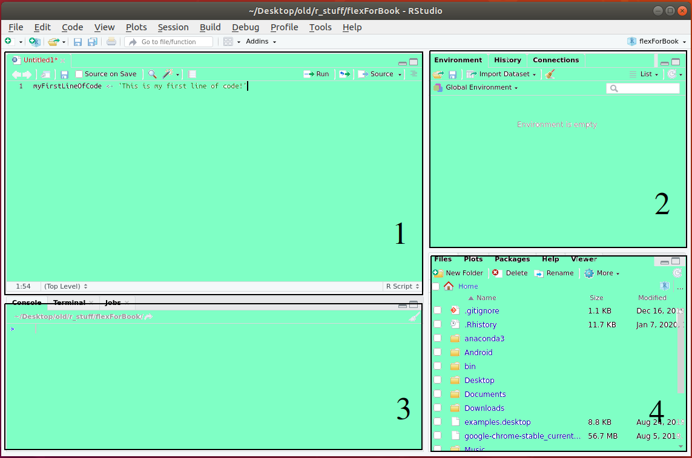

# First Three Months (Maggot) {-}

Congratulations, you’ve accepted that job offer and are just waiting for that first day. The job description mentioned the need for some experience working with data and some good excel knowledge. But during your interviews you noticed something; your interviews were more on the technical side and a lot of people in the office were using those dark screen hacking terminals that you’ve only seen on TV. Nobody told you that you needed to learn programming, but you’re suspecting that you just might have to.


::: {.infobox .note data-latex="{note}"}
Disclaimer: I don’t expect your situation to be similar. It doesn’t have to be. You might be looking for a job and just trying to improve your chances, or you already have a job and want to acquire a new skill. To keep this book somewhat interesting, as I mentioned before, we will follow my path to R proficiency. Hopefully, you can relate to my story.
:::

Anyway, you sit home and google some R tutorials and don’t really know where to start. Before I list some good resources that I used to start, we’re going to need to install R and R Studio on your computer. First, what is the difference between R and Rstudio? R is a programming language just like any other language; before you start using it, it has to be installed. If you ever played video games on your computer, you should be familiar with those damn messages: install the latest C++ dll something. Basically, when you see this message, it means that the programming language that your game runs on is not there or is outdated. Once you install that update, your game runs. Games are built using computer languages (usually, something like C++ or C# for big games and Java or Python for small ones). When you are playing a game, there are scripts running in the background that you do not even see. Same is needed to start coding. In our case, we need to install R. What is Rstudio then? Rstudio is basically a notepad (also called text editor) that understands the R language and makes it run. There are many text editors out there, but Rstudio is built specifically for R and it’s the one you should use. Once you develop your skills a bit more, you can start looking at other text editors. For example, the most popular general use text editor right now is Visual Studio Code. You can use it for R, but it’s not built for data analysis so don’t worry about it right now. Let’s jump straight into the Rstudio installation process.


::: {.infobox .caution data-latex="{caution}"}
I won’t hold your hand too much during the installation process. If you want to actually learn to code, some things you’ll have to figure out on your own. Both R and Rstudio will run on every major operation system. For example, I am using Linux Ubuntu, but I also have them installed on my windows PC at work, and I previously used them on MAC as well. Once installed, everything will run just the same on any platform. So, go to [one of R repositories](https://mirror.las.iastate.edu/CRAN/) to install R.
:::
 

<center>


</center>


After that is done, go to the [Rstudio page](https://rstudio.com/products/rstudio/download/) and install the latest Rstudio for your system. 


<center>


</center>


That’s it. We are ready to start coding. Well, in your case, let the horrible grind of the first few weeks begin!

## Messing Around

Your boss sits you down and tells you: play with R for a while, I’ll give you your first task in a couple of days. Your first few days at the job are slow and encouraging. You are meeting new people and everything is nice. Things are being installed on your computer and, for now, you’re just reading some literature about your organization and some of the latest initiatives. Your boss gives you some space to settle down and play around with your new setup. He tells you that your first task will be cleaning some of his old code. Your naive ears hear, take your time, your first assignment will be easy, you will just add some commas and some narrative to my code. Nothing to worry about. 

### First Script

First thing to do is to open the Rstudio. When you open it for the first time you should see something like this:


<center>


</center>


Go ahead and create your first script. For that, go to the upper left corner, click on the + icon, and chose the R script option, which should be first. You should see something similar to the picture below. Get used to this view as it will be the one you will be seeing a lot from now on.


<center>


</center>


### Layout

Rstudio is quite a complicated text editor. It has a shit ton of advanced features and settings. I myself don’t even know most of them, and absolutely encourage you to look into them once you know what the hell you’re doing. And since right now you probably don’t know what the hell you’re doing, you will only focus on the things you need to start. There are only four areas of the screen that you need to know about now. And I also drew it for you on the screenshot (see below). The first screen is where you’ll write your code. This is your main area. Go ahead and write this:

```{r out.width='80%', fig.asp=.75, fig.align='center'}
myFirstLineOfCode <- 'This is my first line of code!'
```


<center>



</center>


Click 'Run' (the upper right side of the main area) (see below). Instead of clicking 'Run' every time, you can just highlight the chunk of code that you’d like to run and press 'Ctrl + Enter'. Also, you can just click anywhere on the code that you want to run and press 'Ctrl + Enter', same thing. Go ahead, and try all three. A couple of things just happened. In the area number two, you should now see the variable 'myFirstLineOfCode' as well as what is inside of that variable - 'This is my first line of code!' In this window, you will be seeing all the variables, tables, and other data that you created or imported. Whatever is available at the moment.


<center>


</center>


What else happened? In the view number three, you can see the code that you ran (see below). If you ran it three times, you would see it three times. The main use case of this area for us to check if our code is running, finished running, or generated errors or warnings. Let’s generate an error. Type your name without parentheses in the view number one and run it. It should generate an error in the view number three (something like: ‘Error: object ’Nikita’ not found’).


<center>


</center>


Just like this, we know something is wrong with our code. This is not all the third view can do, but this is how we’re going to be using it. Just for the sake of awareness, I would like to show you what else it can do. Type this in the third view (see below):

```{r out.width='80%', fig.asp=.75, fig.align='center'}
  test <- 'testing the third view'
```


<center>


</center>


Hit 'Enter'. Same as the main view, it ran this code without clicking Run or 'Ctrl + Enter' and stored the result in the second view. The difference is the code is now gone. It’s useful to test your code or to run something quickly, but we won’t be using it now. Just wanted to show you. Now, let’s look at the view number four (see below).  


<center>


</center>


This view won’t be super useful for us now so don’t worry about it right now. Basically you should be seeing the folder that you are currently in. Also, when we create graphs and maps, they will appear there. That is about all you need to know about the fourth view right now. In fact, this is about all you need to know about the layout. Let’s move on 

### Saving R File

Now, let’s save this file and see where it goes. When you’re new, there’s always that fear that you’ll break something and won’t be able to get it to work again. One thing I want to do right from the start is kick that fear out of you. To do that, in this and the next few sections, we’ll try to do some things that will seem damaging to your setup. I’ll show you that you can’t really do much damage or lose a lot of data by doing routine operations, and if something really goes wrong, you can restore things. So, go ahead and save our script by clicking the floppy disk icon on top (I hope, I do not need to explain to you how to save files. This operation is pretty universal) (see below). 


<center>


</center>


Now, close the Rstudio. Go to the folder where you saved your file and open it. You should be where you left off. 

### Simulating a Problem.

Now, let’s simulate a problem. Let’s see what happens if your Rstudio session freezes or your computer just crashes. So, lets add another line of code to our script and see what happens if we forget to save it and windows messes up again. Go ahead and add this line of code right under the first one:

```{r out.width='80%', fig.asp=.75, fig.align='center'}
mySecondLineOfCode <- 'This is my second line of code!'
```
  
Run it. I hope you remember how. Now, do me a favor, open the activity monitor by pressing 'ctrl + alt + del' and selecting it if you are on windows. Kill the Rstudio process (see below). 


<center>


</center>


We never saved our code; imagine you had hundreds of lines of code that you never saved (obviously, that would be stupid, but happens). 

::: {.infobox .note data-latex="{note}"}
It happened to me a few times with excel and word, and I did not have auto-save enabled and I lost hours of my life rewriting things, because windows decided to mess me up.
:::
 
Fortunately, this won’t happen to you with Rstudio. Now, do not open the file that you saved, instead just open Rstudio again. Yes, you need to open a completely new Rstudio session. If you are on Windows for example, go to start, find Rstudio and click on it; if it is on your desktop, open from there. It should open with that second line there.

We just simulated a hard stop of your Rstudio session. That should eliminate some portion of the fear about losing your progress. Things like that happen more often than you think. If you’re loading more data than you RAM can handle or if you have a weak CPU, chances are you will see freezes quite often. You will deal with this a lot; restarting your computer and reopening R sessions. Your code in most situations will still be there.

::: {.infobox .tip data-latex="{tip}"}
Tip: 8 gigs of RAM is absolute minimum for working with data, 16 is OK. I have 16 at home and 64 at work, for example. That is in 2019-2020.
:::

### Re-installing RStudio

When you are just starting, you are going to end up experimenting with your setup quite a bit. That might or might not lead to breaking things, or, at least, to having them work in a way you didn’t expect. What do you do? Just not experiment? Not really. It is just like with learning to ski or snowboard; first thing you need to know is how to stop. If you learn how to stop first, then, no matter what, you’re safe and probably won’t break your neck. Same here, when you know that you can always start from scratch, you’re in control, and you learn faster. So, let’s imagine that we did something that made our Rstudio setup really unusable. There is nobody to help us. What do we do? 

::: {.infobox .tip data-latex="{tip}"}
Sage Tip: Delete and reinstall. Proven method, patented by myself.
:::
 
Go to your control panel if you are on windows and delete Rstudio. If you are on MAC, just drag it to trash. If you are on Linux, I expect you to know what to do. Now, just follow the steps that we used to install it. When you open it, you will have a clean Rstudio; but you’ll still be able to easily access all the code scripts that you saved so far. Go ahead and open your new Rstudio. Once opened, go and open that script that we saved. You should see the same line of code that we had (see below):


<center>


</center>


### Messing with Packages

As a final step of kicking the fear of screwing up your setup, we are going to install a few packages and remove them. Packages and Libraries are used interchangeably in R; they mean the same thing. Any Joe Shmoe can write and publish a package in R, given enough knowledge. A package is just a collection of functions that make your life easier. It can even be just one function. For example, R has a number of built-in functions like read.csv() for reading csv files. Some guy thought that he could do better and wrote his own function that reads CSVs faster and gives you more options. That function is called fread(), and it is a part of the data.table package. In order to use it, you first need to install the data.table package. There are tons of packages out there, and we’ll be using a lot of them. Packages for files, maps, aggregations, graphs, web apps, etc. I hope you’re getting it so far; we are going to dive deeper into packages a bit later. For now, let’s just install a few. Go to the top of our script, even above our first line of code. Yes, just move it a few lines down. Write this:

```{r eval=FALSE, out.width='80%', fig.asp=.75, fig.align='center'}
install.packages('data.table')
install.packages('dplyr')
install.packages('shiny')
```

Highlight all three entries and ether press ctrl + Enter or just click Run. You’ll see a bunch of cool looking installs going on. Wait till everything is done. Now, how do I tell that it’s done? In the top right corner of the third view you should notice a red circle with sign ‘stop’ on it. You will only see it when RStudio is busy, in other words, when something is running. Once that red button goes away, that means it’s done. Now, these three packages are installed and you don’t need that code there anymore. Erase those three lines and instead write these:

```{r eval=FALSE, out.width='80%', fig.asp=.75, fig.align='center'}
library(data.table)
library(dplyr)
library(shiny)
```

Highlight these three now and run them. And that’s it, you installed and loaded your first three packages/libraries. Your session should look like this now:


<center>


</center>


Now, it is time to uninstall these. You would ask, why? Why the hell not? But seriously, there are two reasons. First of all, I want you to know how, and secondly, sometimes a package may conflict with another package resulting in your code messing up. Sometimes a package just won’t update and will start kicking errors. It’s not always straightforward and obvious what’s happening. We’ll be installing so many different packages that one day everything might be working smoothly and the next day your code is just not running. 


::: {.infobox .note data-latex="{note}"}
Then, you end up just like Nicholas Cage in ‘Gone in 60 Seconds’ talking to your code just like he did to his car Eleanor - ‘Come on baby, do not be like that, please work’.
:::
 

To make sure you don’t sit there for too long, like I did, figuring that stuff out, I’ll teach you a few troubleshooting tricks. Let’s come back to uninstalling our packages. Run the following:

```{r eval=FALSE, out.width='80%', fig.asp=.75, fig.align='center'}
uninstall.package('data.table')
uninstall.package('dplyr')
```

Erase these two lines. If it worked, running the following will not work, because the packages are not there anymore: 

```{r eval=FALSE, out.width='80%', fig.asp=.75, fig.align='center'}
library(data.table)
library(dplyr)
```

Good. What about the third one? Let’s simulate another problem. At some point, eventually, you will encounter a strange piece of work error – you will be trying to load a library, but it will say that there is no such package or something. You will then try to install that package and it will either install it or will tell you that that package is already installed. You will then try to load the library, but the same annoying stuff will happen again and again and again. You will be like, ‘WHAT DA HELL?!. You’ll then try to do what we have just done and will try to uninstall that package. It might say something like: package is not there and cannot be uninstalled or it will uninstall it but when you repeat the whole circle again, same result. What’s happening? You might have opened a second RStudio session at some point, and it started installing packages to different folders. You don’t have to completely follow this logic. Just remember. If something of this nature is happening to you, here is how to fix it. We are going to locate the folder where our packages are getting installed into. Then, just find the package folder in question and freaking delete it. It might tell you that the folder is in use and cannot be deleted, just restart your computer and delete. After that, open your script that you had the problem with, install that package, and load the library, everything should work fine now. 

::: {.infobox .note data-latex="{note}"}
So, let’s do it for the Shiny package. Save your script, close RStudio. If you are on Windows, your R folder should be in the Documents. So, go to Documents/R/R-…/ and delete the ‘shiny’ folder. If it is in use, restart your PC, come back and try deleting again. 
:::

Let’s confirm. Open your script again and try:

```{r eval=FALSE, out.width='80%', fig.asp=.75, fig.align='center'}
library(data.table)
library(dplyr)
library(shiny)
```
Non should work, because we uninstalled the first two libraries in the previous steps and the ‘shiny’ library manually. That’s it. This is how you do a soft and hard delete of your packages. This concludes our R-fear exorcism ritual.

### Dark Mode

::: {.infobox .caution data-latex="{caution}"}

One thing that you must do, and I can’t emphasize 'must' here enough, is to switch your RStudio color theme to a dark mode. If you don’t do this, your code will not work. On top of that, people will think that you’re a noob. The darker your screen is the better coder you are. Proven by scientists. This is a joke, of course, but I do want you to change to the dark mode. From experience, it helps you focus better and keeps your eyes more relaxed. Also, it does look like you know what you’re doing if your screen is dark. It shows that you’re advanced enough to tinker with the text editor settings. When others see you as advanced, you’re automatically creating that level of expectation for yourself to get better, which, in turn, speeds up your progress. Every time that I helped some of my colleagues at work with their code, by far the most painful part of the experience for me was looking at their bright noob screens. Therefore, go to the ‘Tools’ on top of the Rstudio → Global Options → Appearance and in the editor theme pick ‘cobalt’. 


<center>


</center>


That’s it. All that ranting was just for this. Now, this book will have the white theme. Why? Because when I will decide to publish, I do not want to spend a fortune on color, that would be stupid. But you should know, I will be creating illustrations for this book wearing sunglasses. What a hypocrite, right? Maybe I will switch to cobalt as well later. You will notice if I do.

:::


### Second R Session.

Another trick I want to show to you is using multiple Rstudio sessions at the same time. You see, R is a single process language, which means that it can only tackle one command at a time. Commands are the lines of code that we were just running. The following is a command:

```{r eval=FALSE, out.width='80%', fig.asp=.75, fig.align='center'}
mySecondLineOfCode <- 'This is my second line of code!'
```

Each assignment like this, or a call to a function (like install.packages() or library()) is a command and is processed one at a time in the order that you have written it. In most cases, you will never even notice or it will not be a problem, because it is so quick. 

::: {.infobox .note data-latex="{note}"}

However, there are going to be many many many cases when a command will be taking an insane amount of time, and you will have to sit there like a steaming piece of work and wait for that command to run before you can execute the next one. In most cases, a command that would take a long time to run is something like a SQL call to some old and slow or just overloaded database. I have wasted some good hours of my life interacting with such piece of work databases. Sometimes, I waited for one to four hours at a time for my SQL command to run before I could continue. In the most extreme cases, I had to leave the script running overnight to come back in the morning to see that It has not finished, and be like: ‘NOOOOO!!!’. API calls will give you similar issues, but less often. 

:::

Anyway, do not be super afraid as it does not happen all the time, especially in a modern setup, and when it does, it’s not really your fault. There is not much we can do to make a process run faster. When you become a little bit more advanced, you’ll be able to, maybe, break your database pulls into segments to speed them up a bit and to have more control over them. You can also, sometimes, use parallel processing to assign tasks to different cores of your computer processor. These are more advanced topics and you don’t need to worry about them for now. The simplest solution right now is to just let that long process run for as long as it needs to, but at the same time doing something else in another Rstudio session. Yes, just open a second Rstudio and create a new script in there. Before, I mentioned that you can run into some issues with your packages if you are working in two sessions at the same time. Yes, you can, but it’s not worth worrying about it. You will not learn anything unless you run into the issues like that. You live, you learn. And you already know how to fix them if you do, right? Most of the time, I have three to five sessions opened at the same time. It is helpful not only to hack around a slow code, but also as a point of reference when working on a new project. You will be reusing your code a lot and having it opened and available for copying and pasting in front of you is very useful. 

I do not want to be an all talk but no-show kind of guy, so I want to actually show you how all this works. We’re not pulling big and long data from databases yet, but I do want to show you what a busy session looks like. I will write a loop that prints a piece of text every few seconds. You are not ready to learn loops yet, but basically, a loop will make my text print for as many times as I tell it too, and until it is done, the Rstudio will be busy, and we will not be able to use it. So, you can stay on the same script or you can open a new one. You don’t have to save anything, we are just practicing. Type the following in the view number one:

This line creates a sequence of numbers from 1 to 25 and stores them in the variable ‘sequence’.

```{r eval=FALSE, out.width='80%', fig.asp=.75, fig.align='center'}
sequence <- seq(1:25)
```

This loop reads like this: for each thing inside of the variable ‘sequence’ (so, for 1,2,3,4,5….25) print ‘im busy’, then wait for four seconds and do it for the next thing in the ‘sequence’. Once it is done going through the sequence, it will continue. In our case, it will print ‘done’. 

```{r eval=FALSE, out.width='80%', fig.asp=.75, fig.align='center'}
for (i in sequence){
  print('im busy')
  Sys.sleep(4)
}

print('done')
```

Here, I’m just trying to simulate a busy Rstudio session. I am using a loop for this. In the real world, the place of that loop will be taken, let’s say, by a lengthy database pull, and the place of the print(‘done’) will be taken by some other functions, which, let’s say, will do something to the data that the pull will return. I hope that it is clear, but it does not have to be. You should not be looking into loops just yet. The only purpose of this loop is to keep Rstudio busy. Now, let’s do it again. Run all three. Notice how things are being printed in the view number three. Also, notice the red stop button in the corner of this view. This means that the session is busy, right? Now, open another Rstudio. Create a new script and write a command there. You can write:

```{r eval=FALSE, out.width='80%', fig.asp=.75, fig.align='center'}
something <-  'I can do whatever here'
print(something)
```

Now, run these two lines. As you can see, they ran even as the other Rstudio is still executing its loop. There you go.

This is all you need to know about the layout and working with Rstudio in general . . . for now.

---

<a rel="license" href="http://creativecommons.org/licenses/by-nc-nd/4.0/"></a><br /><span xmlns:dct="http://purl.org/dc/terms/" property="dct:title">R, Not the Best Practices</span> by <span xmlns:cc="http://creativecommons.org/ns#" property="cc:attributionName">Nikita Voevodin</span> is licensed under a <a rel="license" href="http://creativecommons.org/licenses/by-nc-nd/4.0/">Creative Commons Attribution-NonCommercial-NoDerivatives 4.0 International License</a>.
