# Big Assignment {-}

You are back at the office. It is Monday, your second week. You are excited. You are learning things that you want to be learning. Before your boss left for whatever last week, he told you that your first assignment will involve cleaning his code and doing some vehicle data work. Up until now, you have been learning non-stop. Not because they told you to, but because you think it is the right thing to do. You want to get ahead and you genuanly enjoy doing it. You have made some great progress with some basics of the language. Now, you are ready to gradually take on the assignments.

## Code Run-Through

Well, it does not always happen as you picture it in your head. Your boss sits with you and says, 'Here is the code that I had been working on for some time a while ago. It does some things that we want, but it can be improved. I am going to run you through it and then explain what I want you to do to it and what to add.'

::: {.infobox .caution data-latex="{caution}"}

We have two tables that hold vehicles' information in our database. The first table holds vin numbers of all our vehicles. This table is updated daily, because we have new vehicles coming in every day. The second table holds detailed information about those vehicles (columns are: vin, date_added, expiration_date, make, model, year, type, engine_type). The code that creates this table is the one that you will be taking over. You will be updating it a few times a month. Here is how it works:

- 1) You will pull the new vin numbers that got added today;
- 2) Make sure that they have not been processed yet; 
- 3) Add all the required fields by pushing new vin numbers through thr API and code that I am providing for you; 
- 4) Add the finished dataset for that day to the one that we already have in the database. You will be running this every day for now;
- 5) Every month, we will be sending completed monthly files to IT. They will be taking it from there. 

Once you are done and comfortable with that, I will explain the changes to the code that I want you to implememt. 

:::

You watched the lips of your boss moving, but were not understanding 75% of what was being said. You nodded like a dumb smiling puppy, but your eyes displayed zero intelligence. At that point, your heart picked up the pace and you felt the urge to urinate in your pants. All your cockiness was gone and what was left was one question: 'How long until I am fired for being an incompetent degenerate that I am?'

It was not even the end. Next came the code.
 
### Step 1

First, we are going to load some libraries. You will not need all of them, but it will save you some time to have all of them loaded anyway. We are also going to connect to our database. You will be using multiple tables from that database, so you better learn how to join different tables together. 

Loading the libraries.
```{r  message=FALSE, out.width='90%', fig.asp=.75, fig.align='center'}
# Lubraries.
  library(lubridate) 
  library(data.table) 
  library(dplyr) 
  library(openxlsx) 
  library(tidyr) 
  library(fst) 
  library(stringi)
  library(zoo) 
  library(ggplot2) 
  library(scales) 
  library(tibble) 
  library(RMySQL)
  library(pbapply)
```

Connecting to the database
```{r include = F, out.width='90%', fig.asp=.75, fig.align='center'}
# Connecting.
connection = 
  dbConnect(
    drv = MySQL(), 
    user = "fallenangel1", 
    password = 'nvoevodin', 
    host = 'mybookdatabase.cgac79lt7rx0.us-east-2.rds.amazonaws.com', 
    port = 3306, 
    dbname = 'nikita99')
```

```{r eval = F, out.width='90%', fig.asp=.75, fig.align='center'}
# Connecting.
connection = 
  dbConnect(
    drv = MySQL(),
    user = "xxx",
    password = 'xxx', 
    host = 'mybookdatabase.cgac79lt7rx0.us-east-2.rds.amazonaws.com', 
    port = 3306, 
    dbname = 'nikita99'
    ) 

```

### Step 2

::: {.infobox .note data-latex="{note}"}

Note: Obviously, the data in not updated live in this book. We will be simulating that part. Today is January 1st 2018. The second table in the database holds complete vehicles' records up to the last day of 2017.

:::

Lets see how many new vehicles we got today. We will assign today's date to a variable and then pull the vin numbers from the first table only for that date.

```{r out.width='90%', fig.asp=.75, fig.align='center'}
# Creating today.
today <- '2018-01-02'
# Pulling.
lastVins <- dbGetQuery(connection, paste("SELECT
`expiration date`, 
`base type`,
`vehicle vin number` as vin, 
first_seen as date 
FROM book_table 
where first_seen = '", today,"'", sep = ""))
```

### Step 3

We need to make sure that there are no white spaces around the vin numbers. After that, we will store the vin numbers in a vector so we could push it through the API.

```{r out.width='90%', fig.asp=.75, fig.align='center'}
# Eliminating white spaces.
lastVins$vin <- trimws(lastVins$vin)
# Creating vector of vins.
vinVector <- lastVins$vin
```

### Step 4

Time to retreve the vehicles' data that we want. For that, we will be using the API provided by the National Highway Traffic Safety Administration (NHTSA). The API needs a vector of VIN numbers and returns a table with many many fields, from which we will only select the ones that we want.

Writing a function to call the api:
```{r out.width='100%', fig.asp=.75, fig.align='center'}
# Function.
return_vins <-  function(my_vin){
  vinme <- 
    paste0(
      'https://vpic.nhtsa.dot.gov/api/vehicles/DecodeVinValues/',my_vin,'?format=json'
      )
  vinme = httr::GET(vinme)
  result = jsonlite::fromJSON(httr::content(vinme, as = "text")) 
  result = as.data.table(result)
}
```

Calling the function and making sure that if there is an error or an empty vin number, the code does not stop and moves to the next one instead.

Files are written one by one into the data folder.

```{r message=FALSE,out.width='100%', fig.asp=.75, fig.align='center'}
# Loop.
vin_results <- pblapply(vinVector,function(empty_vin){
  
  tricatch_result=
    tryCatch({
      return_vins(empty_vin)
      
    }, error=function(e){cat("ERROR :",conditionMessage(e), "\n")})
  
  
  tryCatch({
    fwrite(
      tricatch_result,paste0("data/vin",tricatch_result$`Results.VIN`,".csv")
      )
  }, error=function(e){cat("ERROR :",conditionMessage(e), "\n")})
  
  Sys.sleep(.001) 
  tricatch_result
})
```

Binding all the files from the data folder into a data frame.

```{r out.width='100%', fig.asp=.75, fig.align='center'}
# Binding.
NHTSAtable <- list.files('data/', pattern = '.csv') %>%
  pblapply(function(x){
  read.csv(paste0('data/',x),stringsAsFactors=FALSE)[, c('Results.VIN',
                                                        'Results.Make',
                                                        'Results.Model',
                                                        'Results.ModelYear',
                                                        'Results.FuelTypePrimary',
                                                        'Results.FuelTypeSecondary')]
  }) %>% rbindlist()
# Eliminating extra files.
unlink("data/*")
```

### Step 5

Finally, we are going to pull the second table from the database and combine it with the data that we just got.

```{r out.width='100%', fig.asp=.75, fig.align='center'}
# Renaming.
colnames(NHTSAtable) <- c('vin','make','model','year','gas1','gas2')
# Joining.
lastVins <- left_join(lastVins,NHTSAtable)
# Pulling the complete vehicles' data
old <- dbGetQuery(connection,"SELECT * FROM fin_book_table")
# Eliminating the first column
old <- old[,-1]
# Renaming to match columns in 'lastVins'.
colnames(old) <- c('expiration date','vin','year','base type','date',
                   'make','model','gas1','gas2')
# Binding complete old data with new.
final <- rbind(old, lastVins)
```

### Step 6

Lets write this out as a separate CSV file with today's date.

```{r message=FALSE, nice-fig25, fig.cap='Here is a nice figure!', out.width='90%', fig.asp=.75, fig.align='center'}
# Saving.
fwrite(final, paste0('vehiclesComplete_',Sys.Date(),'.csv'))
```

This is it for now! Your boss says: 'I know this is complicated and I do not expect you to get it right away. I am giving you a generous amount of time to get familiar with this code. I expect you to be able to reproduce this within six weeks on your own. I will want you to add quite a few things to this. Before I explain, lets give it a week or two for you to practice with this code. Feel free to stop by and ask me any questions about this. Good luck, see ya later."

## Figuring It Out

Well, what do you think? Piece of cake? Or piece of shit? I can tell you, when I first saw this, I thought to myself: 'I am fucked!' I honestly, did not understand anything from that. I sat there for an hour or two just mindlessly staring at the screen afraid to touch the keyboard. This code was shown to me in the morning. During the lunch break, I literally called my mom and said that I do not know what the fuck I am doing. That code was just that to my eyes: a code. I did not see the difference between variable names and functions; I did not know why the commas were where they were; I did not know why some brackets are square and others are round; I did now know anything; and I did not know where to start.

::: {.infobox .note data-latex="{note}"}

In this book, I tried to lead you to this moment so you would be more or less prepared. Still, I do expect you to be lost right now, because the code in this section is very advanced for any beginner. Code like this, takes you out of you comfort zone and makes you think. In other words, it makes you pee your pants.

:::

What are we going to do about it? How are we going to understand that code? Simple, we are going to go line by line to understand what each piece of code does. After that, we are going to try to rewrite some of the code to realize that a lot of things in R can be accomplished by different functions. That, in particular, helped me make that code mine. By rewriting it using different functions I fully understood it and ultimatelly made it mine. Before we dive into that, I think it is a good opportunity to talk about a very important topic. It is called 'Tutorial Purgatory'.

## Tutorial Purgatory

::: {.infobox .tip data-latex="{tip}"}

What is the tutorial purgatory? Even if you do not know what it is already, you have probably experienced it in your life at some point. Be it while learning to code or learning something else, symptoms are the same. In the programming world, tutorial purgatory is the state when you walk through a bunch of tutorials without putting what you are learning to actual use, and without retaining much of it. You are not quite confident in your abilities to start your own project, because you think that you need to know close to a 100% of what, you believe, is necessary to finish it. You feel like you do not know enough and, therefore, you must watch a tutorial or go through a whole course. You finish the course and finally sit down to work on something, only to realize that you still do not know what to do. You ask yourself: 'Maybe I missed something? or maybe there is a better tutorial?'. And instead of starting the project, you go back to youtube or worse, drop the idea. Similarly to procrastination, you push the responsibility of hard work as far away as possible until it bites you in the ass. This is what the 'Tutorial purgatory' is, in my words.

There are a few things that make the situation worse. There are so many nice tutorials out there today. Both, paid and free. Every other homeless guy, now, has a youtube channel along with a udemy course where he teaches you to do something in just 3 days. Most of the tutorials are a 'follow along' type. This is where the devil hides. In the 'follow along' tutorial, you are, basically, just copying and pasting somebody else's code. The illusion of learning comes from not just copying and pasting the code, but from retyping it instead. The code will be perfect and will run flawlessly. The problem with that is that you will not learn anything from it. You will copy the code, the app or site or whatever will work, but you will not be able to replicate it yourself. Also, in most cases, the author will teach you the best practices from the start and will not show you how he actually got to it. That type of code is good for display, but is bad for learning from, and a lot of times you will find yourself frustrated, because you can not follow it, because you never actually went through the 'ugly' code first. If you are persistent, you might struggle through it and finish copying his code, but it will not lead to you understanding it. The second problem and, in my opinion, by far the worst, is platooing and jumping from technology to technology.

I place 'jumping from one technology to another' in the same bucket with the tutorial purgatory, because they both have the same root and outcome. The root would be a lack of motivation and persistence as well as the sheer number of talking heads telling you that learning something else is hotter now. This is how it works. You sit down to learn R, for example. You go through a few tutorials and everything seems fine. You are making some quick progress and are very exited about this new technology that you are learning. Good for you! After a while you get less and less exited about the progress that you are making. You are platooing. Or else, you reached a topic that takes more than a few minutes to understand. At that moment, the thought that this is either boring or too hard starts creeping into your head. You open youtube and are faced by all the jesters telling you that they will teach you something else, something more exiting, in no time. You watch a few more videos about what technology is the hottest right now and how the one that you picked stacks up against it. The best case scenario here is you just wasted a whole bunch of time and sat back down and keept on going. The worst - you installed that other hot language and went on making that quick and exiting initial progress. That exitement runs out eventually and you are at square one, again, having wasted so much more time. These were the roots. Very similar to the tutorial purgarory, right? Be it boredome or self-doubt preventing you from sticking it out. You going in circles and not making any substancial progress that would set you apart. The outcomes are the same as well. In both cases, you are unable to get to the level where you can put your skills into practice. You either watch others or swayed into doing something else.

This is it on this topic. I am quite confident that you can relate to this. There might be better, more thorough explanations of this phenomena, however, my aim here is, in simple terms,  to explain to you that 99% of us went through these things and that you should not. Just keep going with one thing, untill you made some substantial progress, which you can put to use.  Ok, lets keep going. 

:::


## Going line by line

There is no reason why you should be able to understand what is going on in the code that your manager just walked you through. The only way for you to understand it is to run each line time an time again and see what is happening. From my experience, attempting to understand the code that someone else gives you is the best practice if your goal is to actually learn something. Too many times I saw people copy and paste somebody elses code only to find themselves stuck later once that code breaks or needs modification. Ultimatelly, we want to, first, go line by line to see what each function does. Once we understood how it works and how it arrives to the final result, we can, then, see if it can be simplified or rewritten in some other way. These two steps will result in us mastering that particular code. This, in turn, will allow us to build on top of that code if we choose to. For example, if you completely understand the code, it will be much easier to modify it to do something else. Imagine that you do not understand the code that somebody else gave you, at all. It produces the result that you want just fine, and all you need to do is to run it once a month. Now, a database name that your code is pulling data from changes, and your code does not do anything anymore. Since you never put time into understanding the code, you do not even know where to begin looking for the problem. Unless the result of that code is very important for your team or company, there is a very big chance that you will just stop using it as 'not working'. If only you knew where to look, it would have taken you two minutes to see what is wrong and you would go to see a database admin to check the new database name. 

That was one simple example of not owning your code. Another would be when you need to pivot your code to do something else. If you do not understand how your code works, you will not be able to tweak it to do something else. Instead, you would probably opt to write something from scratch if you can. Worse, something that would take you a few hours of tweaking will become a whole big thing with timelines and delays, because you do not know where to start. These things are just common sence, but you will be surprised how many people opt to just copy and paste without looking into things. Do not be like that, you will just shoot yourself in the leg. 

Before we can master our manager's code though, we need to go line by line and see what is going on there. The code was in steps, and, I think, it would be right to explain it in steps as well.

### Step 1

Here, we loaded the libraries that we will and will not be using, and connected to our database. I personally found it to be a major time saver to drag all the libraries that I will on will not be using along from one project to the next. You might find a much better technique, but for now just drag them. It is very annoying when your code is not working because you forgot to load a library. We have already covered libraries in the basics chapter, so I will not spend much time on it here. I will, still, leave some pointers of what each library generally does.

```{r message=FALSE, out.width='90%', fig.asp=.75, fig.align='center'}
# Loading the libraries

  library(lubridate) # for working with dates/times
  library(data.table) # ecosystem for working with tables
# and averall data manipulation
  library(dplyr) # another ecosystem for working with tables
# and averall data manipulation (will be our primary)
  library(openxlsx) # to load data from excel
  library(tidyr) # for data manipulation
  library(fst) # for loading fst files 
  library(stringi) # for manipulating character strings
  library(zoo) # for working with dates/times
  library(ggplot2) # for nice graphs
  library(scales) # combines with ggplot2 for scaling
  library(tibble) # for working with data and tables
  library(RMySQL) # for sql queries using mysql database
  library(pbapply) # looping function with progress bar

```

Then, we connected to our database. I have also gone through this part in the basics. 

::: {.infobox .note data-latex="{note}"}

We are using the MySQL database, which is the most popular free database today. At work you might have something different. In most cases, You are going to have someone setting this part for you, so there is not much to explain to a begginer here. You will be given all your credentials to access the type of database that you will be using, and the connection code will be very similar every time.

:::
 
Here, we are storing the connection (result of the function dbConnect() inside the variable 'connection'. We will be using that variable inside our SQL queries to excecute them. You will see in a bit.

```{r include = F, out.width='90%', fig.asp=.75, fig.align='center'}
# Connecting.
connection = 
  dbConnect(
    drv = MySQL(), 
    user = "fallenangel1", 
    password = 'nvoevodin', 
    host = 'mybookdatabase.cgac79lt7rx0.us-east-2.rds.amazonaws.com', 
    port = 3306, 
    dbname = 'nikita99')
```

```{r eval = F, out.width='100%', fig.asp=.75, fig.align='center'}
# Connecting.
connection = 
#specifying database type. 
  dbConnect(drv = MySQL(), 
# username
            user = "xxx", 
# password
            password = 'xxx', 
# address
            host = 'mybookdatabase.cgac79lt7rx0.us-east-2.rds.amazonaws.com', 
# port
            port = 3306, 
# name of the database
            dbname = 'nikita99') 
```

### Step 2

In this step, we used the connection to the database that we just established to extract one day of new vehicles from it. 

Storing the date that we are interested in in the variable 'today'.

```{r out.width='90%', fig.asp=.75, fig.align='center'}
# Getting today.
today <- '2018-01-02'
```

The function dbGetQuery() here, takes two inputs: connection and the actual SQL command. Connection is what we created in the first step. We just called it 'connection', but you can call it anything. The second input is the actual SQL command ("SELECT ...."). Here, it is also wraped in the function paste(). This is done so we can paste the variable 'today' into the SQL language. When we will be rewriting this code, I will show you how it can be simplified. 

We are selecting four columns. As you can see, some of them are surrounded with ticks (``). This is done because you can not have spaces in column names in SQL. Ticks is a way around that limitation, but generally, you should avoid using spaces when naming columns in your databases, and everywhere else as well. Also, notice that one of the columns is renamed 'as vin'. Renaming columns like this makes it easier to work with the data later. You can rename any of them if you want.

```{r out.width='90%', fig.asp=.75, fig.align='center'}
# Pulling.
lastVins <- dbGetQuery(connection, 
paste("SELECT
`expiration date`, 
`base type`,
`vehicle vin number` as vin, 
first_seen as date 
FROM book_table 
where first_seen = '", today,"'", sep = ""))
```

In the end, you can see the variable 'today' wrapped in a lot of punctiation. That punctuation allows us to paste a predetermined date (2018-01-02) as a variable from outside of the SQL pull. It is quite confusing in the beginning, but as you use SQL inside of R more and more it will definitely make more sense. the sep = "" input tells the function paste() to eliminate spaces when it pastes SQL language with the content of the 'today' variable ('2018-01-02'). As I mentioned before, the same could be done with using function paste0().

### Step 3

We need to make sure that there are no white spaces around the vin numbers. After that, we will store the vin numbers in a vector so we could push it through the API.

Here, we are taking the column 'vin' of the table 'lastVins' and applying the function trimws() to it. The function trimws() eliminates the spaces from the front and back of every entry in the column. Imagine a vin number like this: "  VIN095GHFHGF ". Someone might have mistakenly left two spaces in front and one in the back. R will treat those spaces as characters and you will not be able to match that vin to the same vin in another table if they are not identical. 

::: {.infobox .tip data-latex="{tip}"}

Sage Tip: There might be no spaces to begin with, but it is a good practice to do it anyway just to be sure. That will save you time it a long run.

:::
 
```{r out.width='90%', fig.asp=.75, fig.align='center'}
# Trimming white spaces.
lastVins$vin <- trimws(lastVins$vin)
```

Here, we are storing the column 'vin' of the table 'lastVins' inside of the vector 'vinVector' We are doing that because the API that we are going to be using wants a single vin number as an input. We will write a function that will be retreiving a single vin number at a time and pasting it into the API. But that is later. Right now, we are storing the column 'vin' into its own vector.

```{r out.width='90%', fig.asp=.75, fig.align='center'}
# Creating a vector of vins.
vinVector <- lastVins$vin
# Lets see the first few.
head(vinVector)
```

### Step 4

::: {.infobox .caution data-latex="{caution}"}

Time to retreve the vehicles' data that we want. For that, we will be using the API provided by the National Highway Traffic Safety Administration (NHTSA). The API needs a vector of VIN numbers and returns a table with many many fields, from which we will only select the ones that we want. This will be, by far, the hardest step for you to understand and for me to explain. I am trying to look at this code through your eyes and also remembering how I saw it when I did not know shit. You are definitely are not ready yet to understand how this part works, so, for now, just observe how it works. I will explain every part though. We will also rewrite it later in the book to make it much much simpler looking. However, it is still important for you to understand how this code, even so complex written, works. In my estimation, you will probably be able to replicate it from scratch for some other project in about nine months of learning and using R daily. So, DO come back to this section after some time and see if you get it better.

- Step 4.1. Writing a function to call the api. We will place this function inside of a loop that will feed one vin number at a time to it. So, as the loop goes from the vin number one to number two and so on, this function will kick in for every vin and produce something. We are calling this function 'return_vins'. It takes one input, we are calling it 'my_vin'. We can call it anything, it is just a name. Usually, I use 'x' or 'i' to name inputs.

- Step 4.2. The NHTSA API gives us the address to paste our vins into to get the information back. You do not need to look into that address. Those addresses always look complicated. You just need to follow the API's instructions on how to use them and where to paste your stuff. In our case, we just need to paste our vin numbers where you see 'my_vin' variable in the line below. The reason why we are not pasting an actual vin is because we are not retreaving the information on just one vin but for the whole vector of vins. So, we need a variable that will be changing every time a new vin is fed into the function. Here, we are storing the address with the pasted variable into the variable 'vinme'

- Step 4.3. We then applying the function GET() to that address and in return receiving the response. That response is not yet the data that we want. It is sort of a description of that data.

- Step 4.4. In order to get the actual data from that response, we are applying the function fromJSON() that takes the contents of the response as an input. At this point, we have our data in the table called 'result'.

- Step 4.5. Just to make sure that we are dealing with a data table format, we are converting it again.

:::

```{r message=FALSE, out.width='100%', fig.asp=.75, fig.align='center'}
# Step 4.1.
return_vins <-  function(my_vin){
# Step 4.2.
  vinme <- paste0(
    'https://vpic.nhtsa.dot.gov/api/vehicles/DecodeVinValues/',my_vin,'?format=json'
    )
# Step 4.3. 
  vinme = httr::GET(vinme)
# Step 4.4.
  result = jsonlite::fromJSON(httr::content(vinme, as = "text")) 
# Step 4.5.
  result = as.data.table(result)
}
```

::: {.infobox .caution data-latex="{caution}"}

Next, we are calling the function that we just wrote and making sure that if there is an error or an empty vin number, the code does not stop but moves to the next vin instead. 

- Step 4.6. Here, the function pblapply() creates a loop that takes the vector of vins that we created in the step 3 (vinVector) and feeds one vector a time (empty_vin) into the fuction return_vins() that we just created. 

The function tryCatch() is a very usefull function for loops like this. Imagine we are feeding one vin after another to the API. We are on the vin number fifty thousand and one, and that vin number is empty or just messed up in some way. The API will probably reject it and throw an error. That will probably stop the loop and cost you hours of lost progress. What you want is the code to ignore such cases and just keep going. tryCatch() does just that. 

- Step 4.7. Here, the result of the function retur_vins() with the imput 'empty_vin' (which is one vin at a time) is stored in the variable 'trycatch_result'. If it encounters an error, it will print it in the console and will keep going.

- Step 4.8. After we got the information and stored it in the 'tricatch_result' we are saving each vin with all the data in it in a separate file. Just so you understand it, if we had two hundred vins, we will write two hundred files. Each file is a table with just one row (one vehicle). We will later combine all those files into one.
  
In terms of using tryCatch here, it is the same concept. If, while we are writing files, something goes wrong, the tryCatch() will ignore it and will move on.

- Step 4.9. Function fwrite() takes two inputs: the data that we are saving as first, and the name along with the extention. So, here is what the following means: save the contents of the variable 'trycatch_result' to the folder data/vin/, name it as a current vin number taken from the column named 'Results.VIN' of the table 'tricatch_result' and give the extention 'csv'. The reason why we have to use the function paste0() to paste the column as a name is because the name of the saved file must be different every time. If we wrote something like: fwrite(tricatch_result, "data/vin/VIN#.csv" ) it would overwrite that same file two hundred times instead of generation a new one.

- Step 4.10. Before the loop finishes each round, it falls asleep for a fraction of a second to make sure that the NHTSA API does not kick us out for overusage.

- Step 4.11. After that we print the result of the current round just to see that the data are OK.

:::

```{r message=FALSE, out.width='100%', fig.asp=.75, fig.align='center'}
# Step 4.6.
vin_results <- pblapply(vinVector,function(empty_vin){
# Step 4.7.
  tricatch_result=
    tryCatch({
      return_vins(empty_vin)
      
    }, error=function(e){cat("ERROR :",conditionMessage(e), "\n")})
  
# Step 4.8. 
  tryCatch({
# Step 4.9.
    fwrite(
      tricatch_result,paste0("data/vin",tricatch_result$`Results.VIN`,".csv")
      )
  }, error=function(e){cat("ERROR :",conditionMessage(e), "\n")})

# Step 4.10. 
  Sys.sleep(.001) 
# Step 4.11.
  tricatch_result
  
})
```

::: {.infobox .caution data-latex="{caution}"}

At this point, the loop is at its end. Now it will go back to the beginning to see if there is another vin in the vector. If there is, it will iterate again and again until it goes through every vin.

Finally, we need to put all the files that we just wrote together to create one table out of them. Once we done, the table will be inside of the variable 'NHTSAtable'

- Step 4.12. First thing we need to do is list all the files that we wrote, much like in a vector so we can read them one by one just like we wrote them one by one. The function list.files() does that. We just need to specify the path and a pattern. We know the path and the one thing that every file in that path has in common is the extention, so we will use that as pattern.

- Step 4.13. Now, each filename is fed into the pblapply() loop as 'x'.

- Step 4.14. This step says the following: read the file 'data/x (where x is the file's name that is fed to the function read.csv() by the loop)', then do not convert anything to factors, and only keep the columns specified. In this case, the code is written so that column filtering is happening on the same line. It is called chaining. It does save time and makes code cleaner, but when you are learning it makes thing look more complex than they are. The reason why we are picking these six columns is because the data that we got back have many many useless, to us, columns.

- Step 4.15. Finally, the function rbindlist() puts all the files that we are reading together as one table. So, if there are fifty files in that data folder, there are going to be fifty iterations of our loop and each time the loop finishes its round the rbindlist() will stack the next read table on top of the previous one.

- Step 4.16. At this point we got our final table. Now, we do not need all those files that contain one vehicle each. The following function will delete all files from the specified path.

:::


```{r message=FALSE, out.width='100%', fig.asp=.75, fig.align='center'}
# Step 4.12.
NHTSAtable <- list.files('data/', pattern = '.csv') %>%
# Step 4.13.
  pblapply(function(x){
# Step 4.14.
    read.csv(paste0('data/',x), stringsAsFactors = FALSE)[,c('Results.VIN',
                                                            'Results.Make',
                                                            'Results.Model',
                                                            'Results.ModelYear',
                                                            'Results.FuelTypePrimary',
                                                            'Results.FuelTypeSecondary')]
# Step 4.15.
    }) %>% rbindlist()
# Step 4.16.
unlink("data/*")
```

### Step 5

Again, you should not be able to understand what just happened there. My advice here is to just run this code again and again until you get comfortable with each part. I will tell you now though, that we will be simplifying that code and receiving the same outcome in the next sections. So, do not worry too much if the API part is too confusing right now.

The final two steps will be a breeze compared to the step four. We are going to pull the table with all vehicles from the database and combine it with the data that we just got.

Here, we are renaming the columns so they will match our old columns.

```{r message=FALSE, out.width='100%', fig.asp=.75, fig.align='center'}
# Renaming.
colnames(NHTSAtable) <- c('vin','make','model','year','gas1','gas2')
```

Here, we are joining the data that we just got from the API with the data that we initially pulled from the database in the step 2. We are placing the initial table on the left and the one we want to join on the right. We already know that both have the column 'vin' so we do not need to specify what we are joining on. You can though.

```{r message=FALSE, out.width='90%', fig.asp=.75, fig.align='center'}
# Joining.
lastVins <- left_join(lastVins,NHTSAtable)
```

Here, we are pulling all of our vehicles so we can stack the ones that we just got on top. We are still using the same connection variable 'connection'. We are passing it as the first input to the dbGetQuery() function. The second argument is the actual SQL language wrapped in quotation marks. SELECT * FROM ... means select everything from...

```{r message=FALSE, out.width='90%', fig.asp=.75, fig.align='center'}
# Pulling.
old <- dbGetQuery(connection,"SELECT * FROM fin_book_table")
```

As we pulled the data we noticed that the pull added the index column that we do not need. We will eliminate it with the following code:

```{r message=FALSE, out.width='90%', fig.asp=.75, fig.align='center'}
# Removing first column.
old <- old[,-1]
```

It says: take the table 'old' and eliminate the first column from it. Remember, the left side of the comma there corresponds to rows, the right to columns.

Renaming the columns form the table 'old' so they match 'lastVins'.

```{r message=FALSE, out.width='100%', fig.asp=.75, fig.align='center'}
# Renaming.
colnames(old) <- c('expiration date',
                   'vin',
                   'year',
                   'base type',
                   'date',
                   'make',
                   'model',
                   'gas1',
                   'gas2')
```

Here, we are binding (stacking) these two tables together. For this to work we must make sure that the columns are named and formatted the same.

```{r message=FALSE, out.width='90%', fig.asp=.75, fig.align='center'}
# Binding.
final <- rbind(old, lastVins)
```

### Step 6

Lets write this out as a separate CSV file with today's date.

Finally, we are saving that final table. We are pasting the function Sys.Date() into the name of the file so if we repeat this tomorrow it wont override the file. Sys.Date() generates today's date as you might have guessed.

```{r message=FALSE, out.width='90%', fig.asp=.75, fig.align='center'}
# Saving.
fwrite(final, paste0('vehiclesComplete_',Sys.Date(),'.csv'))
```

We just went line by line over the whole assignment. The only tricky part that anyone new will have problems with is the step number four. At the same time, that step is the most exiting one, because you get to interact with some remote server and retrieve some valuable information from it. Although, I said that I do not expect you to understand that step, it is absolutely essential that you completely understand the rest. When I say the rest, I do not only mean the code in each chunk but also the whole workflow. 

::: {.infobox .caution data-latex="{caution}"}

This kind of workflow when you are loading libraries, connecting to databases, pulling data from them or somewhere else, aggregating, reshaping, joining and rejoining it, and then writing it out is the work pattern that you will be dealing in 95 percent cases at work. So, take that code and go through it many many times, try to take some parts out and see what changes, try to modify the step four, be ready to make it yours.

:::

In the next section I would like to dive deeper into working with dates, but after that, we will be rewriting this code again, simplifying it, and making it really ours.

## Working with dates

R is beautiful and one of the best languages, if not the best, for dealing with dates and times. Since R was the first programming language that I learned, I expected every language to be able to deal with dates, times, and, honestly, with other stuff as seamlessly as R. Transitioning to JavaScript, I quckly learned that it does not have anything that comes close to the packages that deal with dates and times on R level. Things that take a few seconds and a few characters of code in R, will literally take lines of code plus, maybe, a custom function to make them run. You will definitely experience that in the future when you, too, will start experimenting with other languages. In this section, I want to show you the most useful libraries and their functions for dealing with dates and times. Working with them will be a part of your daily routine, so you must become comfortable with it. This section will be more advanced than our intro to data types, however, I am still keeping in mind that you are just starting to learn and, therefore, will not do anything complicated here. Besides, dates and times are not hard at all, if you know which packages to use to deal with them.

### as.Date(), Sys.Date() & Sys.time()

These three are not, usually, grouped together when talking about dates and times, but these are the three functions related to the topic that you will, probably, use the most. as.Date(), Sys.Date & Sys.time() do not belong to any external library, they are part of base R. As we saw in the intro, the function as.Date() can create dates as well as convert existing character strings stat look like dates to dates. The Sys.Date() generates current date and Sys.time() generates current time. As you might recall, we have already used Sys.Date() and Sys.time() to save files so they will not overwrite each other with each loop iteration. That is a good technic to remember. Lets practice with these a bit more.

Lets generate the current timestamp.

```{r error=TRUE, message=FALSE, out.width='90%', fig.asp=.75, fig.align='center'}
# Timestamp.
timeStamp <- Sys.time()
```

If we print it, we will see that it prints as a character string.

```{r error=TRUE, message=FALSE, out.width='90%', fig.asp=.75, fig.align='center'}
# Printing.
print(timeStamp)
```

It is not though. How can we check? One would be to use the function class(), but those classifications might be confusing for you now. Lets experiment with it. Generate a new stamp.

```{r error=TRUE, message=FALSE, out.width='90%', fig.asp=.75, fig.align='center'}
# Timestamp.
newTimeStamp <- Sys.time()
```

Now, lets see how many seconds passed between these two. Just deduct the timeStamp from the newTimeStamp.

```{r error=TRUE, message=FALSE, out.width='90%', fig.asp=.75, fig.align='center'}
# Calculating timediff.
print(newTimeStamp - timeStamp)
```

It should print 'time difference of ... mins (or seconds)'. We just performed a mathematical operation on characters. Right? Not really. Although it printed the timeStamps as characters, under the hood they are still in the time format. Lets see what happens when we explicitly generate a character string that only looks like a timestamp. For this just copy and paste the strings that we generated in the terminal.

```{r error=TRUE, message=FALSE, out.width='90%', fig.asp=.75, fig.align='center'}
# Character time 1.
charTimeStamp <- "2020-01-04 14:21:45 EST"
# Character time 2.
charNewTimeStamp <- "2020-01-04 14:32:00 EST"
```

If they are real timestamps we will get the same result. Lets see if they are.

```{r error=TRUE, message=FALSE, out.width='90%', fig.asp=.75, fig.align='center'}
# Printing timediff.
print(charNewTimeStamp - charTimeStamp)
```

We got an error. It basically says that you are trying to perform a math operation on a non-math object. 

We can not perform mathematical operations with characters, unless we are counting. What if we start with a character string that looks like a date and we want to calculate something with it. We just need to convert them to the correct format. This is where functions like as.Date() and as.POSIXct() come into play. Lets see how they work.

We got our timestamps saved as strings inside the charTimeStamp and charNewTimeStamp variables. Lets see if we can convert them back into the correct format so we could calculate the time difference between them. Lets, first, see what we can do with the as.Date() function. Using as.Date() we will need to specify what the string that we are trying to convert looks like. In our case, it looks like so: '%Y-%m-%d %H:%M:%S'. At first, this looks weird and complicated, but, this is a standard way of specifying what you timestamp looks like or what you want it to look like once converted (I will show you an example later). The percent signs will always be there, but, the characters after each percent sigh will differ based on what your string looks like. Lets, first, convert our date and then check out what else those formats can look like. 

Here, we are passing our character timestamps to the as.Date() function and specifying the format they are in.

```{r message=FALSE, out.width='90%', fig.asp=.75, fig.align='center'}
# Converting 1.
backToDateTimeStamp <- as.Date(charTimeStamp, format = '%Y-%m-%d %H:%M:%S')
# Converting 2.
backToDateNewTimeStamp <- as.Date(charNewTimeStamp, format = '%Y-%m-%d %H:%M:%S')
# Printing 1
print(backToDateTimeStamp)
# Printing 2.
print(backToDateNewTimeStamp)
```

The converted timestamp is in the date format but the time part of it in now gone. This is not what we want. The as.Date() function will always return only the date part without time. In a lot of cases, this is what you will want, because you will not be dealing with times, only with dates. But what about the format that we specified? Since, we specidied that long format with both dates and times, why the result is different? It is different because as.Date() only asks us what the string that we are passing to it looks like and not what we want it to look like. Let me, now, give you an example of when we using this strange formating to specify what we want the date to look like. For that, we will use the function format(). We will take our backToDateTimeStamp variable that now looks like this: '%Y-%m-%d' and will add the time part to it.

```{r message=FALSE, out.width='90%', fig.asp=.75, fig.align='center'}
# Formatting.
addedTimeBack <- format(backToDateTimeStamp, '%Y-%m-%d %H:%M:%S')
# Printing.
print(addedTimeBack)
```

Now, there are a couple of problems here. The time that got added is '00:00:00' and the whole thing is a character string again. 

```{r message=FALSE, out.width='90%', fig.asp=.75, fig.align='center'}
# Checking class.
class(addedTimeBack)
```

This is not usefull to at all right now. I showed format() to you to point out how we can use the time formating to specify what we want our string to look like and not just what it looks like at the moment. Another reason is so you do not rely on format() and expect the datetime format out of it. I made this mistake a few times and it is very frustrating. 

So, how do we get an actual datetime out of the datetime-looking string? as.POSIXct() does that. What da fuck is as.POSIXct()? A function to manipulate objects of class "POSIXct" representing calendar dates and times. I hated this function for a long time, because it sounded to me like some nonsense. Do not worry about it at the moment, it will come to you. Just think of it as equvalent of as.Date() for both date and time format. Before I demonstrate it to you, I want to, first, go over some of the format examples so that '%blabla-%blabla-%bla' crap makes more sence to you.

First, lets get today's date

```{r message=FALSE, out.width='90%', fig.asp=.75, fig.align='center'}
# Today's date.
today <- Sys.Date()
# Printing.
print(today)
```

The format right now is '%Y-%m-%d'. Lets change it to '%Y/%m/%d'.

```{r message=FALSE, out.width='90%', fig.asp=.75, fig.align='center'}
# Formatting.
todaySlash <- format(today, format = '%Y/%m/%d')
# Printing.
print(todaySlash)
```

Lets do something different. Like this: January 05, 2020.

```{r message=FALSE, out.width='90%', fig.asp=.75, fig.align='center'}
# Formatting.
todayBigDate <- format(today, format = "%B %d, %Y")
# Printing.
print(todayBigDate)
```

This would be a nice lable, but because we are using format() it is just a character. Lets format it back to date.

```{r message=FALSE, out.width='90%', fig.asp=.75, fig.align='center'}
# Converting.
dateAgain <- as.Date(todayBigDate, format = "%B %d, %Y") 
# Printing.
print(dateAgain)
# Class.
class(dateAgain)
```

We came back to it being a date. 

Hopefully, these few examples gave you an idea of how this whole formating works. I showed you only a couple of examples. There are many more formats, but they all use the same % pattern. You should go and check them out. One more thing before we move on. Lets first see what happens if we do not specify the format at all.

```{r message=FALSE, out.width='90%', fig.asp=.75, fig.align='center'}
# Converting 1.
backToDateTimeStamp <- as.Date(charTimeStamp)
# Converting 2.
backToDateNewTimeStamp <- as.Date(charNewTimeStamp)
# Printing.
print(backToDateTimeStamp)
# Printing.
print(backToDateNewTimeStamp)
```

::: {.infobox .caution data-latex="{caution}"}

It worked just like before. The reason it worked is because the strings are in %Y-%m-%d %H:%M:%S format. as.Date() can automatically guess that format and does a proper conversion without any errors. On your own, try to change the charTimeStamp variable to something like this: %Y%m%d %H-%M-%S and see if as.Date() guesses it right then. In many cases it will not. That is why it is better to specify the format regardless.

:::

Now, lets go back and finally use that as.POSIXct() function to convert our datetime-looking strings to actual timestamps.

```{r message=FALSE, out.width='90%', fig.asp=.75, fig.align='center'}
# Converting.
backToDateTimeStampPOSIXt <- as.POSIXct(charTimeStamp, format = '%Y-%m-%d %H:%M:%S')
# Converting.
backToDateNewTimeStampPOSIXt <- as.POSIXct(charNewTimeStamp, format = '%Y-%m-%d %H:%M:%S')
# Printing.
print(backToDateTimeStampPOSIXt)
# Printing.
print(backToDateNewTimeStampPOSIXt)
```

The time parts are there and the format is datetime. Lets confirm by subtracting one from the other.

```{r message=FALSE, out.width='90%', fig.asp=.75, fig.align='center'}
# Printing timediff.
print(backToDateNewTimeStampPOSIXt - backToDateTimeStampPOSIXt)
```

It worked. 

This was a deeper dive into the most used built-in R functions designed for dealing with dates and times. There are many more built-in (base) functions provided by R for dealing with different situations involving dates and times. However, when you starting to learn R and generally overwhelmed by the number of functions solving exactly the same problems, you just want something that works. The most intuitive library for dealing with dates that I have found is called 'lubridate'. It just works, and I can recommend it for dealing with dates and times without hesitation. Believe me, it will save you a lot of time and headache.

### Lubridate

The following description is taken staight from lubridate's reference:

::: {.infobox .note data-latex="{note}"}

"R commands for date-times are generally unintuitive and change depending on the type of date-time object being used. Moreover, the methods we use with date-times must be robust to time zones, leap days, daylight savings times, and other time related quirks, and R lacks these capabilities in some situations. Lubridate makes it easier to do the things R does with date-times and possible to do the things R does not."

:::

Having said that lubridate is much easier to work with, I want to be true to my word and will just show you on the same examples how much more intuitive it is. We still have our datetime-looking strings that we were fighting with in the previous section. Lets see how lubridate will convert them. 

::: {.infobox .tip data-latex="{tip}"}
Sage Tip:

Before we do that though, I would like to show you a couple of useful functions. Usually, you will just click the broom icon to clean it, but sometimes it is more preactical to code it in. Our global environment (upper right corner) is pretty full and getting confusing to navigate. I want to clean it. 

```{r message=FALSE, out.width='90%', fig.asp=.75, fig.align='center'}
# Cleaning the environment.
rm(list = ls(all.names = TRUE)) 
```

The function rm() will clear all objects includes hidden objects. You could also just remove a single variable or table by writing rm(nameOfTheVariable). Personally, I almost never used it, but it might be useful for you. 

The second one is the garbage collection function (gc()). It will free up memrory and report the memory usage.
```{r message=FALSE, out.width='90%', fig.asp=.75, fig.align='center'}
gc() 
```

This function is extremely useful when you are working with large objects or optimizing you code and applications.

:::

Now, lets recreate our dates and see how lubridate will handle conversions.

```{r message=FALSE, out.width='90%', fig.asp=.75, fig.align='center'}
# Char time 1.
charTimeStamp <- "2020-01-04 14:21:45 EST"
# Char time 2.
charNewTimeStamp <- "2020-01-04 14:32:00 EST"
# Converting 1.
backToDateTimeStamp <- ymd_hms(charTimeStamp)
# Converting 2.
backToDateNewTimeStamp <- ymd_hms(charNewTimeStamp)
# Printing 1.
print(backToDateTimeStamp)
# Printing 2.
print(backToDateNewTimeStamp)
```

It worked. But it also worked with as.Date() before. Lets see what happens if we change the format and also, for example, reverse the date making it %D/%M/%Y instead of %Y-%M-%D.

```{r message=FALSE, out.width='90%', fig.asp=.75, fig.align='center'}
# Char time 1.
charTimeStamp <- "04/01/2020 14:21:45 EST"
# Char time 2.
charNewTimeStamp <- "04/01/2020 14:32:00 EST"
# Converting 1.
backToDateTimeStamp <- mdy_hms(charTimeStamp)
# Converting 2.
backToDateNewTimeStamp <- mdy_hms(charNewTimeStamp)
# Printing 1.
print(backToDateTimeStamp)
# Printing 2.
print(backToDateNewTimeStamp)
```

We did have to use a different function but we did not have to specify that we are using forward slashes instead of dashes. If we did not specify that in as.Date(), it would probably kick an error. Lubridate does not have all the combinations for the order of years months days etc, but it does have most of them. Just to double check that we got timestamps in return, lets subtract one form the other once again. 

```{r message=FALSE, out.width='90%', fig.asp=.75, fig.align='center'}
# Calculating difftime,
print(backToDateNewTimeStamp - backToDateTimeStamp)
```

Perfect.

As I mentioned before, the number of options that R community offers you to deal with the same problem can be blessing as well as curse. It can definitely be a curse when you are just srarting and can get confused by a smallest thing. That is axactly why I do insist that you only use lubridate for now for dealing with dates. Lets see some other useful functions from lubridate.

```{r message=FALSE, out.width='90%', fig.asp=.75, fig.align='center'}
# Datetime.
now <- now()
# Printing.
print(now)
# Date.
today <- today()
# Printing.
print(today)
```

These two are just lubridate's substitutes for Sys.Date() & Sys.time() functions. From now on lets stick with the datetime that we just generated with the function now(). The following two function are extremely important and useful. You will be using them a lot.

```{r message=FALSE, out.width='90%', fig.asp=.75, fig.align='center'}
# Floor to seconds.
flooredToSecond <- floor_date(now, 'second')
# Printing.
print(flooredToSecond)
# Floor to minutes.
flooredToMinite <- floor_date(now, 'minute')
# Printing.
print(flooredToMinite)
# Floor to every 15 minutes.
flooredTo15Minites <- floor_date(now, '15 minutes')
# Printing.
print(flooredTo15Minites)
# Floor to an hour.
flooredToHour <- floor_date(now, 'hour')
# Printing.
print(flooredToHour)
# Floor to a day.
flooredToDay <- floor_date(now, 'day')
# Printing.
print(flooredToDay)
# Floor to a month.
flooredToMonth <- floor_date(now, 'month')
# Printing.
print(flooredToMonth)
# Floor to a year.
flooredToYear <- floor_date(now, 'year')
# Printing.
print(flooredToYear)
```

The function floor_date() rounds down the timestamp that you pass into it to the time point that you specified as a second input. Notice that apart from rounding to a second or day or whatever, we can also round to 15 minutes. Same works for other time points as well. The second function is round_date(). It works exactly the same as floor_date(), you need to pay attention which way it will round. It can go up or down depending on what it is closer to. Try to experiment with it yourself. There two functions are extremely useful. Personally, I mostly use floor_date(). You will see its use case in the end of this chapter when we will be working with dates in the context of a whole dataframe. 

Now, lets extract sime time points from our variable 'now'.

```{r message=FALSE, out.width='90%', fig.asp=.75, fig.align='center'}
# Extracting year.
year <- lubridate::year(now)
# Printing.
print(year)
```

The unction year() overlaps with the same function from other packages. We need to specify the package to avoid confusion and unintended results. Hence lubridate::.

```{r message=FALSE, out.width='90%', fig.asp=.75, fig.align='center'}
# Extracting month.
month <- lubridate::month(now)
# Printing.
print(month)
# Extracting day.
day <- day(now)
# Printing.
print(day)
# Extracting hour.
hour <- lubridate::hour(now)
# Printing.
print(hour)
# Extracting minute.
minute <- lubridate::minute(now)
# Printing.
print(minute)
# Extracting second.
second <- lubridate::second(now)
# Printing.
print(second)
```

Finally, lets see how lubridate handles mathematical operations with dates and times.

```{r message=FALSE, out.width='90%', fig.asp=.75, fig.align='center'}
# Adding five years.
nowPlus5Years <- now + years(5)
# Printing.
print(nowPlus5Years)
# Adding five months.
nowPlus5Months <- now + months(5)
# Printing.
print(nowPlus5Months)
# Adding five days.
nowPlus5Days <- now + days(5)
# Printing.
print(nowPlus5Days)
# Adding five hours.
nowPlus5Hours <- now + hours(5)
# Printing.
print(nowPlus5Hours)
# Adding five minutes.
nowPlus5Minutes <- now + minutes(5)
# Printing.
print(nowPlus5Minutes)
# Adding five seconds.
nowPlus5Seconds <- now + seconds(5)
# Printing.
print(nowPlus5Seconds)
```

I hope, you can see how intuitive lubridate is. These were just some functions that lubridate provides for us. However, this is more than enough for you to start with.

You do not really need to see the benefit of using lubridate over other datetime packages in R, and I do not expect you too. After all, you do not have anything to compare it to at the moment.

When I started, I experimented with bunch of differnt libraries designed to work with dates. A lot of times, I just got stuck due to the sheer number of them. Sometimes function names were the same and I did not understand why I was getting different results all the time. Sometimes, I would get a character string instead of a datetime and did not know why. I would spend hours figuring things out. I came to realization that, at least, for your first months, you should focus on lubridate for datetimes and then branch out once you are comfortable. For the final part of this section, lets pull our vehicles data from the database and see how we can use lubridate to play with it.

```{r include = F, out.width='90%', fig.asp=.75, fig.align='center'}
# Connecting.
connection = 
  dbConnect(
    drv = MySQL(), 
    user = "fallenangel1", 
    password = 'nvoevodin', 
    host = 'mybookdatabase.cgac79lt7rx0.us-east-2.rds.amazonaws.com', 
    port = 3306, 
    dbname = 'nikita99')
```

```{r eval = F, out.width='90%', fig.asp=.75, fig.align='center'}
# Connecting.
connection = dbConnect(
  drv = MySQL(), 
  user = "xxx",
  password = 'xxx',
  host = 'mybookdatabase.cgac79lt7rx0.us-east-2.rds.amazonaws.com',
  port = 3306,
  dbname = 'nikita99')
```

Lets pull the whole table with the vehicles.

```{r error=TRUE, message = F,  out.width='90%', fig.asp=.75, fig.align='center'}
# Pulling.
vehicles <- dbGetQuery(connection,"SELECT * FROM fin_book_table")
```

Show me first five rows.

```{r error=TRUE, message = F,  out.width='90%', fig.asp=.75, fig.align='center'}
# Printing.
print(head(vehicles,5))
```

I suspect that both 'expiration date' and 'first_seen' columns are characters. Lets check if we can do math with them anyway. I want add a column what will calculate the time difference for each vehicle between when it was first seen and when it will expire.

```{r error=TRUE, message = F,  out.width='90%', fig.asp=.75, fig.align='center'}
# Deducting first seen from experation.
vehicles$timeDifferende <- vehicles$`Expiration Date` - vehicles$first_seen
```

Same error as before. The columns are characters. Lets convert them. By the way, do you remember why \`Expiration Date\` is surrounded in ticks? It is because it has space in between, not a good practice. Notice how date formats are differnt for these two columns. We well have to use different lubridate functions.

```{r error=TRUE, message = F,  out.width='90%', fig.asp=.75, fig.align='center'}
# mdy()
vehicles$`Expiration Date` <- mdy(vehicles$`Expiration Date`) 
```
```{r error=TRUE, message = F,  out.width='90%', fig.asp=.75, fig.align='center'}
# ymd()
vehicles$first_seen <- ymd(vehicles$first_seen) 
```

Lets see if we can do math now.

```{r error=TRUE, message = F,  out.width='90%', fig.asp=.75, fig.align='center'}
# Deducting first seen from experation.
vehicles$timeDifferende <- vehicles$`Expiration Date` - vehicles$first_seen
# Printing.
print(head(vehicles,5))
```

Great, we got, in most cases 1096 days. Now, I want to see how many vehicles were first seen by month.

```{r error=TRUE, message = F,  out.width='90%', fig.asp=.75, fig.align='center'}
firstSeenByMonth <- vehicles %>% 
  dplyr::group_by(floor_date(first_seen, 'month')) %>% 
  count()
```

This is what the code above just did: takes the dataframe vehicles, groups everything inside by the column first_seen (which we floored to month) and counts how many entries we have for each month. Stores the result inside 'firstSeenByMonth'.

Lets rename the columns for presentability.

```{r error=TRUE, message = F,  out.width='90%', fig.asp=.75, fig.align='center'}
# Renaming.
colnames(firstSeenByMonth) <- c('month', 'count')
# Printing.
print(firstSeenByMonth)
```

This is it for this exercise. Whatever we just did is 90% of your usual workflow when when dealing with dates. It can be more complex or less complex, but the structure and general steps are the same.

```{r error=TRUE, message = F,  out.width='90%', fig.asp=.75, fig.align='center'}
# Disconnecting. 
dbDisconnect(connection)
```

You have accomplished alot in this section. For now, focus on learning lubridate for dealing with dates, use base R from time to time, and keep in mind that there are other packages as well. Once you are completely comfortable with lubridate, start looking into zoo and chron. In reality, there are whole courses out there dedicated to dealing with dates and times in R. I really gave you just enough for you to get going while, hopefully, not getting confused. 

### Bonus

Before we move on, I would like to show you something cool. It is a simple loop that prints current time second by second, like a clock. I want to show it to you, because when I was learning, cool things like this keept me going.

Lets create a sequence of numbers that the loop will iterate over.

```{r error=TRUE, message = F, out.width='90%', fig.asp=.75, fig.align='center'}
# Sequence 1:10.
sequenceOfTrumps <- seq(1,10)
```

Now, lets write a 'for' loop that will print the current time each time it makes its round. We also need to tell the loop to go to sleep for one second on each round so it does not print ten timestamps at once.

```{r error=TRUE, message = F, out.width='90%', fig.asp=.75, fig.align='center'}
# for each number in the sequence
for (Trump in sequenceOfTrumps) { 
# print the current timestamp lubridate::now()  
  print(now()) 
# fall asleep for 1 second 
  Sys.sleep(1) 
}
```

In my opinion, it is a cool excercise. You can change 10 to a higher number and it will print for longer. You can make it sleep longer and intervals will be longer. You can change now() to 'Trump' and it will print 'Trump' many times. If you want it to print infinitely, you should look into the 'while loops' instead of 'for loops'. Good luck.

## Rewriting our code

It has been some time and we have been writing and rewriting our code trying to understand each line. Our manager gave us a couple of months to really get it. It has been only a couple of weeks, but we mostly understand what each code chunk does. Before running to brag about our progress to the manager, we really want to make that code ours by rewriting it in simpler and more concise way. That will definitely cement our knowledge and really show that we know what the hell we are doing.  

::: {.infobox .caution data-latex="{caution}"}
Before we jump ahead, if you think that you are ready, you should be able to solve the following test. If you can not, go back, because you missed something. I will only give you a couple of pointers and the final value that I expect to get from you.

- 1. Connect to the database

- 2. Pull columns 'first_seen' and 'make' from the table 'book_table'

- 3. The column 'first_seen' must be less than '2017-09-02'. Change '=' to '<' for it.

- 4. Store the result in a variable 'tableTest'

- 5. Make sure the first_seen is in the right format

- 6. Floor the first_seen column to 15 days

- 7. Tell me how many vehicles were first seen on 2017-05-16.

- 8. Your result should be: 2252

:::

::: {.infobox .warning data-latex="{warning}"}

If you could not pass the test, do not proceed, because you do not know what the hell you are doing yet. This is not a sprint that you can just get over with. If you do not want the time that you put into reading so far be a waste, go back and solve the test first.

:::
 

If you solved the task, good for you, you get a star and a rainbow and can now proceed to the next section where we will be rewriting our complex code in order to trully make it ours. I will keep the 'step' structure in tact so it is easier for you to navigate and compare the code to the one we wrote initially. Do not expect some tremendous changes to the existing code. I just want to point out a few things here and there that, maybe, were unnecessary and could be simplified. 

### Step 1

Here, we need to add one more library. It is called 'jsonlite'. Install it first though. Other than that, nothing to change here.

```{r eval = F, out.width='90%', fig.asp=.75, fig.align='center'}
#installing
install.packages('jsonlite')
```

```{r message = F, out.width='90%', fig.asp=.75, fig.align='center'}
# Loading the libraries
    library(lubridate) 
    library(data.table) 
    library(dplyr) 
    library(openxlsx) 
    library(tidyr) 
    library(fst) 
    library(stringi)
    library(zoo) 
    library(ggplot2) 
    library(scales) 
    library(tibble) 
    library(RMySQL)
    library(pbapply)
    library(jsonlite)
```

```{r include = F, out.width='90%', fig.asp=.75, fig.align='center'}
# Connecting.
connection = 
  dbConnect(
    drv = MySQL(), 
    user = "fallenangel1", 
    password = 'nvoevodin', 
    host = 'mybookdatabase.cgac79lt7rx0.us-east-2.rds.amazonaws.com', 
    port = 3306, 
    dbname = 'nikita99')
```

```{r eval = F, out.width='90%', fig.asp=.75, fig.align='center'}
# Connecting to the database
connection = dbConnect(
  drv = MySQL(), 
  user = "xxx", 
  password = 'xxx', 
  host = 'mybookdatabase.cgac79lt7rx0.us-east-2.rds.amazonaws.com', 
  port = 3306, 
  dbname = 'nikita99')
```

### Step 2
The step two is not wrong and it might be even better for somewhat experienced programmer. However, when you are new, every extra comma, sign, variable, etc is a big deal and a cause of panic. Lets see how we can change this to make it easier to look at and understand.

Get rid of this: today <- '2018-01-02'. Storing dates inside of variables to later paste them into SQL queries or anywhere else is useful when you are automating your scripts or if your query is inside of a loop and that date that you are pasting has to be different on every iteration. You are not doing that anytime soon so no need to complicate things.

Since we are not storing the date inside of the 'today' variable, we are not pasting that variable into the query. Therefore, we can get rid of the function paste() along with its command 'sep = ""' and the variable 'today' with all that confusing punctuation around it. We do need to change 'today' to an actual date though. After we done with that, we can also change the column names just like we did in 'vehicle vin number'. Our goal is to have column names without spaces. That would be it. Lets see what we got:

```{r nice-fig40, fig.cap='Here is a nice figure!', out.width='90%', fig.asp=.75, fig.align='center'}
# Pulling.
lastVins <- dbGetQuery(connection, 
"SELECT
`expiration date` as expirationDate, 
`base type` as baseType,
`vehicle vin number` as vin, 
first_seen as date 
FROM book_table 
WHERE first_seen = '2018-01-02'")
```

::: {.infobox .note data-latex="{note}"}

It is also good to capitalize the key words in SQL (SELECT, FROM, WHERE, ect). It will make you see the difference between key words and inputs. I do not do that though.

:::

As you can see, it was not a dramatic change, but it eliminated some extra code. And it still runs just the same.

### Step 3

This step is straightforward. Nothing to see here.

```{r nice-fig41, fig.cap='Here is a nice figure!', out.width='90%', fig.asp=.75, fig.align='center'}
# Trimming.
lastVins$vin <- trimws(lastVins$vin)
# Creating a vector.
vinVector <- lastVins$vin
```

### Step 4

This is the step where you will notice the greatest transformation. In this step, we were connecting to the NHTSA api, feeding our vin numbers into it and retreiving vehicles' information for each vin. It was, by far, the hardest part, and if you understood it, congradulations, you are a genious. I did want you to understand the general flow of that code and what each part did, but do not worry if you did not. For me personally, that chunk of code was an enigma for quite a while. I accepted that I could not understand the first thing about it and was just glad that it worked. However, I made a note for myself that once I understood how it works with being able to replicate it from scratch and improve it, I will then know R. It took me a year and three months to do that. Obviously, I was not trying to do exactly that. It just happened that after that time I needed that code and when I opened it and looked at it, I said: 'Ohh, I can improve it!'. Honestly, I was surprised how much simpler I was able to make it. That not only speaks for the progress that I have made during that year, but also, for the unnecessary complexity of the code that I got handed over. It would be so much easier for me to understand what was going on if that chunk looked something like the one below. But again, It became my montain to climb and I am better for it. Hopefully, for you, this simplification will serve as a boost in your learning process.

Last time, we created a function that connected us to the api. Then we created a loop. That loop went over every vin number in our list of vin numbers and applied that function to each vin. Each time the loop made its round, it returned a dataframe containing one vehicle information. That table got saved as a csv file. Once the whole thing finished running, we had a bunch of files each holding one vehicle. We then wrote another loop that went over each file, opened it and bound all of them together one by one. On top of that, we had a tryCatch() function checking for errors, which made the whole thing look even more ugly.

Here is what I did instead. 

::: {.infobox .note data-latex="{note}"}

- 1. I creatd an empty variable 'finalData'. Creating an empty variable or a list before a loop is a usual practice if you want to stack the return of that loop in one table.

- 2. After that, I wrote a simple 'for loop' that goes over each vin in our list of vins that we created in the previous step (vinVector). 

- 3. Each vin is pasted into the api address that NHTSA provides for us. That returns a json file with all the information about that vehicle. If you do not understand how that particular step works, paste any vin number into the NHTSA provided link.instead of the 'vin' variable use an actual vin number. Like this: 'https://vpic.nhtsa.dot.gov/api/vehicles/DecodeVinValues/4T1BD1FK7GU197727?format=json' and insert that link into your browser. You should see a json file with the information for that particular vehicle. The function fromJSON() reads that json file into R and lets us see it as a list. 

- 4. After that, we are converting that list into a data table format using the function as.data.table(). 

- 5. Now, we just need to keep only the columns that we want and

- 6. bind that single row table with the empty variable (finalData) that we created. When we bind our data table to the empty variable, our data table basically becomes the first row of that 'finalData' table. On the next turn of the loop, the 'finalData' is not empty anymore as it holds that first row from the previous iteration, and when we bind for the second time, the second row is added, and so on and so forth for each vin number. 

- 7. Finally, I printed the first few rows of the result just to check if everything is fine. 
:::


```{r message=FALSE, nice-fig42, fig.cap='Here is a nice figure!', out.width='100%'}
#1
finalData = NULL 
#2
for (vin in vinVector){ 

#3
  listWithResult  <- 
    fromJSON(paste0('https://vpic.nhtsa.dot.gov/api/vehicles/DecodeVinValues/',vin,'?format=json'))
  
#4
  ourData = as.data.table(listWithResult)
  
#5
  ourData <- ourData[,
                     c('Results.VIN',
                       'Results.Make',
                       'Results.Model',
                       'Results.ModelYear',
                       'Results.FuelTypePrimary',
                       'Results.FuelTypeSecondary')]
  
#6
  finalData <- rbind(finalData, ourData) 
  
}

#7
print(head(finalData))

```

I think, it is pretty cool how we were able to change that monstrosity into just seven steps in one shot. A big part of this simplification is, of course, the elimination of the tryCatch() function. After experimenting with the api for some time, I figured that it does not produce any arrors and when it does, it automatically skips them. Also, it does not time out if you feed vin numbers one at a time, so we do not need sys.sleep() function. Obviously, I did not arrive to this code in an hour. The same tedious process that made this code better is the same process that made me better. Righ now, you are just copying my code and it is not very good. Maybe, knowing how to use apis like this will give you a boost, but it is really through a struggle that you improve. If you want to do that, try to simulate an error using that api. Go into the list of our vins in excel or figure out how to do it in R and mess up one or two vins in that list. Run the list through the api again and see if it kicks an error. If it does, reintroduce the tryCatch() function into the simplified code. I think, it is much better to start with simpler code so you can gradually layer on top of it. Good luck.

### Step 5

There is nothing in the steps 5 and 6 that we should improve at the moment. If you do not remember what the commands below do, return to the previous section where I go over each line in detail.

```{r message=FALSE, out.width='100%', fig.asp=.75, fig.align='center'}
# Renaming.
colnames(finalData) <- c('vin','make','model','year','gas1','gas2')
# Joining
lastVins <- left_join(lastVins,finalData)
# Pulling.
old <- dbGetQuery(connection,"SELECT * FROM fin_book_table")
# Deleting first column
old <- old[,-1]
# Renaming.
colnames(old) <- 
  c('expirationDate','vin','year','baseType','date','make','model','gas1','gas2')
# Binding.
final <- rbind(old, lastVins)
```

### Step 6

```{r message=FALSE, out.width='90%', fig.asp=.75, fig.align='center'}
# Saving the combined dataset.
fwrite(final, paste0('vehiclesComplete_',Sys.Date(),'.csv'))
```
```{r message=FALSE, out.width='90%', fig.asp=.75, fig.align='center'}
# Disconnecting from the database.
dbDisconnect(connection)
```  

Lets also save the daily data that we worked on:

```{r message=FALSE, out.width='90%', fig.asp=.75, fig.align='center'}
# Saving.
fwrite(lastVins, 'lastVins.csv')
```

## Adding MPG

We have spent weeks now writing and rewriting running and rerunning that piece of code that our manager handed over to us. We have, finally, mastered it and completed the initial task well ahead of time. We presented the running code to our superiors and they were very impressed. We demonstrated that we can tackle such a complicated task in a short period of time. The most important part is that we did not just take the code and  mindlessly ran it every n period, but, actually, rewrote and improved it. We have positioned ourself as a serious analyst, developer, or engineer ready to take on more important tasks. 

The following week, our manager sits down with us and says that everybody is very impressed with our progress and that the code that we put together will be very useful for the IT team. He also asks us to look into adding mpg (miles per gallon) data for each vehicle. Nobody really attempted to do that so far, but having that would be extremely useful. Seeing how well you have done on your first big assignment, he feels that it would be logical to build on that momentum. He gives you a pointer though. He says, check out fueleconomy.gov, they might have the data that we need. Try to add mpgs as a column to the vehicles that you have, start with the one day that you worked on, we will use it as a proof of concept. He said that there was no time limit on the assignment. He wished you good luck and left. 

You are extremely exited, because you know that having a reputation of a reliable and self-sufficient professional is very important, and it seems that you are moving in the right direction. You are definitely not wasting any time and jumping straight to it.

Install the package stringr and load it.

```{r eval=F, out.width='90%', fig.asp=.75, fig.align='center'}
install.packages('stringr')
```

```{r message=FALSE, out.width='90%', fig.asp=.75, fig.align='center'}
library(stringr)
```

The file vehiclesfuel.csv contains multiple years of fuel data from fueleconomy.gov. Lets load it in to see what is inside.
```{r message=FALSE, out.width='90%', fig.asp=.75, fig.align='center'}
# Reading data in.
fuel <- fread("vehiclesfuel.csv")
```

The data table has too many useless to us columns. At first, we should identify potentially useful columns, keep only them, and go from there. Few thing for certain, we need make, model, year, gas type, and mpg itself. We identified a few more potentially useful columns. Lets keep only them.

```{r message=FALSE, out.width='100%', fig.asp=.75, fig.align='center'}
# Selecting columns.
fuel <- fuel[, c("make", "model", "year", "VClass", "fuelType", 
                    "fuelType1", "fuelType2", "city08", "cityA08", 
                    "cityE", "fuelCost08", "fuelCostA08", "charge120", 
                    "charge240")]
```

You can definetely go through these to check what they do or mean. Also, there is a legend on the fueleconomy.gov. 

Our ultimate goal here is to end up with the data table that has whatever it had before plus mpg for each vehicle. Upon the initial inspection, I noticed a huge problem. There is no unique identifier for the gas data. 

::: {.infobox .caution data-latex="{caution}"}

A unique identifier is something we could easily connect our data with the fuel data. The unique identifier in our data, for example, is a vin number. 
 
:::

The left joins that we performed so far we all based on us joining one table to another on the vin number column. We do not have that with the fuel data, which is a big problem for us. We are going to need to created that identifier on our own. The only way that I could think of at the moment was to combine make, model, year, and fuel type into a single string in both tables and join them. It is a good and, I think, the best approach for us given the data. However, it is very challenging at the same time. There is one big problem that makes it so. Makes, models, and fuel types are not uniform across the tables, meaning that even if we join them into single strings they will not merge because they are just a litte different. I will give you an example, 'mercedes-benz' is different from 'Mercedes benz', 'wolkswagen golf gti' is different from 'wolkswagen golf/gti'. Even a smallest discrepancy will cause a no-merge. Our task is to make these two tables as uniform as possible. It is challenging, but that is how you learn.

I will purposly use the code that I used when I did this task. It is not the most elegant and maybe I would do it differently now. But, if it was good enough for me then, it is good enough for you now. There is no point in showing you the most sophisticated code right away, because you will definitely get confused. 

::: {.infobox .tip data-latex="{tip}"}

Sage Tip: The only thing that matters is that your code does the job. Do the job however you can, and then see if you can make it look nice as well. 
 
:::

First, we are going to work with the fuel data. Although, you can go row by row to see what you should eliminate in each, it is not practical. It is much better to apply the same standardization to everything and then see if some individual cases need adjustments.

Lets eliminate all kinds if punctuation from make and model.

```{r message=FALSE, out.width='90%', fig.asp=.75, fig.align='center'}
# Eliminating punctuation 1.
fuel$make <- gsub("[[:punct:]]"," ",fuel$make)
# Eliminating punctuation 2.
fuel$model <- gsub("[[:punct:]]"," ",fuel$model)
```

::: {.infobox .note data-latex="{note}"}

The function gsub() does exactrly what we need. It takes three inputs:

- 1. what you want to change; 
- 2. what you changing it to;
- 3. which column are you targeting. 

In our case, "[[:punct:]]" means 'all punctuation', It is a special command and you will have to google to see if there are more like that. Usually, you do something like this: gsub("."," ",fuel$make) this will change all dots to spaces in the column 'make' of the table 'fuel'. 
 
:::

Next, lets eliminate the spaces that can be around our makes and model. You already know the function.

```{r message=FALSE, out.width='90%', fig.asp=.75, fig.align='center'}
# Eliminating white spaces 1.
fuel$make <- trimws(fuel$make)
# Eliminating white spaces 2.
fuel$model <- trimws(fuel$model)
```

The next thing I noticed is that, sometimes, both, makes and model can be stored as two words in our data and as three or more in the fuel data. You can see it more often with models than with makes but I noticed it in both. Again, the unique identifiers must be the same to merge. We might need to sacrafice precision a bit for that. For example, the 'model' in our data might say 'Golf', but the 'fuel' table will have both 'Golf' and 'Gold GTI'. We will have to eliminate the 'GTI' part and average their mgs. That will scew mpg higher, but that is the price for not doing everything manually.

First. lets split the column 'make' into ten columns. This will create ten columns out of one with each word occupying one column. Because the majority of our makes consists of one or two words, most of the columns will be empty. Do not worry, we will get rid of them. 

Making sure that 'fuel' is in the data table format.

```{r message=FALSE, out.width='90%', fig.asp=.75, fig.align='center'}
# Converting to data table.
setDT(fuel)
```

Splitting the column into ten.

```{r message=FALSE, out.width='90%', fig.asp=.75, fig.align='center'}
# Splitting.
fuel <- fuel[, paste0("make", 1:10) := tstrsplit(make, " ")]
```

The code above follows the data.table package code pattern. That pattern reads as follows: data table[work with rows , work with columns]. Our code says: in the data table fuel, create ten columns named make1, make2 ... make10, and populate these columns with the contents of the column 'make' that we are splitting (the splitting point is " "). It is better if you just take a look at the resulting data table. We end up with ten extra columns. Most of them are empty. We will be keeping only the first two. 

Lets put these ten columns back into one. 

First, we eliminate the column 'make'. We will be replacing it with the result of or splitting stuff.

```{r message=FALSE, out.width='90%', fig.asp=.75, fig.align='center'}
# Eliminating first column.
fuel <- fuel[, -1]
```

Second, we are pasting make1 and make2 together to recreate the column 'make'.

```{r message=FALSE, out.width='90%', fig.asp=.75, fig.align='center'}
# Pasting.
fuel$make <- paste(fuel$make1, fuel$make2)
```

Third, because not every make consisted of two words, when we pasted them back together we got, for example, "Audi NA". We do not need that NA.

```{r message=FALSE, out.width='90%', fig.asp=.75, fig.align='center'}
# Removing nas.
fuel$make <- str_remove_all(fuel$make, "NA")
```

Fourth, we eliminated the NA, but there was a spece between "Audi" and "NA". We do not need it.

```{r message=FALSE, out.width='90%', fig.asp=.75, fig.align='center'}
# Eliminating spaces.
fuel$make <- trimws(fuel$make)
```

Finally, we can eliminate the columns that we do not need and put the ones that we do need in the right order by using the function select().

```{r message=FALSE, out.width='100%', fig.asp=.75, fig.align='center'}
# Selecting columns.
fuel <- fuel %>% 
  dplyr::select("make", "model", "year", 
                "VClass", "fuelType", 
                "fuelType1", "fuelType2", "city08", "cityA08", 
                "cityE", "fuelCost08", "fuelCostA08", "charge120", 
                "charge240")
```

Now, we need to do the same thing to the 'model' column.

```{r message=FALSE, out.width='90%', fig.asp=.75, fig.align='center'}
# Splitting.
fuel <- setDT(fuel)[, paste0("model", 1:10) := tstrsplit(model, " ")]
```

In model, we just want one word.

```{r message=FALSE, out.width='100%', fig.asp=.75, fig.align='center'}
# Pasting.
fuel$model <- paste(fuel$model1)
# Removing nas.
fuel$model <- str_remove_all(fuel$model, "NA")
# Eliminating spaces.
fuel$model <- trimws(fuel$model)
# Selecting columns.
fuel <- fuel %>% 
  dplyr::select("make", "model", "year", "VClass", "fuelType", 
                "fuelType1", "fuelType2", "city08", "cityA08", 
                "cityE", "fuelCost08", "fuelCostA08", "charge120", 
                "charge240")
```

We are only interested in the newer vehicles. Lets filter out some old junk.

```{r message=FALSE, out.width='90%', fig.asp=.75, fig.align='center'}
# Filtering.
fuel <- fuel %>% 
  dplyr::filter(year > 2008)
```

::: {.infobox .note data-latex="{note}"}

The '%>%' might still confuse you. I will explain again. '%>%' is called  'pipe' operator. It sends that data table into the function without actually writing it there. This same function can be written like this: fuel <- dplyr::filter(fuel$year > 2008). Imagine you wanted to do multiple operation in a row with different columns of 'fuel'. You would have to write multiple functions. With the pipe, you can do it all in one shot. If it is not clear, do not worry, it will come with practice. 
 
:::

So far we got make, model and year. We need to standardize our fuel types. Gasoline alone is listed under 'Premium', 'Midgrade' and 'Regular'. We need to standardize it. Gas is 'g', Diesel is 'd', etc. We will later apply the same logic to our initial data.

```{r message=FALSE, out.width='90%', fig.asp=.75, fig.align='center'}
# Creating a new column based on existing one.
setDT(fuel)[fuelType=="Premium", fuel:="g"]
```

This says: if fuelType is 'Premium', create a column named 'fuel' where corresponding cells will be populated with 'g'. Check out how your table changed and it will become clear. Lets do the same to the rest.

```{r message=FALSE, out.width='90%', fig.asp=.75, fig.align='center'}
# Abbreviating fuel types.
fuel[fuelType=="Regular", fuel:="g"]
fuel[fuelType=="Midgrade", fuel:="g"]
fuel[fuelType=="Gasoline or natural gas", fuel:="h"]
fuel[fuelType=="CNG", fuel:="cng"]
fuel[fuelType=="Gasoline or E85", fuel:="h"]
fuel[fuelType=="Gasoline or propane", fuel:="h"]
fuel[fuelType=="Electricity", fuel:="e"]
fuel[fuelType=="Premium or E85", fuel:="h"]
fuel[fuelType=="Premium Gas or Electricity", fuel:="h"]
fuel[fuelType=="Regular Gas and Electricity", fuel:="h"]
fuel[fuelType=="Premium and Electricity", fuel:="h"]
fuel[fuelType=="Regular Gas or Electricity", fuel:="h"]
fuel[fuelType=="Diesel", fuel:="d"]
```

If you are wondering how I found out all fuel types in the fuel data table, here is how:

```{r message=FALSE, out.width='90%', fig.asp=.75, fig.align='center'}
# Printing.
print(unique(fuel$fuelType))
```

We do not really need all these columns. The only ones that we need are make, model, year, fuel, and city08.

```{r message=FALSE, out.width='90%', fig.asp=.75, fig.align='center'}
# Selecting columns.
fuel <- fuel %>% dplyr::select(make,model,year,fuel,city08)
```

We want to end up with a single string (unique identifier). Something like: "audia42010g". We need to get rid of spaces in make and model again. Lets do it in one shot this time.

```{r message=FALSE, out.width='90%', fig.asp=.75, fig.align='center'}
# Eliminating spaces 1.
fuel$make <- trimws(gsub(" ","",fuel$make))
# Eliminating spaces 2.
fuel$model <- trimws(gsub(" ","",fuel$model))
```

The gsub() is excecuted first. trimws() is applied to the result of it. It is the same as 1. fuel\$make <- gsub(" ","",fuel\$make) then 2. fuel\$make <- trimws(fuel\$make)

We can now create our unique identifier.

```{r message=FALSE, out.width='100%', fig.asp=.75, fig.align='center'}
# Pasting together.
fuel$identifier <- paste0(fuel$make, fuel$model, fuel$year, fuel$fuel)
```

We do not need these columns anymore.

```{r message=FALSE, out.width='90%', fig.asp=.75, fig.align='center'}
# Selecting.
fuel <- fuel %>% dplyr::select(identifier, city08)
```

Now, we need to find the mean mpg per vehicle make/model/year/fuel.

```{r message=FALSE, out.width='90%', fig.asp=.75, fig.align='center'}
# Grouping and summarising.
fuel <- fuel %>%
  dplyr::group_by(identifier) %>%
  dplyr::summarize(mpg = mean(city08))
```

Here you can see the piping again and how it saves us time.

Lets make our identifier completely lower case.

```{r message=FALSE, out.width='90%', fig.asp=.75, fig.align='center'}
# Switching to lower case.
fuel$identifier <- tolower(fuel$identifier)
```

There might be duplicates left. It is smart to always remove them just in case.

```{r message=FALSE, out.width='90%', fig.asp=.75, fig.align='center'}
# Keeping uniques.
fuel <- unique(fuel)
```

I think this should be enough. We created an identifier for each time of vehicle, but we are not done yet. We need to do the same for our data. It will not be too hard though as we will mostly be repeating the same steps.

Reading in the file with one day of vehicles that we saved before.

```{r message=FALSE, out.width='90%', fig.asp=.75, fig.align='center'}
# Reading data in.
data <- fread('lastVins.csv')
```

Lets split out the columns that we will be working with.

```{r message=FALSE, out.width='90%', fig.asp=.75, fig.align='center'}
# Selecting columns.
finalData <- data %>% dplyr::select(vin,make,model,year,gas1,gas2)
```

Before we start working on the unique identifier, we need to abbreviate our fuel types just like we did before. There are more combinations here and it was more tedious. You do not need to go through the table and do it, I have done it for you, but just keep in mind that programming often involves a bunch of dirty work. The method is the same as before though. Get the unique types and go from there.

```{r message=FALSE, out.width='100%', fig.asp=.75, fig.align='center'}
# Renaming empty cells.
finalData <- finalData[gas2 == '', gas2:=NA]

# Conditionally abbriviating the fuel types.
finalData <- setDT(finalData)[finalData$gas1 == 
                                'Gasoline' & 
                                is.na(finalData$gas2),Type:='g']

finalData<- setDT(finalData)[finalData$gas1 == 
                               'Gasoline' & 
                               finalData$gas2 == 
                               'Electric',Type:='h']

finalData <- setDT(finalData)[finalData$gas1 == 
                                'Gasoline' & 
                                finalData$gas2 == 
                                'Ethanol (E85)',Type:='h']

finalData <- setDT(finalData)[is.na(finalData$gas1) & 
                                is.na(finalData$gas2),Type:='Unknown']

finalData <- setDT(finalData)[finalData$gas1 == 
                                'Flexible Fuel Vehicle (FFV)' & 
                                finalData$gas2 == 
                                'Gasoline',Type:='h']

finalData <- setDT(finalData)[finalData$gas1 == 
                                'Flexible Fuel Vehicle (FFV)' &
                                is.na(finalData$gas2),Type:='h']

finalData <- setDT(finalData)[finalData$gas1 == 
                                'Electric' & 
                                finalData$gas2 == 
                                'Gasoline',Type:='h']

finalData <- setDT(finalData)[finalData$gas1 == 
                                'Diesel' & 
                                is.na(finalData$gas2),Type:='d']

finalData <- setDT(finalData)[finalData$gas1 == 
                                'Gasoline' & 
                                finalData$gas2 == 
                                'Flexible Fuel Vehicle (FFV)',Type:='h']

finalData <- setDT(finalData)[finalData$gas1 == 
                                'Flexible Fuel Vehicle (FFV), Gasoline' &
                                finalData$gas2 == 
                                'Ethanol (E85)',Type:='h']

finalData <- setDT(finalData)[finalData$gas1 == 
                                'Gasoline, Flexible Fuel Vehicle (FFV)' &
                                finalData$gas2 == 
                                'Ethanol (E85)',Type:='h']

finalData <- setDT(finalData)[finalData$gas1 == 
                                'Electric' & 
                                is.na(finalData$gas2),Type:='e']

finalData <- setDT(finalData)[finalData$gas1 == 
                                'Gasoline, Electric' & 
                                finalData$gas2 == 
                                'Electric, Gasoline',Type:='h']

finalData <- setDT(finalData)[finalData$gas1 == 
                                'Gasoline' & 
                                finalData$gas2 == 
                                'Compressed Natural Gas (CNG)',Type:='h']

finalData <- setDT(finalData)[finalData$gas1 == 
                                'Electric, Gasoline' & 
                                finalData$gas2 == 
                                'Gasoline, Electric',Type:='h']

finalData <- setDT(finalData)[finalData$gas1 == 
                                'Gasoline, Flexible Fuel Vehicle (FFV)' &
                                finalData$gas2 == 
                                'Gasoline',Type:='h']

finalData <- setDT(finalData)[is.na(finalData$gas1) & 
                                finalData$gas2 == 
                                'Gasoline',Type:='g']

finalData <- setDT(finalData)[finalData$gas1 == 
                                'Compressed Natural Gas (CNG)' &
                                is.na(finalData$gas2),Type:='cng']

finalData <- setDT(finalData)[finalData$gas1 == 
                                'Ethanol (E85)' &
                                is.na(finalData$gas2),Type:='ethnl']

finalData <- setDT(finalData)[finalData$gas1 == 
                                'Flexible Fuel Vehicle (FFV)' & 
                                finalData$gas2 == 
                                'Electric',Type:='h']

finalData <- setDT(finalData)[finalData$gas1 == 
                                'Flexible Fuel Vehicle (FFV), Gasoline' &
                                finalData$gas2 == 
                                'Gasoline',Type:='h']

finalData <- setDT(finalData)[finalData$gas1 == 
                                'Electric, Gasoline' &
                                is.na(finalData$gas2),Type:='h']

finalData <- setDT(finalData)[finalData$gas1 == 
                                'Liquefied Petroleum Gas (propane or LPG)' &
                                is.na(finalData$gas2),Type:='lpg']
```

Lets get our identifier now.

```{r message=FALSE, out.width='90%', fig.asp=.75, fig.align='center'}
# Eliminating punctuation and spaces 1.
finalData$make <- trimws(gsub("[[:punct:]]"," ",finalData$make))
# Eliminating punctuation and spaces 2.
finalData$model <- trimws(gsub("[[:punct:]]"," ",finalData$model))
```

Our 'makes' do not need splitting, we just need to eliminate spaces.

```{r message=FALSE, out.width='90%', fig.asp=.75, fig.align='center'}
# Eliminating punctuation and spaces
finalData$make <- trimws(gsub(" ","",finalData$make))
```

Splitting the models.

```{r message=FALSE, out.width='90%', fig.asp=.75, fig.align='center'}
# Splitting.
setDT(finalData)[, paste0("model", 1:2) := tstrsplit(model, " ")]
```

Keeping only the first word and inserting it back into the 'model'.

```{r message=FALSE, out.width='90%', fig.asp=.75, fig.align='center'}
# Pasting the column model1 into model.
finalData$model <- finalData$model1

# Removing NAs 
finalData$model <- str_remove_all(finalData$model, "NA")

# Eliminating spaces around the models.
finalData$model <- trimws(finalData$model)
```

Lets only keep the columns that we need.

```{r message=FALSE, out.width='90%', fig.asp=.75, fig.align='center'}
# Selecting columns.
finalData <- finalData %>% dplyr::select(vin, make,model,year,Type)
```

Now, lets create a unique identifier so we can join our date with the mpg data.

```{r message=FALSE, out.width='100%', fig.asp=.75, fig.align='center'}
# Pasting four columns together.
finalData$identifier <- 
  paste0(finalData$make, finalData$model, finalData$year, finalData$Type)
```

Lets make the identifier all lower case.

```{r message=FALSE, out.width='90%', fig.asp=.75, fig.align='center'}
# Lowercasing.
finalData$identifier <- tolower(finalData$identifier)
```

Keeping only the neccessary columns.

```{r message=FALSE, out.width='90%', fig.asp=.75, fig.align='center'}
# Selecting columns.
finalData <- finalData %>% dplyr::select(vin, identifier)
```

Done.

I think, we are ready to try to join our data with the mpg data. We created unique identifiers for each vehicle type and most of them should join fine. Some vehicles will require manual adjustments of their names. Lets see.

```{r message=FALSE, nice-fig47, fig.cap='Here is a nice figure!', out.width='90%', fig.asp=.75, fig.align='center'}
# Joining.
testJoin <- left_join(finalData, fuel)
# Printing.
print(head(testJoin))
```

I will not be manually fixing the discrepancies here. It worked as a prove of concept and that is good enough. We could notice that a lot of toyota camries are missing there. It would be a good starting point for fixing the missing vehicles. Obviously, in real life, I did manually fix 90% of the missing vehicles and joined them again and again until I felt comfortable to present the result. 

Before we move on, lets join this back to our main data and write it out again. We are joining the table that we split above to the testJoin table that now contains the mpg info by vin number.

```{r message=FALSE,  out.width='90%', fig.asp=.75, fig.align='center'}
# Joining.
data <- left_join(data, testJoin)
# Printing.
print(head(data))
# Saving.
fwrite(data,'dataWithMpg.csv')
```

::: {.infobox .caution data-latex="{caution}"}

We are done with the analytics part of this book. The grind work is over. This is pretty good so far. Just for your reference, this is what you need to know to be able to work on your own without someone else constantly holding your hand. Obviously, there are better ways to solve some of the things that we covered, but they are much harder to grasp. Understanding the stuff that we coverd so far, should give you a good foundation to solve simple to medium level tasks and figure out more complicated stuff on your own. As I mentioned before, beautiful code will come later, first you must learn how to get stuff done.
 
:::

We are done with analytics, but we are not done with our task yet. We must be able to generate some graphs and chart to present to our boss. In the next section we will be doing just that. For now, pat yourself on the back, you have done a lot, especially if you understood most of it. If not, try to go over the stuff that was not clear again, it will go a long way for you.

## Charts & Reports

R is great at graphing and reporting your findings. In fact, when it is compared to Python, it gets one of its plusses for its better graphing and reporting capabilities. This topic is not an introductory topic and we will not be diving deep into it in this book. There are books dedicated specifically to this topic out there. What I want to do is to give you just enough so you can create your first report. Having said that, you will probably not need more than I will show you in this section. 

Our goal for the first part of this section is to generate two plots, one will be a bar plot about the age of our vehicles, and the other will be a line plot about the number of new vehicles by year. The library that we will be using is the extremely popular 'ggplot2' library. According to statmethods.net, "the ggplot2 package, created by Hadley Wickham, offers a powerful graphics language for creating elegant and complex plots. Its popularity in the R community has exploded in recent years. Origianlly based on Leland Wilkinson's The Grammar of Graphics, ggplot2 allows you to create graphs that represent both univariate and multivariate numerical and categorical data in a straightforward manner." All this mambo-jambo is nice to hear, but all you need to know is that it is the best in R. 

### The setup

First thing we need to do is to install a few new packages. The first one is 'ggplot2' itself, the second one is 'scales', and the third is 'ggthemes'. The ggplot2 is the library that we will be using to create all those nice plots. The ggthemes library will help use style our plots. The scales package will help us format the labels and other components on our plots.

```{r message=FALSE, out.width='90%', fig.asp=.75, fig.align='center'}
# Libraries.
library(ggplot2)
library(ggthemes)
library(scales)
```

Then we need to prepare our data to be plotted. ggplot2 is not super easy to master, but it is pretty good at how it guesses what you want it to do. Still, we will probably have to make small adjustments to our data here and there for different types of charts. Lets load the lates 'vehiclesComplete' file.

```{r message=FALSE,  fig.cap='Here is a nice figure!', out.width='90%', fig.asp=.75, fig.align='center'}
# Reading data in.
data <- fread('vehiclesComplete_2020-01-10.csv')
# Printing.
print(head(data))
```

Right away, I can see that we will need to rename our gas1 and gas2 into the abbreviations that we used before. It will be easy. We will just copy and paste the code from before. We will do it later.

The first plot that I want to build is the number of new vehicles by month. It will be a simple line plot. We will layer some fancy stuff on it once we got the basics.

We will isolate the two columns that we will be using for our first plot. These columns are 'vin' and 'date'. We probable do not even need 'vin' here, but the table will just look weird with just one column. Vin will give us a good visual reference for what each date means.
```{r message=FALSE,  fig.cap='Here is a nice figure!', out.width='90%', fig.asp=.75, fig.align='center'}
# Selecting columns.
dataForLine <- data %>% 
  dplyr::select(vin, date)
```

We are interested in seeing how many vehicles came in every month. But, the column 'date' contains dates that have years, months, and days. We do not need days. We are going to foor the date column using the library lubridate. After that, we will need to actually calculate how many.

```{r message=FALSE,  fig.cap='Here is a nice figure!', out.width='100%', fig.asp=.75, fig.align='center'}
# Converting the date column from character to date format.
dataForLine$date <- lubridate::ymd(dataForLine$date)

# Flooring to a month.
dataForLine$date <- lubridate::floor_date(dataForLine$date, 'month')

#Printing.
print(head(dataForLine))

# Calculating
dataForLine <- dataForLine %>% 
  dplyr::group_by(date) %>% 
  dplyr::count()
```

The data are now ready. Lets build our first plot. First, I would like to go over some sintax. The main function that creats the plot is ggplot(). ggplot() takes two inputs: the data table that we are feeding it and aes(), which is short for estetics, which nobody knows what the fuck that means. aes() will basically include the main parameters of your plot (x-axis, y-axis, color, and group) - do not worry, you will see.
It all looks like this: 

```{r eval=FALSE,  out.width='90%', fig.asp=.75, fig.align='center'}
ggplot(data, aes(x = blabla, y = blabla, color = 'blabla', group = 'blabla'))
```

The color and group are optional but really are not, meaning that your plot will render without them but it will look like shit. That gives us the base for our plot. At this stage it is empty. To add a line you need to add '+' at the end and add geom_line(). That will look like this: 

```{r eval=FALSE,  out.width='90%', fig.asp=.75, fig.align='center'}
ggplot(data, aes(...)) + geom_line()
```

That is it. Since we already specified the aes() inside of the ggplot(), the geom_line() will adopt those parameters and will draw the line accordingly. That will give us what we need in the basic form. It will look ok regardless, but we will add more bells and whistles to it. To do that you just need to keep adding '+'. The '+' sign is just like a pipe (%>%) operator for dplyr package. Lets do this:

```{r message=FALSE,  out.width='90%', fig.asp=.75, fig.align='center'}
# Plot.
ggplot(dataForLine, aes(date, n)) +
  geom_line()

```

This is pretty good as it is. The better way of doing it is by storing the whole thing in a variable first and then calling that variable. That gives you more flexibility, for example, if you want to later do something to that plot. I will show you later what kind of things you can do to a plot stored in a variable. Lets store it first.

```{r message=FALSE,  out.width='90%', fig.asp=.75, fig.align='center'}
# Storing the plot.
ourLinePlot <- ggplot(dataForLine, aes(date, n)) +
  geom_line()
```

Now that our line plot is stored in the variable 'ourLinePlot', to show it, we need to just call the variable like this:

```{r message=FALSE, out.width='90%', fig.asp=.75, fig.align='center'}
# Rendering.
ourLinePlot
```  

As you can see, storing and calling a plot from a variable produces the same result as just calling the ggplot() function straigh away. Lets see if we can layer a few things on top of our chart to make it look better. I want to add a title and change the color to red and make the line wider. Lets do it.

```{r message=FALSE, out.width='90%', fig.asp=.75, fig.align='center'}
ourLinePlot <- ggplot(dataForLine, aes(date, n)) +
  # Adding size and color params to the line
  geom_line(size = 1.5, color = 'red') +
  # 'labs' can add a title and rename the x and y labels
  labs(title="Incoming Cars (by month)")

ourLinePlot
``` 

This is nicer. Y aixis says 'n' and we only see three dates. That just looks weird. Lets change the x and y labels and make the x axis show us every month break instead of just three. Also, I want to change the date format to something like this: '2020-Jan'. 

```{r message=FALSE, out.width='100%', fig.asp=.75, fig.align='center'}

ourLinePlot <- ggplot(dataForLine, aes(date, n)) +
  geom_line(size = 1.5, color = 'red') +
  # 'labs' can add a title and rename the x and y labels
  labs(title="Incoming Cars (by month)", x="Date (month)", y="New Cars") +
  # the scale+x_date() lets us work with the x axis more closely.
  # We can change the date format, and specify the breaks. We 
  # can also specify the date borders. I will show you that later.
  scale_x_date(labels = date_format("%Y-%b"), 
               breaks = date_breaks("1 months"))

ourLinePlot
``` 

We are close. The first thing we need to fix is overlapping dates. We can tilt them 45 degrees and they should look better. The second thing I do not like is that ugly backgroud. We can apply one of the themes from the package ggthemes. 

```{r message=FALSE,  out.width='100%', fig.asp=.75, fig.align='center'}

ourLinePlot <- ggplot(dataForLine, aes(date, n)) +
  geom_line(size = 1.5, color = 'red') +
  labs(title="Incoming Cars (by month)", 
       x="Date (month)", y="New Cars") +
  scale_x_date(labels = date_format("%Y-%b"), 
               breaks = date_breaks("1 months")) +
  # The function theme() lets us move the text around. 
  theme(axis.text.x = element_text(angle = 45)) +
  # The function below is the ggthemes function. You should check
  # out their themes. We are using the 'hc'
  theme_hc()

ourLinePlot
``` 

This looks really nice. There are two last things that I want to change before we move on though. The date labels are a bit too high, and the first and the last data points are outliers that we should get rid of (just not good from the presentation standpoint). The first we can remedy by adding the hjust input into the theme() function. The second, by adding the limits into the scale_x_date() function. 

```{r message=FALSE, out.width='100%', fig.asp=.75, fig.align='center'}

ourLinePlot <- ggplot(dataForLine, aes(date, n)) +
  geom_line(size = 1.5, color = 'red') +
  labs(title="Incoming Cars (by month)", 
       x="Date (month)", y="New Cars") +
  scale_x_date(labels = date_format("%Y-%b"), 
               breaks = date_breaks("1 months"), 
               limits = as.Date(c('2016-12-01','2017-12-01'))) +
  # The hjust = 1 will move the tick labels down just enough.
  # You should definitely play with some of these params
  theme(axis.text.x = element_text(angle = 45, hjust = 1)) +
  theme_hc()

ourLinePlot
``` 

We are done here. This looks very professional now. One thing to change here would be the scale of the y axis. See if you can change it to '2000 to 7000' by yourself. That will be a good practice for you. 

::: {.infobox .caution data-latex="{caution}"}

If you look at the final code that we have, you will see that it was not hard at all. It might be a bit time consumng at the beginning, because you have to get just the right balance for your plot. You might be wondering why am I not going deep into each parameter of every function anymore. First of all, this topic and the next few are quite big and deserve books of their own. In fact, they do have books of their own. Secondly, by now you should be able to understand how functions and parameters of those functions work, at least on a basic level. At this point, I just want to show you how the things can and should look and how to achive that. You should be able to look deeper into them and tweak them on your own. You should be able to chew your own food from now on. I am still feeding you from a spoon though.
 
:::
  
For the rest of this section, I want to show you different ways we can plot our data. Lets see what our line plot would look like if we had a grouping variable there. Lets add the fuel type as a grouping varible. The data aggregation for that will be very similar to what we did for the basic line plot. The extra stuff that we need to do here is selecting the gas1 and gas2 and renaming them just like we did when we were creating our unique identifier. We will just copy it from there.

```{r message=FALSE, out.width='100%', fig.asp=.75, fig.align='center'}
# Selecting the columns.
dataForFuelLine <- data %>% 
  dplyr::select(vin, date, gas1, gas2)
# Renaming empty spaces into nas.
dataForFuelLine <- dataForFuelLine[gas2 == '', gas2:=NA]
dataForFuelLine <- dataForFuelLine[gas1 == '', gas1:=NA]

# Conditionally abbriviating the fuel types.
dataForFuelLine <- 
  setDT(dataForFuelLine)[dataForFuelLine$gas1 == 
                           'Gasoline' & 
                                is.na(dataForFuelLine$gas2),Type:='g']

dataForFuelLine <- 
  setDT(dataForFuelLine)[dataForFuelLine$gas1 == 
                           'Gasoline' & 
                               dataForFuelLine$gas2 == 
                           'Electric',Type:='h']

dataForFuelLine <- 
  setDT(dataForFuelLine)[dataForFuelLine$gas1 == 
                           'Gasoline' & 
                                dataForFuelLine$gas2 == 
                           'Ethanol (E85)',Type:='h']

dataForFuelLine <- 
  setDT(dataForFuelLine)[is.na(dataForFuelLine$gas1) & 
                                is.na(dataForFuelLine$gas2),Type:='Unknown']

dataForFuelLine <- 
  setDT(dataForFuelLine)[dataForFuelLine$gas1 == 
                           'Flexible Fuel Vehicle (FFV)' & 
                                dataForFuelLine$gas2 == 
                           'Gasoline',Type:='h']

dataForFuelLine <- 
  setDT(dataForFuelLine)[dataForFuelLine$gas1 == 
                           'Flexible Fuel Vehicle (FFV)' &
                                is.na(dataForFuelLine$gas2),Type:='h']

dataForFuelLine <-
  setDT(dataForFuelLine)[dataForFuelLine$gas1 == 
                           'Electric' & 
                                dataForFuelLine$gas2 == 
                           'Gasoline',Type:='h']

dataForFuelLine <- 
  setDT(dataForFuelLine)[dataForFuelLine$gas1 == 
                           'Diesel' & 
                                is.na(dataForFuelLine$gas2),Type:='d']

dataForFuelLine <- 
  setDT(dataForFuelLine)[dataForFuelLine$gas1 == 
                           'Gasoline' & 
                                dataForFuelLine$gas2 == 
                           'Flexible Fuel Vehicle (FFV)',Type:='h']

dataForFuelLine <- 
  setDT(dataForFuelLine)[dataForFuelLine$gas1 == 
                           'Flexible Fuel Vehicle (FFV), Gasoline' &
                                dataForFuelLine$gas2 == 
                           'Ethanol (E85)',Type:='h']

dataForFuelLine <- 
  setDT(dataForFuelLine)[dataForFuelLine$gas1 == 
                           'Gasoline, Flexible Fuel Vehicle (FFV)' &
                               dataForFuelLine$gas2 == 
                           'Ethanol (E85)',Type:='h']

dataForFuelLine <- 
  setDT(dataForFuelLine)[dataForFuelLine$gas1 == 
                           'Electric' & 
                                is.na(dataForFuelLine$gas2),Type:='e']

dataForFuelLine <- 
  setDT(dataForFuelLine)[dataForFuelLine$gas1 == 
                           'Gasoline, Electric' & 
                                dataForFuelLine$gas2 == 
                           'Electric, Gasoline',Type:='h']

dataForFuelLine <- 
  setDT(dataForFuelLine)[dataForFuelLine$gas1 == 
                           'Gasoline' & 
                                dataForFuelLine$gas2 == 
                           'Compressed Natural Gas (CNG)',Type:='h']

dataForFuelLine <- 
  setDT(dataForFuelLine)[dataForFuelLine$gas1 == 
                           'Electric, Gasoline' & 
                                dataForFuelLine$gas2 == 
                           'Gasoline, Electric',Type:='h']

dataForFuelLine <- 
  setDT(dataForFuelLine)[dataForFuelLine$gas1 == 
                           'Gasoline, Flexible Fuel Vehicle (FFV)' &
                                dataForFuelLine$gas2 == 
                           'Gasoline',Type:='h']

dataForFuelLine <- 
  setDT(dataForFuelLine)[is.na(dataForFuelLine$gas1) & 
                                dataForFuelLine$gas2 == 
                           'Gasoline',Type:='g']

dataForFuelLine <- 
  setDT(dataForFuelLine)[dataForFuelLine$gas1 == 
                           'Compressed Natural Gas (CNG)' &
                                is.na(dataForFuelLine$gas2),Type:='cng']

dataForFuelLine <- 
  setDT(dataForFuelLine)[dataForFuelLine$gas1 == 
                           'Ethanol (E85)' &
                                is.na(dataForFuelLine$gas2),Type:='ethnl']

dataForFuelLine <- 
  setDT(dataForFuelLine)[dataForFuelLine$gas1 == 
                           'Flexible Fuel Vehicle (FFV)' & 
                                dataForFuelLine$gas2 == 
                           'Electric',Type:='h']

dataForFuelLine <- 
  setDT(dataForFuelLine)[dataForFuelLine$gas1 == 
                           'Flexible Fuel Vehicle (FFV), Gasoline' &
                                dataForFuelLine$gas2 == 
                           'Gasoline',Type:='h']

dataForFuelLine <- 
  setDT(dataForFuelLine)[dataForFuelLine$gas1 == 
                           'Electric, Gasoline' &
                                is.na(dataForFuelLine$gas2),Type:='h']

dataForFuelLine <- 
  setDT(dataForFuelLine)[dataForFuelLine$gas1 == 
                           'Liquefied Petroleum Gas (propane or LPG)' &
                                is.na(dataForFuelLine$gas2),Type:='lpg']


```

We are interested in seeing how many vehicles came in every month, by fuel type this time. We will do here exactly what we did for the first line plot, plus add the 'Type' as another grouping variable.

Converting the date column from character to date format.

```{r message=FALSE, out.width='90%', fig.asp=.75, fig.align='center'}
# Converting.
dataForFuelLine$date <- lubridate::ymd(dataForFuelLine$date)
```

Flooring to a month.

```{r message=FALSE, out.width='90%', fig.asp=.75, fig.align='center'}
# Flooring.
dataForFuelLine$date <- lubridate::floor_date(dataForFuelLine$date, 'month')
```

Calculating.

```{r message=FALSE, out.width='90%', fig.asp=.75, fig.align='center'}
# Grouping and counting.
dataForFuelLine <- dataForFuelLine %>% 
dplyr::group_by(date, Type) %>% 
dplyr::count()
```

Lets see what it looks like.

```{r message=FALSE, out.width='90%', fig.asp=.75, fig.align='center'}
# Printing.
print(head(dataForFuelLine))
```

Perfect. We aggregated the data just the way we needed. Lets take the final plot code and see how it changes when we add fuel as the grouping variable.

We need to add the 'color' input. It will serve as a grouping parameter.

```{r message=FALSE, warning=FALSE,  out.width='100%', fig.asp=.75, fig.align='center'}
# Plot.
ourLineFuelPlot <- ggplot(dataForFuelLine, aes(date, n, color = Type)) +
  # We need to eliminate the color parameter from the geom_line(), 
  # because we already specified it in the aes() above.
  geom_line(size = 1.5) +
  labs(title="Incoming Cars (by fuel type)", 
       x="Date (month)", y="New Cars") +
  scale_x_date(labels = date_format("%Y-%b"), 
               breaks = date_breaks("1 months"), 
               limits = as.Date(c('2016-12-01','2017-12-01'))) +
  theme(axis.text.x = element_text(angle = 45, hjust = 1)) +
  theme_hc()

ourLineFuelPlot
``` 

We almost did not to do anything here. We basically, just recylced the same code we wrote before. We just tweaked two small things. This is what it is all about, get the code that works well for you and recycle it with some tweaking. I do not only mean plotting, but the same concept works across programming as a whole. 

There is one thing I do not like about this plot though. The diesel (d) and electric (e) are on the bottom of the plot and there is no way to tell how many there actually are. There are a few ways to solve this problem. My favorite is to make this plot interactive. I will show you this way later. The second is to create multiple views where each view will represent a singel group. Lets do this now.

Again, we are just recycling the same code with minor tweaking.

```{r message=FALSE, warning=FALSE, out.width='100%', fig.asp=.75, fig.align='center'}

# Plot.
ourLineFuelPlotFacet <- ggplot(dataForFuelLine, aes(date, n, color = Type)) +
  geom_line(size = 1.5) +
# The function facet_wrap() will split our plot into multiple plots
# by the specified parameter, which is our grouping parameter in this
# case.
  facet_wrap(~Type) +
  labs(title="Incoming Cars (by fuel type)", 
       x="Date (month)", y="New Cars") +
# I suspect that '1 months' break will be too dense for small charts we 
# are creating. Lets change it to '2 months'
  scale_x_date(labels = date_format("%Y-%b"), 
               breaks = date_breaks("2 months"), 
               limits = as.Date(c('2016-12-01','2017-12-01'))) +
  theme(axis.text.x = element_text(angle = 45, hjust = 1)) +
  theme_hc()

ourLineFuelPlotFacet
``` 

::: {.infobox .warning data-latex="{warning}"}

This did not really solve our problem. The scales are still the same, and, therefore, d and e are still on the bottom. There are ways to fix it in ggplot() but, I think, I know a better way. Soon, we will be making these charts interactive and that will solve our issue. At least, you now know how to create a multiview with the facet_wrap() function.
 
:::

Before we do interactive charts, I want to show you my favorite type of plot, the bar plot. There will be not much different to what we have been doing so far. I like bar plots better, because I feel that they are just more informative. It is just a matter of preference. 

Lets create a bar plot where we will demonstrate average ages of incoming vehicles by month. Similarly to the line plots, we first need to prepare the data. 

First, we need to isolate the columns that we need.

```{r message=FALSE, out.width='90%', fig.asp=.75, fig.align='center'}
# Selecting.
dataForBarPlot <- data %>% 
  dplyr::select(vin, date, year)
```

Lets calculte age of our vehicles. We are just deducting the year of a vehicle from the current year. Change '2020' to your year if it is different.

```{r message=FALSE, out.width='90%', fig.asp=.75, fig.align='center'}
# Calculating ages.
dataForBarPlot$year <- 2020 - dataForBarPlot$year
# Printing.
print(head(dataForBarPlot$year))
```

Nice. We got the ages. Lets again floor our date column to a month.

```{r message=FALSE, out.width='90%', fig.asp=.75, fig.align='center'}
# Flooring.
dataForBarPlot$date <- 
  lubridate::floor_date(ymd(dataForBarPlot$date), 'months')
```

Now, we can find the average age of our vehicles by month.

```{r message=FALSE, out.width='90%', fig.asp=.75, fig.align='center'}
# Grouping and summarising.
dataForBarPlot <- dataForBarPlot %>%
  dplyr::group_by(date) %>% 
  dplyr::summarise(age = mean(year))
```

Lets round the age to one decimal as well.

```{r message=FALSE, out.width='90%', fig.asp=.75, fig.align='center'}
# Rounding.
dataForBarPlot$age <- round(dataForBarPlot$age, 1)
# Printing.
print(head(dataForBarPlot))
```

Beautiful.

Now that our data are ready, we can just reuse our line plot code and tweak it a little bit to make it a bar plot. Lets do this.

Very similar to the line plot.

```{r message=FALSE, warning=FALSE, nice-fig65 , out.width='100%', fig.asp=.75, fig.align='center'}
# Bar plot.
ourBarPlot <- ggplot(dataForBarPlot, aes(date, age)) +
  geom_bar(stat = "identity") +
  labs(title="Incoming Cars (by age)", 
       x="Date (month)", y="Age") +
  scale_x_date(labels = date_format("%Y-%b"), 
               breaks = date_breaks("1 months")) +
  theme(axis.text.x = element_text(angle = 45, hjust = 1)) +
  theme_hc()

ourBarPlot
``` 

Great! This concludes our introduction to the basics of ggplot2(). When you done and comfortable with your plots, it is time to export them. The simpliest way to do this is to go to the plots tab in the lower left corner of Rstudio, selext Export and save it as an image, for example (see Image export demo pic below). The next step is to open a Word Document, write a narrative and paste the images in there. I hope I do not need to show you how to do that. If I do, you are really in the wrong place. 

<center>

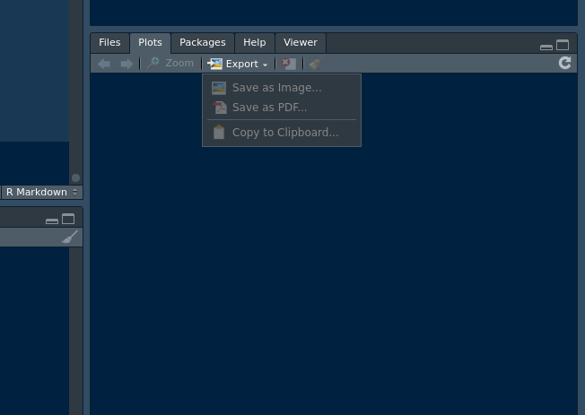

</center>

### R Markdown

Although, Word is not a bad solution for reporting our findings, R has a much more convenient tool that takes a regular Word report and injects it with steroids. Again, I am not going to go deep on this topic, because it is too big. I will show you the basics to get you started. The first thing you need to do is to install r markdown. Run:

```{r eval=FALSE,  out.width='90%', fig.asp=.75, fig.align='center'}
install.packages("rmarkdown"). 
```

::: {.infobox .tip data-latex="{tip}"}

Sage Tip: You do not need to write 'library(rmarkdown)' in this case, Rstudio knows. 
 
:::

Before we start, install another package - 'stringi'. This package provides some tools for working with text, but we will need it to generate random text for our markdown report.

```{r eval=FALSE, out.width='90%', fig.asp=.75, fig.align='center'}
install.packages("stringi"). 
```

Before we proceed, lets save the final tables that we used to generate our plots. We could copy and paste the code that we used to get to these tables, but why do that if we already got what we need. 

```{r message=FALSE, warning=FALSE, nice-fig66 , out.width='90%', fig.asp=.75, fig.align='center'}
# Saving.
fwrite(dataForLine, 'dataForLine.csv')
fwrite(dataForFuelLine, 'dataForFuelLine.csv')
fwrite(dataForBarPlot, 'dataForBarPlot.csv')
``` 

First, create a folder inside of the folder with the current project. Name it 'markdown' or something. Now, open a completely new Rstudio session. Your screen should look like the illustration below. Click on 'File' -> 'New File' -> 'R Markdown...'.
<center>

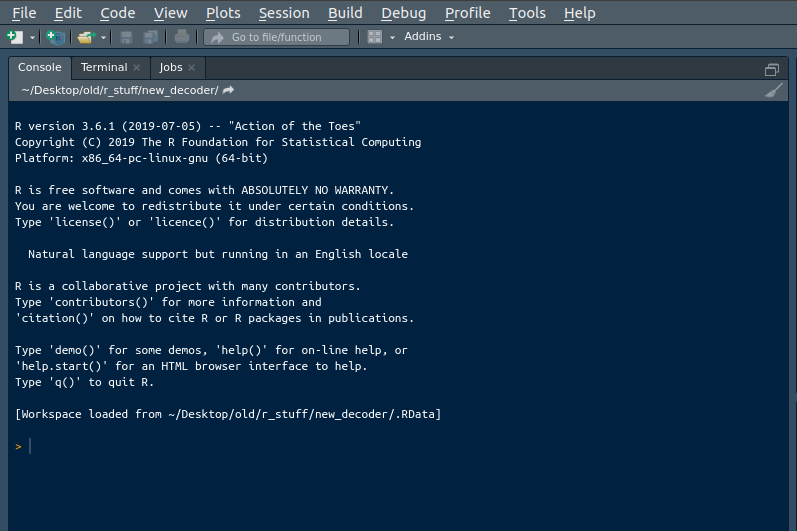

</center>

You will see a new markdown file window like below. A markdown project can result in different final formats, but we are only exporing HTML now. Name your markdown something and specify the author. Click 'OK'. 

<center>

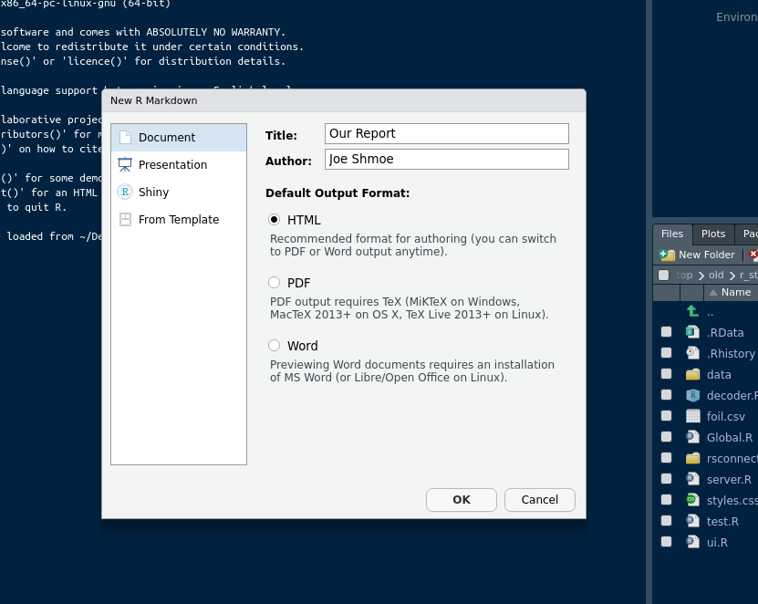

</center>

Another great thing about Rsudio is that it provides templates for many different things. When we will be discussing APIs, Web Apps, and other things, you will see how useful it is to have a code tepmlate to get you started. Markdown is not different. Below, Rstudio gives you a working template of how a markdown document should look like. Lets go through the template to see what it consists of. 

::: {.infobox .caution data-latex="{caution}"}

There are five parts that I can identify: 

- The first is a 'hat'. This is where the information and parameters of the markdown go. It is surrounded by the tripple dashes. 

- The second is the general space where you can specify titles, write text, and in-line code. 

- The third is a 'chunk'. Chunks are bulding block of a markdown document. Any code that we wrote and ran so far in this book, we can run inside a chunk. To created a chunk, you need to write two sets of tripple ticks. The space between them will be your chunk. 

- The fourth element comes after the first set of tripple ticks and is surrounded by curly braces. This is where you specify chunks parameters. There are many different parameters that you can specify there. You will see all that for yourself when you will start experimenting with markdowns, however, I will just give you a few most freqient parameters and what they do. When you press 'knit', the code that you write in those chunks gets executed line by line just like in regular R file. In most cases, you will not want the reader of your report to see the code behind your findings. The parameter 'echo = False' takes care of that. Also, as you might have noticed, any code can produce a bunch of warnings or messages. There are parameters for that too. There are parameters for width and height of your charts or illustrations, and a bunch of other crap as well. If I start to list all of them here, you will not remember. It is better if you just google them on case by case base when you need them. 

- The fifth part is the actual code that you include in a chunk. As I mentioned before, the code in the chunks runs just the same as the one that you have been practicing with so far. The difference here is that it is sectioned by chunks and you can apply different rules (parameters) to each chunk. 

These are the main five parts of a markdown. There are, obviously, more sub-parts, but you do not need to worry about them right now. 
 
<center>

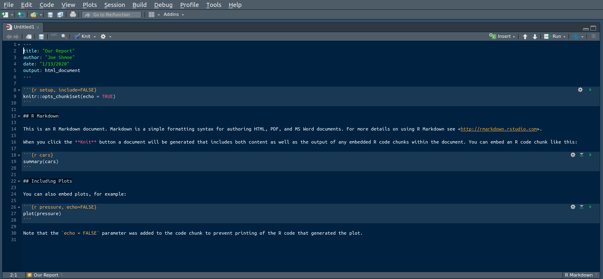

</center>

:::

Although, it is just a template, since we have already specified the title and author, we can see them in the 'hat' of the markdown. The hat of the markdown is where you specify different parameters for the final document. The parameters can be font, spacing, color, themes, and more. Although, it is just four lines now, it can get much much bigger. Everything else is generic now. Click the 'Knit' button above the 'hat' to see what the final document will look like. 

<center>

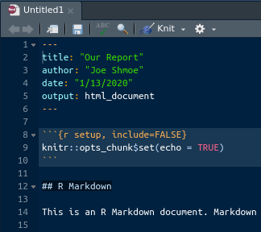

</center>

Pretty cool, right? R and Rstudio makes it extremely easy to go from doing research and writing code to presenting it in a widely accessible format. 

::: {.infobox .note data-latex="{note}"}

If you have not noticed yet, the document that you just produced is an html. This means that any browser can open your report. It might not seem like a big thing, but presenting your stuff from outside of your own computer can be a really big fucking problem. Many tools that are popular now are very close-ended and will not let you do shit from ouside, unless you give them your kidney.  
 
:::

Anyway, your template report should look like mine. Go through it, compare side by side with the template's code, see what corresponds to what.

<center>

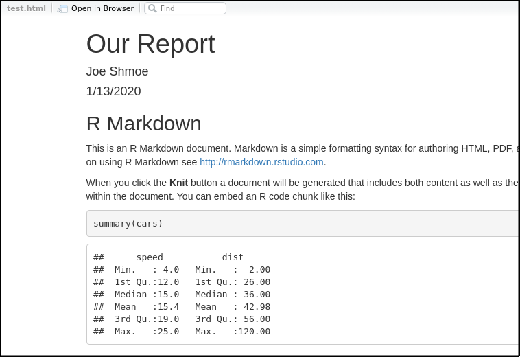

</center>

Lets use our plots to create a markdown report. First, eliminate everyhing except the 'hat'. The first chunk will only hold the libraries that we will be using for the code to generate the report. Just copy the ones that we used so far. Use the illustration below for reference. If not sure, just copy and paste all the libraries that we have been using so far. One thing about markdowns is that it will not render if something is missing or broken, and it will not tell you why in most cases. So, even if one library is missing, it will not work. It is actually better to include more libraries than you need than less because of that. Then, create a chunk with two sets of tripple ticks. Inside of the curly braces you want to specify three things: 

- 1. Engine (r) - mandatory, 
- 2. Chunk name (libraries) - optional and must be different for each chunk, 
- 3. Include = False - optional. 

::: {.infobox .tip data-latex="{tip}"}

Sage Tip: The 'include = false' parameter will run the code but will not print or display it in any way, so our libraries will be loaded but we will not see all those garbage messages that come with them.  
 
:::

Press 'knit' and you will see an empty report with the hat information.

<center>

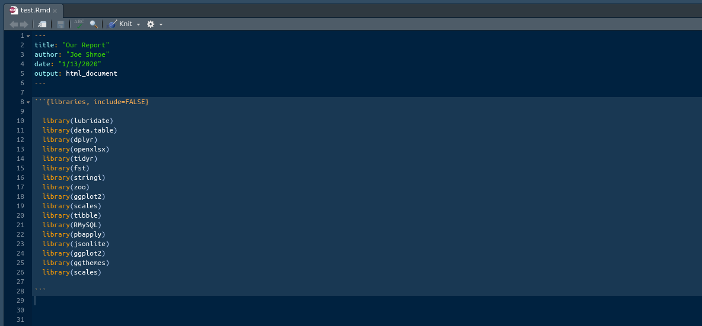

</center>

Ok, lets start simulating a real report. You can write any text outside of your chunks. On top of that, you can specifiy headers and write in-line code there. There are three types of header in markdown. The main header has to prefixed with the single 'hash' (#) sign. The middle one has two hashes. The smallest has three. In order to write in-line code, you have to surround it with a set of single ticks. Inside goes the engine (r) and the code. Check out the illustration below to see the examples of both. The function stri_rand_lipsum() generates a paragraph of random text for us. Knit it to see what it looks like.

<center>

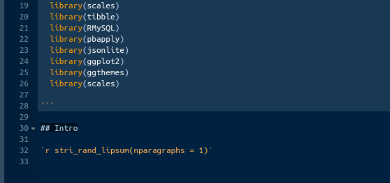

</center>

At this point, we have covered the core of the shit that we need to know about markdowns. From now on, we will be just copying an pasting our plots code and filling the voids with some generic text. Lets create a new paragraph with a middle-size header called 'Line Plot' and random text. After that, create a chunk with the following parameters: {r, echo = False, error = False, message = False, message = False, fig.aling = 'center}.

Lets go over the parameters. The first one is the engine, in other words, the language that we are using, which is 'r'. The next one is 'echo = False'. Echo works just like the 'include' that we used in the first chunk. The difference is that 'echo' will render the result of the code but not the code itself, and 'include' will not display anything if set to 'false'. The next three parameters are 'error', 'message', and 'warning'. These three are very similar as they block the display of errors, messages, and warnings. We do not need any, so we are setting them to 'false'. The final parameter is 'fig.align'. We want our plots at the center of the screen, so we are setting it to 'center'. Again, you can include more parameters here, but we do not need to now. Now, we are ready to render our first plot. As you should remember, we saved the result of our aggregations for the line plot as 'dataForLine.csv'. Lets read it back to this chunk. Type: 

```{r eval=FALSE, warning=FALSE, out.width='90%', fig.asp=.75, fig.align='center'}
dataForLine <- fread('dataForLine.csv')  
```

We need to convert the date to the date format as it flipped to the character type in transitions. I hope, you remember how to do that. If not, go back. If can not, reference the illustration below. Finally, just copy and paste the code we used to generate and output the line plot (see the illustration below for reference).

<center>

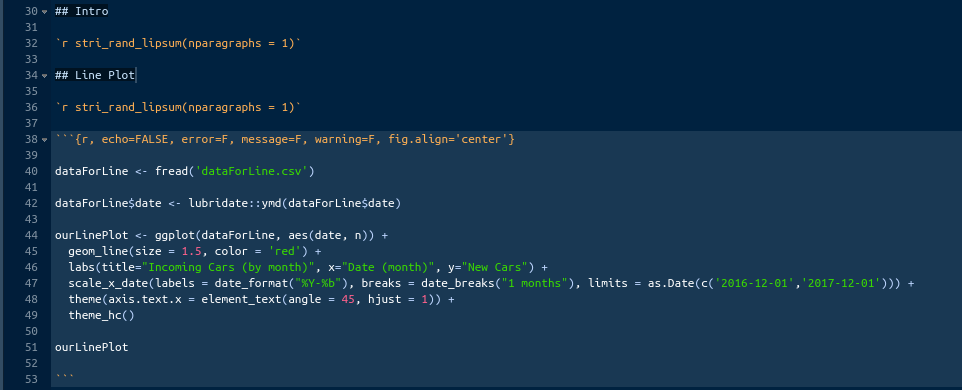

</center>

Knit the file and your report should look like the illustration below:

<center>

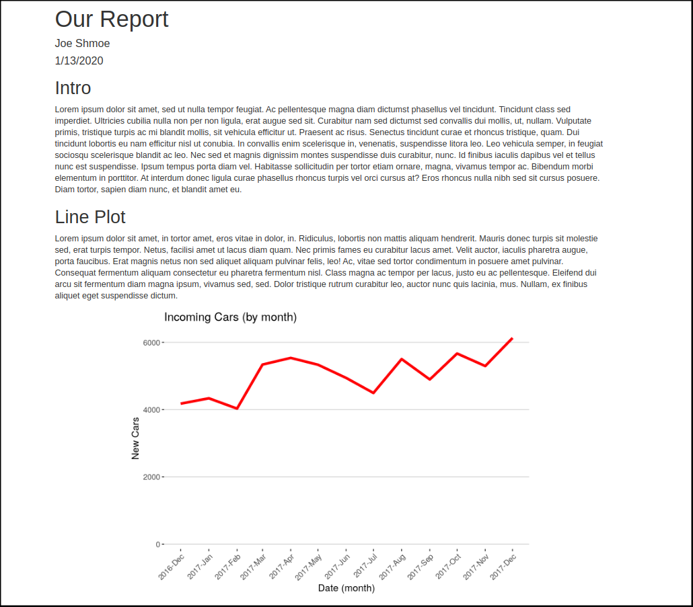

</center>

So far, we got the hat, introduction, and the first plot. The rest of the report will be the same. After the second chunk create another mid-size header 'Line Plot (by fuel)'. Add another random text paragraph under it and create another chunk with the same parameters as in the previous one. Load the 'dataForFuelLine.csv' to this chunk, fix the date column, and copy and paste the second plot code in here. Reference the illustration below if stuck.

<center>

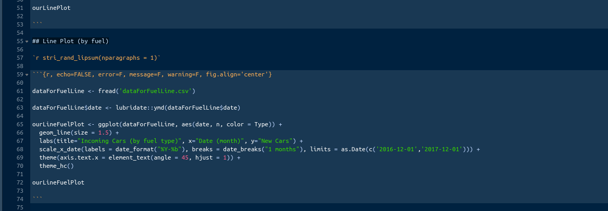

</center>

Repeat the same steps for the bar plot this time. You can name things as you see fit. Refer to the illustration below if confused. After the final chunk, create another mid-size header 'Conclusion' and add another paragraph with generic text to complete the report.

<center>

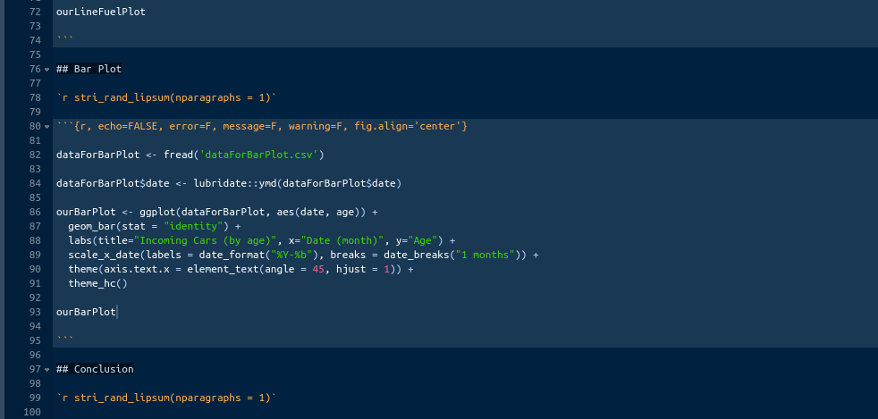

</center>

Finally, I want to show you how to add a table of contents (toc) to our report. The toc will be linked to the headers that we created. A markdown's 'hat' is very particular about formatting. If you want things to work as intended, you must make sure that punctuation and indentations are correct. To add the toc, change the hat exactly like I have it in the illustration below. 

<center>

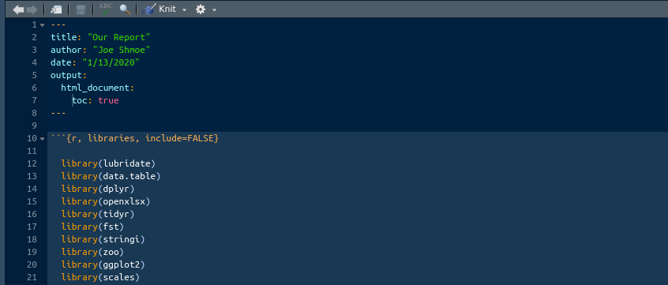

</center>

Knit the report and the toc will look like the illustration below. You can now click on any entry and you will be navigated to it. Give it a go.

<center>

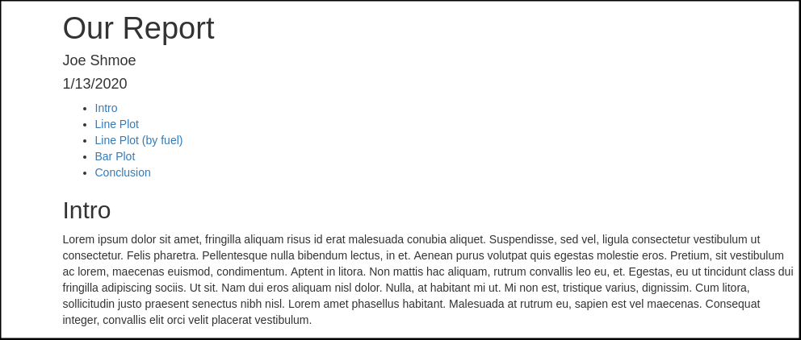

</center>

We are done with our report. You final document should look like this. Pretty fucking awesome.

<center>

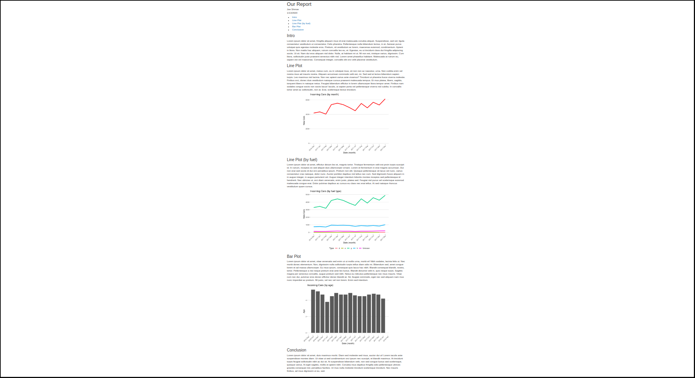

</center>

Now you have some basic understanding of Rmarkdown. You know how to generate it and how to properly structure your reports. On top of that, this section leaves you with not a bad template for some basic reporting. Obviously, there are many more things that you can do with a markdown, but we are not covering that in the introduction to everything in R. However, what you know now should be a good foundation to start exploring other capabilities of Rmarkdown. Personally, I never had the need to do with markdown more than I just showed you. So, whatever we have covered will be already enough for the most of you. Having said that, Rmarkdown is important to at least be familiar with.

## Bonus

Remember I said that I will show you how to make your plots more informative. Now is the time. The trick that I am about to show you was a gateway for me into the topic of interactive visualization. It would be cool if we could just take the ggplot that we created and start interacting with it. We would not need to dance around looking for adhoc solutions to improve the informativeness. Meet the package 'plotly'. Plotly is a JavaScript library that is heavily adopted and used in R to create interactive visualizations. First thing you need to do is to install the package. Type: 

```{r eval=FALSE, warning=FALSE, out.width='90%', fig.asp=.75, fig.align='center'}
install.packages('plotly')   
```

Once it is done installing, I want you to change the first chunk of your markdown according to the following illustration:

<center>

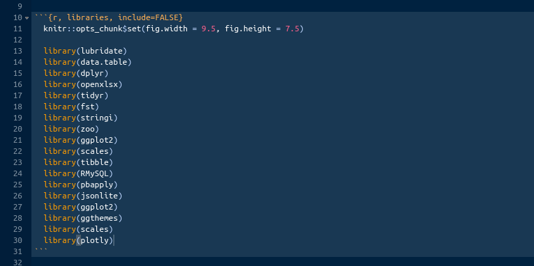

</center>

There are two additions: 

- 1. knitr::opts_chunk$set() specifies the global parameters for all chunks. In this case, the plot dimensions. 
- 2. library(plotly) - I should not explain this one. 

::: {.infobox .note data-latex="{note}"}

Now, to the trick itself. Plotly is just like ggplot2. We can use plotly to create any interactive chart from scratch just like we did in ggplot2. That is the whole topic and we will not be doing that. The reason I am refering to this part as a 'trick' is because we can just take out plots that we created in ggplot2 and wrap them with the plotly function ggplotly(). That function will take all the parameters, bells, and whissles, and will generate a plotly plot with them. Lets do it. 
 
:::

Take every chunk that generates a plot and wrap the final variable with the ggplotly() function like so: 

```{r eval=FALSE, warning=FALSE, out.width='90%', fig.asp=.75, fig.align='center'}
ggplotly(ourLinePlot).
```
 
Do it for all three of them.

<center>

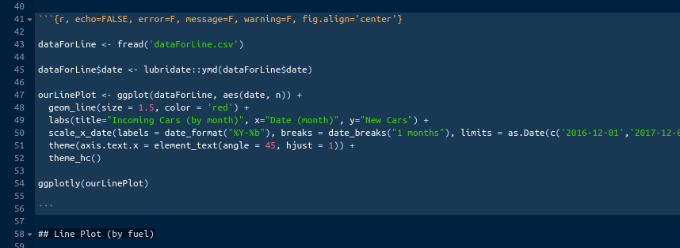

</center>

Knit the report again and you should end up with the report that is very interactive. You can zoom in, take a snapshot, hover to see the numbers, select and deselect data, etc. It is really fucking awesome for basically no effort. Most importanly, it makes your report stand out. 

## You are not an R maggot anymore

Congradulations, you are not an R maggot anymore. This is the end of your big assignment. You went far beyond what was expected of you. You will present this report to your supperiours and they will be very impressed with your progress while you are in front of them. They will definitely forget about you the next minute, but that is not the most important part. The most important is that you have proven to them and to yourself that you can take something really complex and completely new to you and master it in a short period of time with minimum or no supervision. 

Let me remind you what you were tasked to do. You were given the code that your superviser has been working on for months. That code already worked and you just needed to tweak it a bit more. I got to tell you that the majority of people would just run the code, encounter an issue or two, and run for help as soon as things got tough. Forget about improving the code and building things on top of it. Best case scenario, they would just run it from time to time and periodically lean on you to do their job. You will encounter that kind of attitude a lot and it is important that you yourself do not fall into the trap of relying on others for something that you must do. That is particularly important in programming. Nobody is going to do the learning for you. If there is one thing that I wanted you to take from this book, that would be the steps and attitude we took to solve our big assignment. Applying the strategy that I showed you for the next year, combined with hunger, will make you an expert in R and will take you to the level where you will be able to teach others, just like I am teaching you now. With this settled, lets see what we have actually done in this section and what it means for us. 

First, we were given a very complex, for us back then and for most now, code and got tasked with understanding it and running it periodically. We were given two to three months for that. We had no idea what the code was doing and what any of it meant. We ran it line by line to see what each piece of it did. We learned how to connect to a database, pull data that we need from it, aggregate that data using various R function, and save the result. In the programming world, this is called 'ETL' (Extract, Transform, Load). Although, we went over the code many many times and understood the outcomes of each line, some parts of it were still very hard or impossible to understand without deeper understanding of R. Here, I mean the NHTSA API call. 

Along the way, we learned about a thing called 'Tutorial Purgatory' and how to avoid getting sucked into it. We dove deeper into working with dates and times and learned the one library that we will be sticking with for a while (lubridate)

Second, we decided to see if we could rewrite the same code in a more staighforward way. The biggest improvement that we were able to make was to the API call. I, still, do not expect you to fully understand that thing, but at least it became much easier to, compared to the monstrosity that it was before. After we rewrote the code, we should have gotten a better grasp of it. At that point we were doing things that we will be doing ninty percent of a time from now on, give or take a few things. We presented our progress and were ready to start building on top of it. We impressed our supervisor and were given our addon assignment. 

Third, we got tasked with adding 'Miles per Gallon' (mpg) information for each vehicle from now on. There was no clear procedure for that. We had to be creative and more importantly knowledgeable in R to get something like that done. The fact that we got an assignment like that showed that we demonstrated our capacity to independently do something like that. The problem with that task was the lack of unique identifier that we could use to join the fuel dataset with our vehicles dataset. That particular problem taught us how to write ugly but working code. We are no longer intimidated by the majority of tasks, because we know that they will probably not be much harder than this one. And if they are, we will be able to dissect, understand, and complete them. The most important thing that we took from that part was confidence. 

Finally, we dicided that it would be proper to present our efforts in a nicely formatted report. We learned a lot about ggplot2 library and generated a few plots. From experience, in ninety percent cases, you will not need more ggplot2 than we have covered here. After covering plots, we leaped forward and covered a lot of ground on Rmarkdown. That will be extremely useful for you if your job requires a bunch of reports. Markdown is the standard for that kind of stuff and, again, we covered just enough so you can tackle the most of the tasks thrown at you. Obviously, you might requre different parameters for your chunks, but you got the template and knowledge that you can work with already. Finally, as a bonus, we converted our static ggplot2 plots into dynamic plotly plots, which made our report more impressive and informative. More importantly, it took our skills to the next level and opened the doors to the topic of dynamic visializations. 

The big assignment is over, the topics that will follow are important but are not core. Pat yourself on the back, you are not useless anymore!

---
  
<a rel="license" href="http://creativecommons.org/licenses/by-nc-nd/4.0/"></a><br /><span xmlns:dct="http://purl.org/dc/terms/" property="dct:title">R, Not the Best Practices</span> by <span xmlns:cc="http://creativecommons.org/ns#" property="cc:attributionName">Nikita Voevodin</span> is licensed under a <a rel="license" href="http://creativecommons.org/licenses/by-nc-nd/4.0/">Creative Commons Attribution-NonCommercial-NoDerivatives 4.0 International License</a>.
