# FlexDahsboard {-}

You are back at work. Your completed your first major assignment and really impressed you superiors. You had a bit more free time and since you did not want to waste it, you spent that time learning interactive mapping techniques. You have built a few prototypes and even showed them around at work. People there are impressed that you continue developing but your place is very bottomline oriented and you start hearing questions like: 'how can we use a map like this?' or 'can we create a dashboard around it?'. After the euphoria of learning something new and cool subsides, you should really start thinking about the utility of you work. 

::: {.infobox .caution data-latex="{caution}"}
Producing scattered visualizations is ok, however, you work will be valued much more if you also include a presentational component to it. What kind of presentational component? Am I not fucking amazing already? You are. Compared to yourself who did not know shit just a few weeks ago, that is. 
:::

So, put aside your imagined glory and lets learn another cool presentation tool. It is called 'flexdashboard', and it is similar to the Rmarkdown that we covered at the end of the main assignment. The difference is the layout arrangement. The Rmardown is a report type of document where informations is presented vertically paragraph after paragraph. The flexdashboard lets you create a real dashboard with tabs, buttons, dropdowns, etc. It is as static as a markdown, however, if you dive deeper into it, there is a way to make it truly dynamic. We will not be doing that just yet, though. In this section, again, we will learn just enough about the topic so we can add it to our arsenal of R tools. 

::: {.infobox .note data-latex="{note}"}
Before we begin, I want to say that flexdashboard is definitely a useful tool that you should know about. For me personally, it was a stepping stone to the next and the biggest for me topic 'RShiny'. The flexdashboard is great to create a quick report in the dashboard format, but it lacks the features that I was looking for when I was learning. I used it twice during my first year of working with R. The first time is for this: https://medium.com/@NYCTLC/visualizing-taxis-and-for-hire-vehicle-models-in-nyc-19278ad23466 and particularly for this dashboard: https://tlc_blog_posts.gitlab.io/word_cloud/car_cloud1.html. The second time was to generate a seriously complicated report for the TLC DATA HUB that I created for the Taxi and Limousine Commission of New York City here: https://tlcanalytics.shinyapps.io/tlc_dash/ (the button 'Download This Page' will generate a flexdashboard report). Although, I am saying that it lacks the functionality that I wanted, without knowing it, I would not be able to generate that kind of sophisticated report for the TLC DATA HUB. 
:::

Anyway, I want you to create a new project. You should know how by now. If not, go back. In the new project, open a new R file and install the flexdashboard package.

```{r eval=FALSE, warning=FALSE, out.width='90%', fig.asp=.75, fig.align='center'}
install.packages('flexdashboard') 
```

Before we start working on the dashboard, we need to get the data ready again. 

## Data

We need to load the libraries and connect to the database again. After that, we will prepare three datasets that we will display using the dashboard. The first dataset will have crashes per zipcode in 2019, and we will use it for the map. The second dataset will have crashes per month in 2019 and we will create a ggplotly bar plot out of it. The third dataset will have the total number of injured and the total number of killed in those crashes. We will use these numbers for value boxes. Value boxes are important, you will see what they look like.

```{r message=FALSE}

# Loading the libraries

    library(lubridate) 
    library(data.table) 
    library(dplyr) 
    library(tidyr) 
    library(tibble) 
    library(RMySQL)
```

```{r include = F, out.width='90%', fig.asp=.75, fig.align='center'}
# Connecting to the database
connection = 
  dbConnect(drv = MySQL(), 
  user = "fallenangel1", 
  password = 'nvoevodin', 
  host = 'mybookdatabase.cgac79lt7rx0.us-east-2.rds.amazonaws.com', 
  port = 3306, 
  dbname = 'nikita99')
```

```{r eval = F, out.width='90%', fig.asp=.75, fig.align='center'}
# Connecting to the database
connection = 
  dbConnect(drv = MySQL(), 
  user = "xxx", 
  password = 'xxx', 
  host = 'mybookdatabase.cgac79lt7rx0.us-east-2.rds.amazonaws.com', 
  port = 3306, 
  dbname = 'nikita99')
```

```{r message=FALSE}
# Pulling initial data
crashes2019 <- dbGetQuery(connection, 
  "SELECT * 
  FROM book_pdData 
  WHERE date >= '2019-01-01' and date < '2020-01-01'
  ")

# The first dataset
byZip <- crashes2019 %>%
  dplyr::group_by(zip) %>%
  count()

# The second dataset
byMonth <- crashes2019

byMonth$date <- lubridate::ymd(byMonth$date)

byMonth$date <- lubridate::floor_date(byMonth$date, 'month')

byMonth <- byMonth %>%
  dplyr::group_by(date) %>%
  count()

# The third dataset
injuredAndKilled <- crashes2019 %>%
  dplyr::summarise(injured = sum(injured), killed = sum(killed))

# Saving the datasets
fwrite(byZip, 'byZip.csv')
fwrite(byMonth, 'byMonth.csv')
fwrite(injuredAndKilled, 'injuredAndKilled.csv')
```

## Layouts

Flexdashboard provides multimple layout patterns, however, since this is only a functional introduction to the topic, I will show you only the two layouts that I like the most, the column-based and the row-based. I will show you how to create both layouts using the same data. You do not have to create both. Just pick the one that you prefer (row or column based). To create a flexdashboard, you need to go to 'File' -> 'R Markdown..' -> 'From Template' -> 'Flex Dashboard'. Name it something and click 'OK'.

<center>

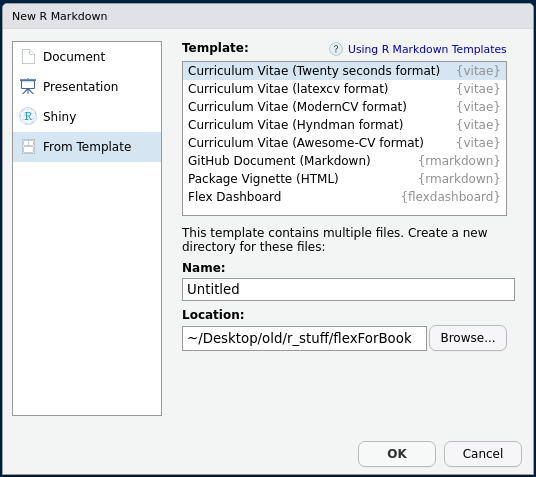

</center>

### Column based

When we hit 'OK', Rstudio give as a column based template, which is cool. Lets explore it. The flexdashboard has similar structure to the Rmarkdown. It has the same five components that the markdown has. The difference is the layout. Below, I highlighed the areas that are different. You can see two main differences: 

- 1) Special sintax for specifying columns (or rows if the dashboard is row-based), and 
- 2) the tripple hashes. The tripple hashes create boxes in the flexdashboard. As you might recall, in a simple markdown a tripple hash sign specifies the smallest title. 

Enough reading, you will understand better if you just knit this dashboard. Go agead and press 'Knit'. 

<center>

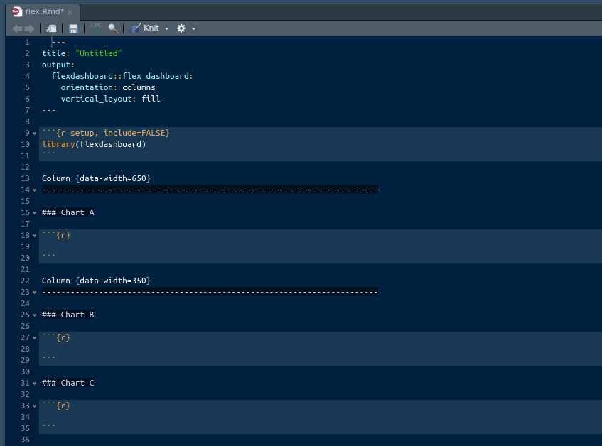

</center>

<center>

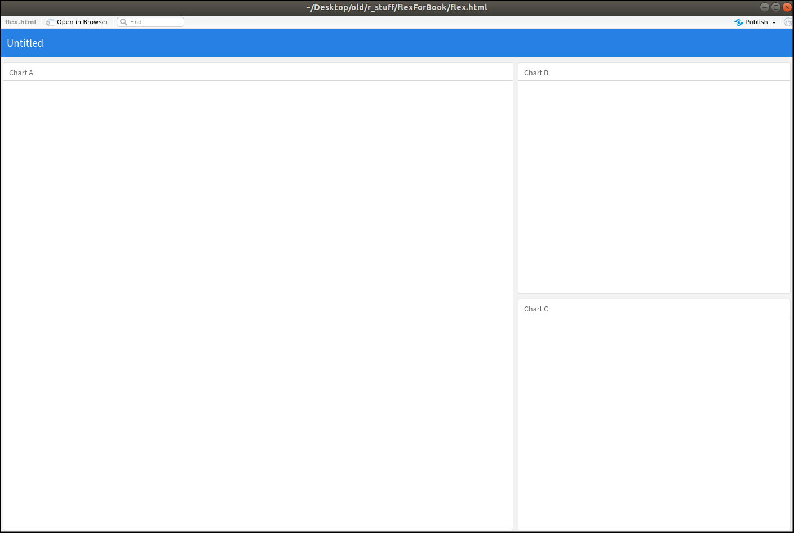

</center>

There you go. We got an empty dashboard. The whole layout thing should become clear now. We got the main header (blue top bar) that displays the title and three boxes that we created in the layout. As far as I know, the width of a page in R, usually, adds up to 1200px or 12, depending on the context. It does not strictly apply to the flexdahsboard for some reason. In the template, we can see that the widths of two columns add up to a thousand. Even if you change the width of one of the columns to, lets say, 5000, it wont break it. Instead, it resizes proportionally. What does it mean? Means that you will have to experiment with sizes. It is not a real problem, though, so, lets move on. Lets actually insert our crash map into the main window.

Before we are able to recreate the map from the last chapter, we need to load the libraries that we will be using. They are the libraries that we have been using so far. You can just copy and paste them from our previous projects, or you can type them if you want. Use the illustration below as reference. Make sure you have all of them installed and loaded.

<center>

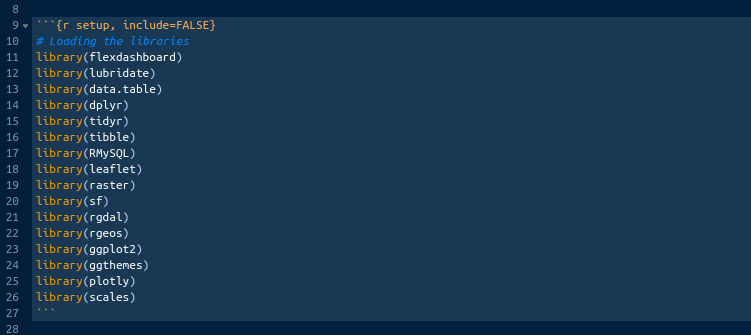

</center>

Now that we got the libraries down, lets prepare the data for the map. We have already done all these steps in the previous chapter, so you can just copy and paste them into the chunk. Use the illustration below as reference. 

<center>

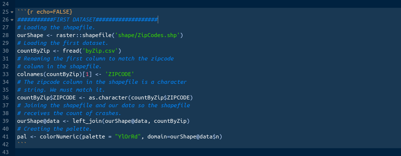

</center>

The data are ready. Now, literally, just copy the map code from the previous chapter and paste in the first empty chunk provided in the template under the '### Chart A'. Use the illustration below as reference.

<center>

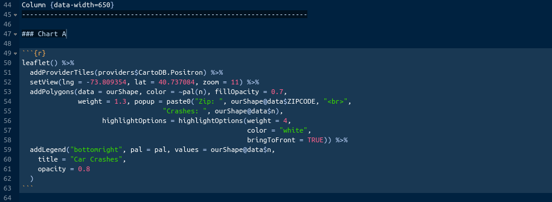

</center>

We have anough code in there to see some nice results already. Lets knit the documnet to see what it looks like at this stage. Press 'Knit'.

<center>

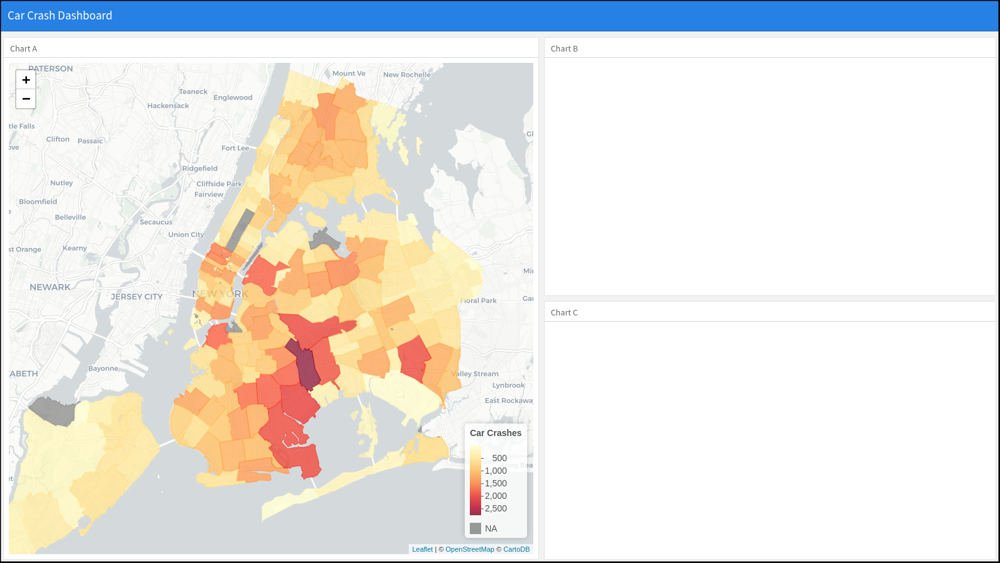

</center>

This is really good already. The structure is there. The map is fully interactive. We are half way there. Lets load the second dataset. It will serve as the base for the bar plot that we will fit into the second box of the dashboard. The second one is much easier, because we do not need to agregate and join anything. When we will read it in, the date column will turn into character. We will need to revert it back to date. Reference the illustration below.

<center>

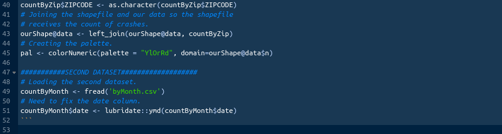

</center>

Once the data are in, we need to build our plot. The plot that we want to build here will be almost axactly the same as the bar plot that we built at the end of the our big assignment. Go and find that plot. It is called 'ourBarPlot'. Copy it and paste into the second empty chunk provided in the template under the '### Chart B'. There are a couple of things to change here. First, add the 'fill = "blue"' parameter to the geom_bar() function. This will change the color of our bars to blue. You can pick a different color if you want. It will be dark grey if we will not include it. Second, change the title to '' (empty). We will later rename the '### Chart B' to something else, and we do not want to have two titles there. Finally, wrap the 'ourBarPlot' in the ggplotly() function to turn the ggplot2 into plotly. Reference the illustration below.

<center>

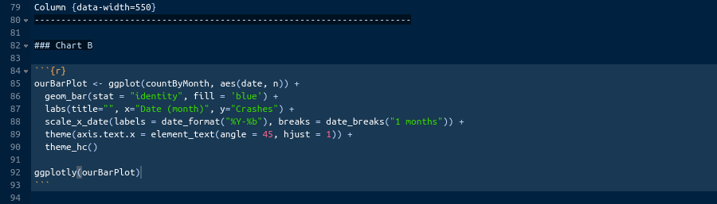

</center>

Once you done, knit the dashboard to see what we got. 

<center>

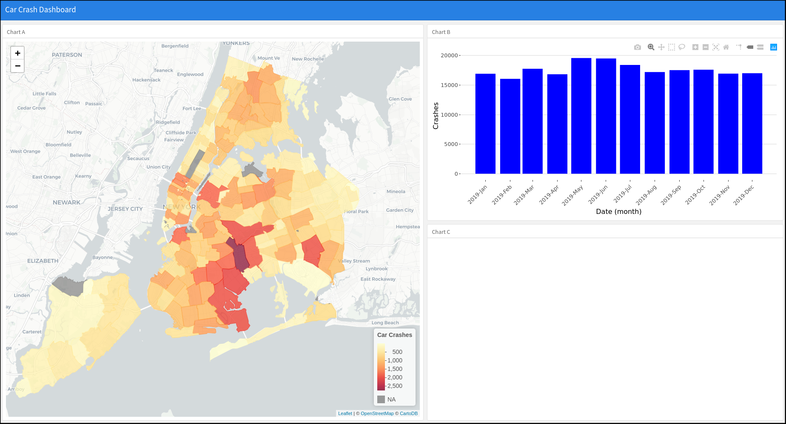

</center>

We got two interactive elements that we learned in the last two chapters. Lets fill the third box. Remember I mentioned some value box and that it was important. Lets see what it is. Value boxes are great for highlighting important numbers. You can assign different colors to them and even add icons. It will be better if I just show you. Lets import the third dataset first. No modifications this time. Reference the illustration below.

<center>

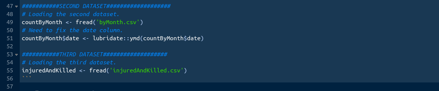

</center>

Now, paste the following code in the empty chunk provided by the template under the '### Chart C': valueBox(injuredAndKilled$injured, icon = 'fa-angry', color = 'warning'). What does this mean? 

::: {.infobox .note data-latex="{note}"}
Well, the valueBox() is the function for value boxes. It takes the number (which is contained in the column 'injured' of the table 'injuredAndKilled'), icon (we are using the fontawesome icon library, here is the link for more information: https://fontawesome.com/icons?d=gallery), and color. You might wonder, what does color = 'warning' mean? It is the bootstrap-library standard color. You will learn about bootsrap in the future. For now, just know that bootstrap is a styling library developed by tweeter for web developement. There are just a few standard colors in bootstrap. For instance, warning means orange. 
:::

<center>

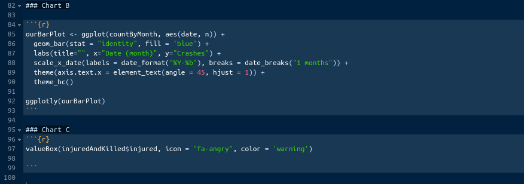

</center>

Lets knit and see what we got.

<center>

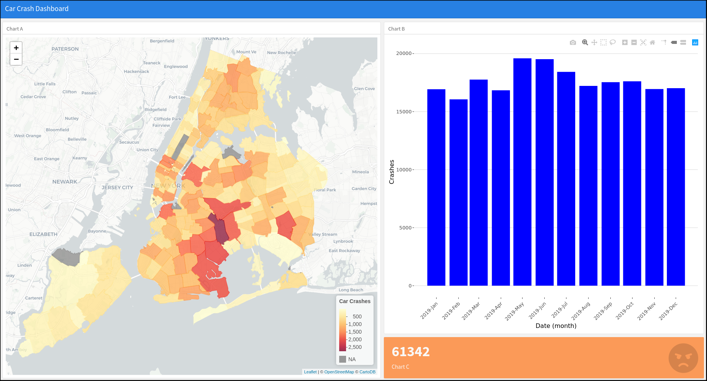

</center>

Great. As you can see, we got an orange value box displaying the number of injuries in a big fat font with an angry face icon. 

::: {.infobox .note data-latex="{note}"}
Value boxes are extremely important, because they can highligh the most important numbers in your report or dashboard. 
:::

Lets add the second value box displaying the number of killed. We will use red color and some different icon for it. If we just add another chunk with similar code, the value boxes will overlap for some reason. We need to add '### Chart D' for the second value box to be properly displayed. It does not have to be 'Chart D' precisely, it be called anything. We will rename them all later. Use the illustration below as reference.

<center>

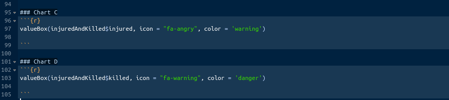

</center>

We are almost done here. Lets knit and see what everything looks like.

<center>

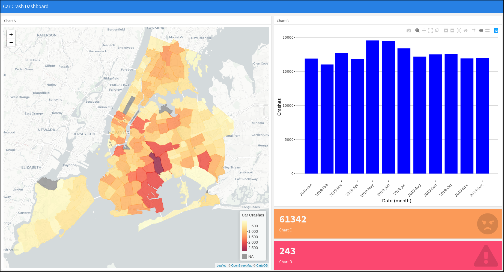

</center>

Perfect. We are done here. One last thing to do is to change the names of the boxes from Chart A,B,C, and D to proper names. For example, instead of '### Chart A' I wrote '### Number of Car Accidents by Zipcode in 2019'. You can rename them as you see fit. Use the illustration below as reference for the names.

<center>


</center>

This is it for the row-based flexdashboard. It looks really good and is informative anough to share with others. You should have an html file with this dashboard in your project's folder. That html can be opened by most browsers and is small enough to be shared via email. 

### Row based

We will not have to change much to switch from the column-based layout to the row-based. Go the the hat of the document and change the orientation parameter to 'rows'. See the illustration below.

<center>

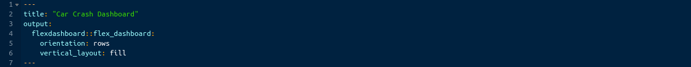

</center>

In the body, change 'Column' to Row and instead of data-width = ... write data-height = ... . You can knit the document now, but you will see that the layout is not great at all. We will have to move our bar plot from the second row to the first one. Do it according to the illustration below. Once done, knit the document to see what it looks like.

<center>

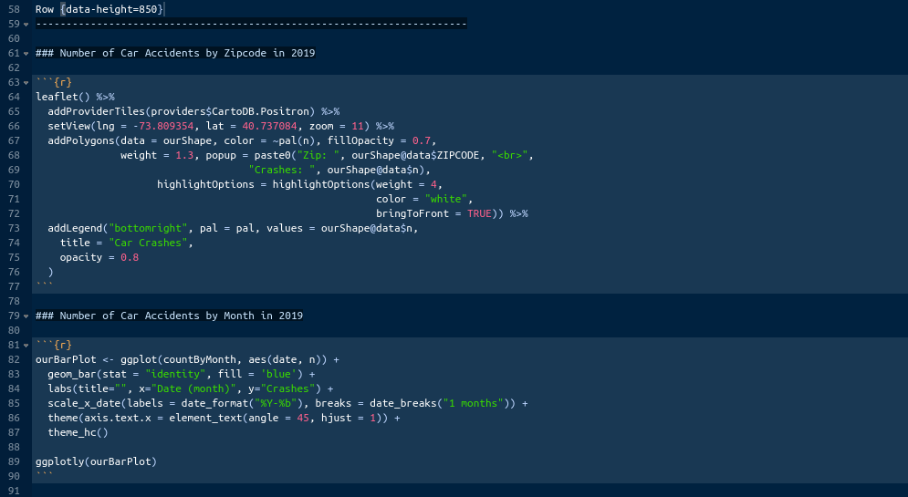

</center>

It is better but the value boxes are too tall. Change the height of the second row to 150 like below.

<center>

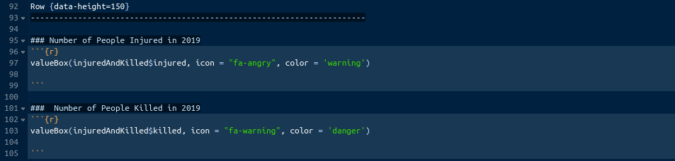

</center>

We should be go to go. Knit.

<center>

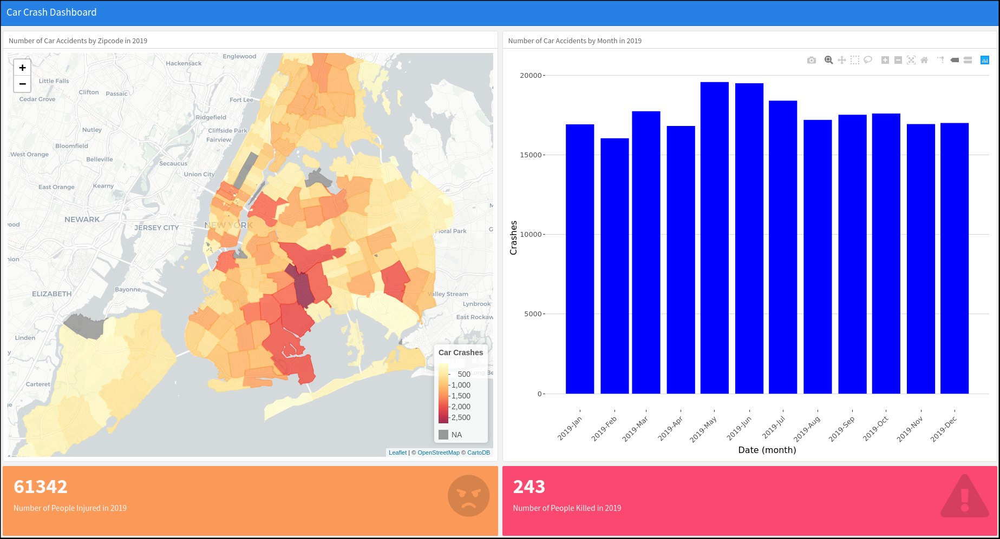

</center>

Good. This is usable but I prefer the column-based one. 

## Conclusion

In this section we covered everything that you need to really get started with this cool tool. There are more than just two layouts that I showed you here. However, these two are the easiest to get started with. You should use them as baselayers for your experimentations. As I said a few times here, it is much much easier to take a working prototype and start layering thing on top. You can do interesting things with flexdashboard. You can add tabs to boxes and even add multiple pages. At the moment, it should be impressive for you, but you will quickly realize, just like I did, that flexdashboard can not do all the thing that you want. Therefore, there is no point in trying to truly master it. Instead, it makes sence to practive with it a little bit, add it to your toolbox, and move on to the topic of web applications. 

::: {.infobox .caution data-latex="{caution}"}
This is the end of this book. I will not be teaching you anything else here. Instead, as a bonus, I want to show you a little preview of what we will be doing in the next books.
:::


---

<a rel="license" href="http://creativecommons.org/licenses/by-nc-nd/4.0/"></a><br /><span xmlns:dct="http://purl.org/dc/terms/" property="dct:title">R, Not the Best Practices</span> by <span xmlns:cc="http://creativecommons.org/ns#" property="cc:attributionName">Nikita Voevodin</span> is licensed under a <a rel="license" href="http://creativecommons.org/licenses/by-nc-nd/4.0/">Creative Commons Attribution-NonCommercial-NoDerivatives 4.0 International License</a>.
