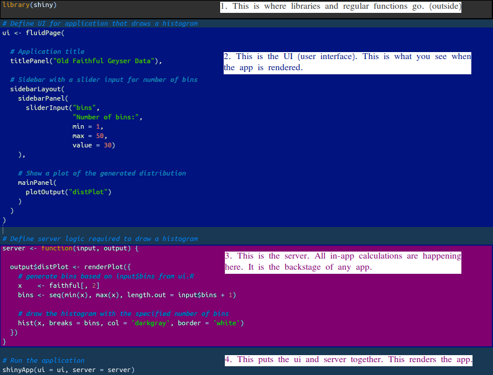
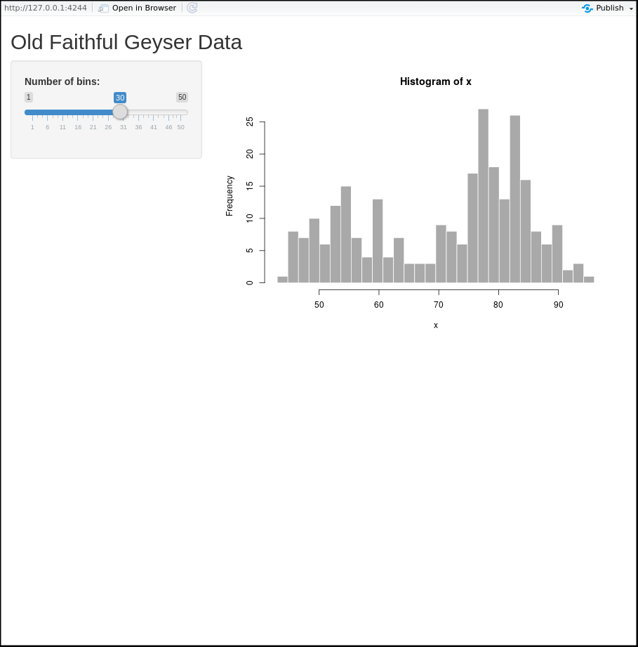
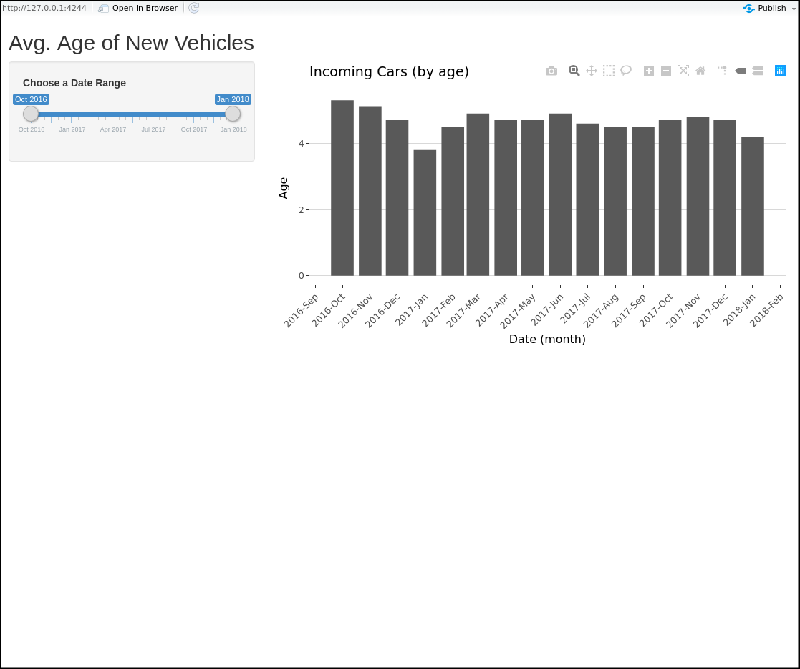

# Shiny (Bonus) {-}
Straight from the RStudio website:

::: {.infobox .tip data-latex="{tip}"}

"Shiny is an R package that makes it easy to build interactive web apps straight from R. You can host standalone apps on a webpage or embed them in R Markdown documents or build dashboards. You can also extend your Shiny apps with CSS themes, htmlwidgets, and JavaScript actions."

:::

This is a bonus section, so I will not teach you anything here. I just want to talk about the Shiny package or framework if we can call it that. Shiny is a package, however, it is so big and spun so many additions that I want to call it a framework. If you do not know what a framework is, it is something between a package and a whole new language. Anyway, Shiny is big and it has its own special sintax. That is why I want to call it a framework.

::: {.infobox .note data-latex="{note}"}

Around the time when I was messing around with maps and flexdashboards, I started to run into some limitations of static code. I could only display data once. If, for example, I wanted to change a timeline on a plot, I needed to re-aggregate my data and re-render the plot again. Basically, I needed a new script. I thought, 'It would be cool if I just could add a slider or a switch to the flexdashboard that would do something like that.' I was told that there is a solution, the package called 'Shiny'. I thought, 'What a stupid name.' Still think that. Why not 'Pink Unicorn'? I would name it 'the Plague' or 'the Archangel' or something cool like that.

:::

Anyway, I started learning Shiny and it was amazing. Basically, in a matter of days, I turned from a data genetor to a web app developer. It was definitely hard and it took me many months, but even in the beginning, I knew that this is how I will learn the rest of R. Below is the generic Shiny App that uses data that RStudio provides for us. The app does not do much, but you can already see reactivity. Just copy the code and paste it into a new R script and it will render an app. 

```{r eval = F, out.width='90%', fig.asp=.75, fig.align='center'}
# Installing shiny
install.packages('shiny')
```

```{r eval = F, out.width='90%', fig.asp=.75, fig.align='center'}
library(shiny)

# Define UI for application that draws a histogram
ui <- fluidPage(
  
  # Application title
  titlePanel("Old Faithful Geyser Data"),
  
  # Sidebar with a slider input for number of bins 
  sidebarLayout(
    sidebarPanel(
      sliderInput("bins",
                  "Number of bins:",
                  min = 1,
                  max = 50,
                  value = 30)
    ),
    
    # Show a plot of the generated distribution
    mainPanel(
      plotOutput("distPlot")
    )
  )
)
  
# Define server logic required to draw a histogram
server <- function(input, output) {
  
  output$distPlot <- renderPlot({
    # generate bins based on input$bins from ui.R
    x    <- faithful[, 2]
    bins <- seq(min(x), max(x), length.out = input$bins + 1)
    
    # draw the histogram with the specified number of bins
    hist(x, breaks = bins, col = 'darkgray', border = 'white')
  })
}

# Run the application 
shinyApp(ui = ui, server = server)
```

It is not our goal here to understand the code, but, if you are curious, below is a diagram of what each chunk does.

</center>



</center>

This is what this generic app should look by the way:

</center>



</center>

Lets take one of the datasets that we saved a while ago and generate our own app by modifying that generic code. 

First, I will load the libraries that I will need:

```{r message = F, out.width='90%', fig.asp=.75, fig.align='center'}
library(shiny)
library(data.table)
library(dplyr)
library(lubridate)
library(ggplot2)
library(ggthemes)
library(scales)
library(plotly)
```

Then, I will load some data that we saved a while ago. I think, that dataset holds average ages of incoming vehicles by month.

```{r echo = F, out.width='90%', fig.asp=.75, fig.align='center'}
forBarPlot <- fread('dataForBarPlot.csv')
forBarPlot$date <- lubridate::ymd(forBarPlot$date)
```


I will modify the generic app code to show the plotly plot while being able to filter it with a double slider. Will not explain how, though, as this is just a demonstration.

```{r eval = F, out.width='90%', fig.asp=.75, fig.align='center'}

ui <- fluidPage(
  
  # Application title
  titlePanel("Avg. Age of New Vehicles"),
  
  # Sidebar with a slider input for number of bins 
  sidebarLayout(
    sidebarPanel(
      sliderInput("monthdate", "Choose a Date Range", 
                  min = min(forBarPlot$date), 
                  max = max(forBarPlot$date), 
                  value = c(min(forBarPlot$date),
                            max(forBarPlot$date)),
                  timeFormat="%b %Y")
    ),
    
    
    mainPanel(
      plotlyOutput("plot")
    )
  )
)


server <- function(input, output) {
  
# Dynamically filtering the dataset based on slider values and storing it
# in the 'data' variable.
  data <- reactive({
    forBarPlot %>% dplyr::filter(date >= input$monthdate[1], date <= input$monthdate[2])
  })
  
# Plotting.  
  ggplotly(
    ggplot(data(), aes(date, age)) +
  geom_bar(stat = "identity") +
  labs(title="Incoming Cars (by age)", 
       x="Date (month)", y="Age") +
  scale_x_date(labels = date_format("%Y-%b"), 
               breaks = date_breaks("1 months")) +
  theme(axis.text.x = element_text(angle = 45, hjust = 1)) +
  theme_hc()
  )


}

# Run the application 
shinyApp(ui = ui, server = server)
```

This is what our app 'new cars' app should look like:

</center>



</center>

::: {.infobox .caution data-latex="{caution}"}

Great! We built an app. What now? It is a good start. Keep practicing and in six to eight months you will be able to build this: [TLC Data Hub](https://tlcanalytics.shinyapps.io/tlc_dash/). At least, that is how long it took me.

:::

This was just a glimpse of what is comming in the next books. This app lives on your computer now. It will not open on anybody elses computer unless that computer has R installed along with everything that you used to created this app. To share a Shiny app, you need to host it. That and many other techniques and tricks will be covered in the next books. 


---

<a rel="license" href="http://creativecommons.org/licenses/by-nc-nd/4.0/"></a><br /><span xmlns:dct="http://purl.org/dc/terms/" property="dct:title">R, Not the Best Practices</span> by <span xmlns:cc="http://creativecommons.org/ns#" property="cc:attributionName">Nikita Voevodin</span> is licensed under a <a rel="license" href="http://creativecommons.org/licenses/by-nc-nd/4.0/">Creative Commons Attribution-NonCommercial-NoDerivatives 4.0 International License</a>.
