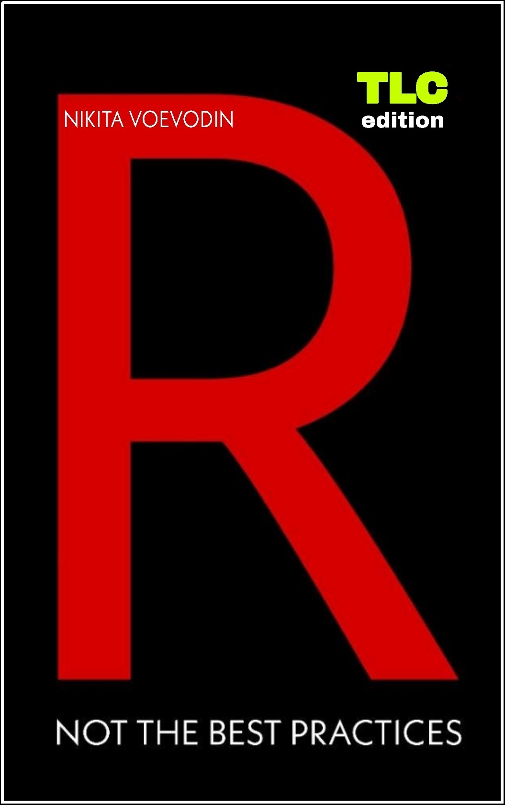

--- 
title: "R, Not the Best Practices"
author: "Nikita Voevodin"
date: "`r Sys.Date()`"
site: bookdown::bookdown_site
output: word_document
documentclass: book
always_allow_html: yes
bibliography: [book.bib, packages.bib]
biblio-style: apalike
link-citations: yes
colorlinks: yes
graphics: yes
github-repo: rstudio/bookdown-demo
description: "R, Not the Best Practices (TLC version)."
---

# Preface {-}

::: {.infobox .caution data-latex="{caution}"}

<a rel="license" href="http://creativecommons.org/licenses/by-nc-nd/4.0/"></a><br /><span xmlns:dct="http://purl.org/dc/terms/" property="dct:title">R, Not the Best Practices</span> by <span xmlns:cc="http://creativecommons.org/ns#" property="cc:attributionName">Nikita Voevodin</span> is licensed under a <a rel="license" href="http://creativecommons.org/licenses/by-nc-nd/4.0/">Creative Commons Attribution-NonCommercial-NoDerivatives 4.0 International License</a>.

:::


```{r echo = F, out.width= "65%", out.extra='style="float:right; padding:10px"'}

``` 

Welcome to R, Not the Best Practices. You, probably, selected this book for one of the following three reasons; one, you saw the title, the cover and thought well this might be interesting. Two, you know that books that are called something something, best practices are hard to follow, because they are written by someone who already forgot how it feels to not know anything. Third, someone referred you to this book, because they learned a lot from it themselves. My hope is that your reason is somewhere between the second and third points; although even if it is the first, you will not regret it. 

Why is this book called Not the Best Practices? Simple; you do not learn by looking at perfect code. If I wrote a vectorized loop with a custom function and told you that it was the most efficient way and best practice, you likely would never understand what the hell was going on and probably would quit. That was my experience with the majority of tutorials that I went through; at some point I would just stop getting what was going on. But because I had invested some time and money into a course, I would force myself through it regardless. Unfortunately, that tactic results in very little progress and a lot of frustration and discouragement. Writing this book, I want it to be nothing like those experiences. There will be some boring, basic things that I just have to cover, but the majority of it will be practical and interactive. 

## What This Book Is and Is Not
- This book is not written by an academic.

I am not an R professor or creator of some fancy library. I am a professional data analyst and an R, SQL and JavaScript practitioner.

- This book is not a set of best practices.

I do not care about the cleanliness of your code, especially at this stage in your R career. The only thing that matters is whether your code gets the job done; best practices will come later. This book is a set of tips, tricks and hacks, both good and bad, that will make things work for you when you need them to.

- This book will not filter words.

I believe that learning to code can be dull, boring, and discouraging. Therefore, I will try to maintain your interest by using some seasoned language.

::: {.infobox .caution data-latex="{caution}"}

In fact, this is the 'Vanilla' version of this book available. I if prefer spicy language, go to the [18+](https://nvoevodin.github.io/R_Not_the_Best_Practices) version of this book.

::: 


- This book will not use stupid generic data.

I have seen and practiced with a bunch of stupid and semi-generic data that makes no sense. It really traumatized me and I do not want you to experience the same pain. Not only will we be working with real data (real vehicles vin numbers, and NYPD car crash data), but also, we will be pulling that data from a real SQL database that I specifically set up for this book. You can be sure that we will not be writing stupid 'hello world' examples at every turn. By the end of this book you will have something interesting to show for the time that you invested.

- This book is not only about R.

In production, R goes hand in hand with other languages. The most important one we will cover is SQL, the language of database interaction. We will be using a SQL database and the SQL language to write commands and pull our practice data into R. In addition I will also explain a good deal about other programming languages and how they interact or do not interact with R.

- Finally, this book was never intended for you (I’m kind of kidding).

When coding, after a while, you will begin to forget everything you learned; as a developer the world moves quickly and you are constantly learning new things. This book is therefore my documentation, a reminder of the things I have done and processes I have built; perhaps as a consequence you might learn a thing or two so stick around.  

## What Will This Book Teach You

This book will follow the first three months of learning R at my new job. Before that I was just okay at computers. I played games, used the interweb and Microsoft Word and Excel for professional stuff. I did not know anything about programming nor did I know a single programmer. Code for me was just that, code, a random string of matrix letters that meant nothing. Since the memories of not knowing anything are still fresh, I feel quite confident that I should be able to put myself in your shoes and bring you to the level of proficiency that you should be after learning R for three months. Yes, three months. This book will cover my first quarter of dealing with R and programming in general.

You may be thinking, oh man, this guy will only show me some real basic stuff! You are wrong. I will show you basic stuff, there is no way around it, if you want to learn. However, most of this book deals with practical examples, things that you face ninety five percent of the time. For instance, the core of this book revolves around the main assignment I received on the second week of my job. That assignment took me off guard and it took me two months of non-stop learning in R and SQL to complete. By the end of that assignment I felt comfortable with most basic tasks where I needed to work with data. 

I will lead you through the same experience with many tips and tricks along the way. You will learn how to interact with databases in R, pull data, aggregate and reshape it to your liking; merge it with other data; save it; work with different data and time formats; create useful static and dynamic plots; fit all that nice stuff into presentable reports; create bad and great maps; use all that again to create dashboards; and finally build a simple web app as a bonus. Along the way, I will be telling you about mine and other programmers’ experiences and touch on some peripheral programming topics.

If all that is not enough for you, feel free to close this book and get yourself something like R for Dummies or something. This book is, ultimately, what and how I wanted to be taught when I was a noob.

::: {.infobox .important data-latex="{important}"}

Special thanks go to Fausto Lopez for proofreading this book. Fausto is a Director of Data Engineering & Analytics at NYC Taxi and Limousine Commission.

:::  


